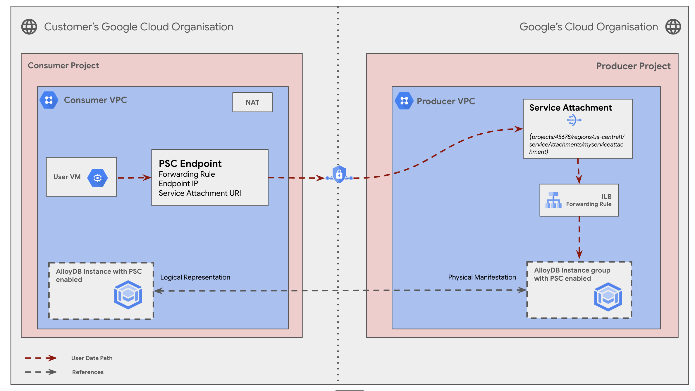
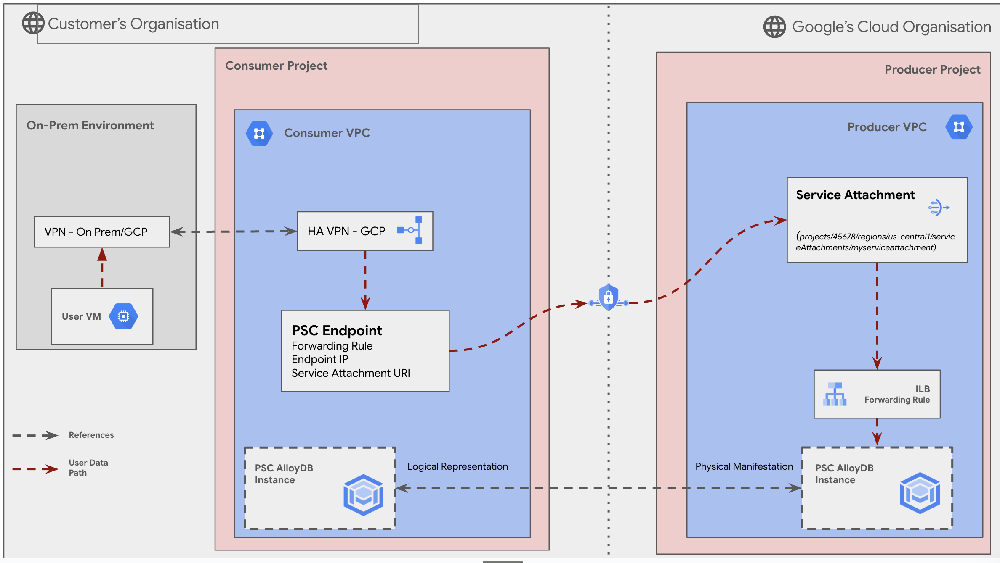
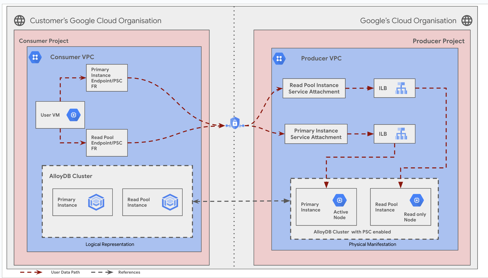

# **AlloyDB with Private Service Connect (PSC) Enabled**


  1. [Objectives](#objectives)

  2. [Architecture](#architecture)

  3. [Request flow](#request-flow)

  4. [Deploy the solution](#deploy-the-solution)

  5. [Prerequisites](#prerequisites)

  6. [Deploy through “terraform-cli”](#deploy-through-terraform-cli)

  7. [Optional : Delete the deployment](#optional-delete-the-deployment)

  8. [Submit feedback](#submit-feedback)

## Introduction

  This guide helps you understand, deploy, and use the AlloyDB with Private Service Connect (PSC) solution. This solution enables you to securely access AlloyDB instances using Private Service Connect, ensuring private connectivity between your services and AlloyDB over Google Cloud’s internal network.

  By leveraging Private Service Connect, this solution addresses critical security and performance concerns, allowing businesses to seamlessly integrate AlloyDB into their infrastructure with minimal exposure to public networks. PSC provides benefits such as enhanced data privacy, reduced latency, and improved security by ensuring that traffic remains within Google Cloud’s private network.

## Objectives

This solution guide helps you do the following:

* **Learn** how to configure and deploy AlloyDB with Private Service Connect (PSC) to ensure secure and private connectivity to your database instances within Google Cloud.
* **Deploy** an AlloyDB instance with PSC enabled, integrating it with your existing infrastructure for secure communication and optimized performance.
* **Modify** your network and connectivity settings to ensure seamless private access to AlloyDB, including configuring firewall rules and setting up appropriate routing.
* **Perform** actions after deployment such as testing the connectivity, managing security configurations, and monitoring the performance of AlloyDB with PSC enabled.

## Architecture

* **Scenario 1: Simple Connectivity Within a VPC:** Suitable for deployments entirely within the Google Cloud environment.

  


  ### Request flow

  * Enabling Private Service Connect involves creating an AlloyDB cluster with Private Service Connect configured, and then creating an AlloyDB instance with a list of allowed projects.
  * The process of creating an instance remains the same with the exception of passing the list of allowed projects using the \--allowed-psc-projects flag for a Private Service Connect-enabled primary cluster.
  * After creating an AlloyDB instance with Private Service Connect enabled, get the service attachment URL and use it to create the Private Service Connect endpoint.
  * **Logical Representation:** From the user's perspective on the User VM, they interact with the AlloyDB instance as if it were local to their VPC. This simplifies access and management.
  * **PSC Endpoint as the Gateway:** The User VM sends traffic to the AlloyDB instance using its internal IP address. This traffic is directed to the PSC endpoint within the Consumer VPC.
  * **Service Attachment as the Bridge:** The PSC endpoint forwards the traffic through the Service Attachment, which establishes a secure connection to the Producer VPC. This connection remains entirely within Google's private network, ensuring enhanced security and performance.


* **Scenario 2: Connectivity with Cloud HA VPN:** Ideal for connecting your AlloyDB cluster to on-premises or other cloud networks using Google Cloud High Availability

  

  ### Request flow

  * **User connects to the company network:** The user starts by connecting to their company's network. This could be through a physical connection in the office or a VPN if they are working remotely.
  * **Company network connects to Google Cloud:** The company's network has a direct connection to Google Cloud through a colocation facility. This means their equipment is physically located in a Google data center, allowing for a fast and secure connection.

* **Scenario 3: Connectivity with Dedicated Interconnect:** Ideal for connecting your AlloyDB cluster to on-premises or other cloud networks using Google Cloud 99.9% Availabilty Setup.

  

  ### Request flow

  The architecture includes the following Google Cloud products:

  1. **AlloyDB for PostgreSQL**
      * **Purpose**: A fully managed, PostgreSQL-compatible database designed for high performance and scalability.
      * **Configuration**: This solution deploys an AlloyDB instance configured to connect securely through Private Service Connect, eliminating exposure to public networks.
  2. **Private Service Connect (PSC)**
      * **Purpose**: Provides private, secure access to services within Google Cloud, ensuring data privacy and network security.
      * **Configuration**: Configures endpoints within a Virtual Private Cloud (VPC) to establish private connections to the AlloyDB service.
  3. **Google Cloud VPC**
      * **Purpose**: A global, scalable, and secure network that hosts the resources necessary for AlloyDB and its private connectivity.
      * **Configuration**: The VPC is set up with appropriate subnets, firewall rules, and routing to ensure secure communication between client applications and the AlloyDB service through PSC.
  4. **Cloud Logging** and **Cloud Monitoring**
      * **Purpose**: Provide observability tools for tracking database performance and diagnosing potential issues.
      * **Configuration**: Automatically collect metrics and logs from AlloyDB, allowing you to monitor usage and optimize performance.

   ### **Additional Configuration Highlights**

    * **Firewall Rules**: Configured to allow only authorized access from specific networks or client IP ranges.
    * **IAM Roles and Permissions**: Ensure that only users or service accounts with the appropriate roles can interact with the solution components.
    * **Endpoint Connectivity**: A PSC endpoint is deployed and linked to the VPC, enabling private connectivity for applications accessing the AlloyDB instance.

  This combination of components ensures secure, high-performance database connectivity and simplifies the management of cloud infrastructure.

* **Scenario 4:** The diagram illustrates how a user VM within the Consumer Project interacts with an AlloyDB cluster in the Producer Project. The communication is facilitated by Private Service Connect (PSC) endpoints.

  

  ### Request Flow

   1. **Request from Consumer**
      - The **User VM** in the Consumer VPC initiates a database request.
      - Based on the request type:
        - **Write Requests**: Directed to the **Primary Instance Endpoint/PSC Forwarding Rule**.
        - **Read Requests**: Directed to the **Read Pool Endpoint/PSC Forwarding Rule**.

   2. **Private Service Connect (PSC)**
      - The request is routed through **Private Service Connect**, which establishes a private, secure connection between the Consumer VPC and the Producer VPC.
      - The **PSC forwarding rule** in the Consumer VPC sends the request to the appropriate **Service Attachment** in the Producer VPC.

   3. **Producer Project**
      - The request reaches the corresponding **Service Attachment**:
        - **Primary Instance Service Attachment**: For write requests.
        - **Read Pool Instance Service Attachment**: For read requests.
      - The **Service Attachment** forwards the request to the **Internal Load Balancer (ILB)** in the Producer VPC.

   4. **AlloyDB Cluster**
      - The ILB routes the request to the appropriate AlloyDB instance:
        - **Primary Instance**: For handling write operations.
        - **Read Pool Instance**: For handling read operations.

   5. **Response Back to Consumer**
      - The AlloyDB instance processes the request and sends the response back through the reverse path:
        - **ILB → Service Attachment → PSC → Forwarding Rule → User VM**.

    **Key Features of the Flow**
    - **Isolation and Security**: The connection between the Consumer and Producer projects occurs via PSC, ensuring no public IP exposure.
    - **Efficient Traffic Routing**: The use of forwarding rules and ILBs ensures high availability and proper load balancing.
    - **Separation of Read and Write Operations**: Traffic is intelligently routed to the appropriate instances based on the type of request.

## Products used

The solution uses the following Google Cloud products:

1. **AlloyDB for PostgreSQL**
   * A fully managed, PostgreSQL-compatible database service designed for high performance, scalability, and analytics. AlloyDB provides advanced capabilities such as columnar storage for analytical queries and built-in high availability, making it suitable for demanding enterprise workloads.
2. **Private Service Connect (PSC)**
   * A service that allows private, secure communication between Virtual Private Cloud (VPC) networks and Google-managed services. PSC ensures that traffic remains within Google’s private network, enhancing security and reducing latency.
3. **Google Cloud Virtual Private Cloud (VPC)**
   * A globally distributed, highly scalable network infrastructure that provides the foundation for securely hosting and connecting cloud resources. VPC supports private networking, subnets, and custom routing configurations.

4. **Cloud Logging**
   * A service that collects and stores logs from Google Cloud services and applications. Cloud Logging allows you to analyze database operations, network connectivity, and other key events.
5. **Cloud Monitoring**
   * A service that provides insights into the health and performance of Google Cloud resources and applications. With Cloud Monitoring, you can track metrics, set up alerts, and optimize resource usage.
6. **Identity and Access Management (IAM)**
   * A framework for managing access to Google Cloud resources. IAM ensures that only authorized users or service accounts can configure or interact with the solution components.

## Deploy the solution

This section guides you through the process of deploying the solution.

### **Prerequisites**

For the common prerequisites for this repository, please refer to the **[prerequisites.md](../prerequisites.md)** guide. Any additional prerequisites specific to this user journey will be listed below.

* Ensure you have the following tools and permissions:
  * Terraform installed (pre-installed in Cloud Shell).
  * Sufficient IAM permissions to create and configure resources in the Google Cloud project.
* Verify that the APIs required for AlloyDB and networking are enabled in your project:
  * AlloyDB Admin API
  * Compute Engine API
  * Cloud Resource Manager API
  * Cloud Billing API

####

### Deploy through “terraform-cli”

1. **Clone the** cloudnetworking-config-solutions repository repository**:**

    ```
    git clone https://github.com/GoogleCloudPlatform/cloudnetworking-config-solutions.git
    ```

2. Navigate to **cloudnetworking-config-solutions** folder and update the files containing the configuration values
   * **00-bootstrap stage**
     * Update configuration/bootstrap.tfvars **\-** update the google cloud project IDs and the user IDs/groups in the tfvars.

        ```
        bootstrap_project_id                      = "your-project-id"
        network_hostproject_id                    = "your-project-id"
        network_serviceproject_id                 = "your-project-id"
        organization_stage_administrator          = ["user:user-example@example.com"]
        networking_stage_administrator            = ["user:user-example@example.com"]
        security_stage_administrator              = ["user:user-example@example.com"]
        producer_stage_administrator              = ["user:user-example@example.com"]
        producer_connectivity_stage_administrator = ["user:user-example@example.com"]
        consumer_stage_administrator              = ["user:user-example@example.com"]
        ```

   * **01-organisation stage**
     * Update configuration/organization.tfvars \- update the google cloud project ID and the list of the APIs to enable for the AlloyDB cluster.

        ```
        activate_api_identities = {
          "project-01" = {
            project_id = "your-project-id",
            activate_apis = [
              "servicenetworking.googleapis.com",
              "alloydb.googleapis.com",
              "iam.googleapis.com",
              "compute.googleapis.com",
              ],
          },
        }
        ```

   * **02-networking stage**
     * Update configuration/networking.tfvars \- update the Google Cloud Project ID and the parameters for additional resources such as VPC, subnet, and NAT as outlined below.

        ```
        project_id  = "your-project-id",
        region      = "us-central1"

        ## VPC input variables
        network_name = "CNCS_VPC"
        subnets = [
          {
            ip_cidr_range = "10.0.0.0/24"
            name          = "CNCS_VPC_Subnet_1"
            region        = "us-central1-a"
          }
        ]
        psa_range_name    = range1
        psa_range         = "10.0.64.0/20"

        ## PSC/Service Connectivity Variables
        create_scp_policy  = false

        ## Cloud Nat input variables
        create_nat = true
        ## Cloud HA VPN input variables
        create_havpn = false
        ```

   * **03-security stage**
     * Update configuration/security/gce.tfvars file \- update the Google Cloud Project ID. This will facilitate the creation of essential firewall rules, granting GCE instances the ability to transmit traffic to AlloyDB instances.

        ```
        project_id = "your-project-id"
        network    = "CNCS_VPC"
        ingress_rules = [
          {
            name        = "allow-ssh-custom-ranges"
            description = "Allow SSH access from specific networks"
            priority    = 1000
            source_ranges = [
              "", # Source ranges such as "192.168.1.0/24" or "10.0.0.0/8"
            ]
            target_tags = ["ssh-allowed", "https-allowed"]
            allow = [{
              protocol = "tcp"
              ports    = ["22", "443"]
            }]
          }
        ]
        ```

    * **04-producer stage :** Minimal YAML (Mandatory Fields Only): This minimal example includes only the essential fields required to create a basic AlloyDB instance.

        ```
        project_id: <Project-ID>
        cluster_id: cn-alloydb-cid
        cluster_display_name: cn-alloydb-cid
        region: us-central1
        network_id: projects/<Project-ID>/global/networks/<Network-Name>
        primary_instance:
        instance_id: "cluster-${region}-instance1-psc"
        connectivity_options: "psc" # Use "psa" for PSA connectivity
        psc_allowed_consumer_projects: [ex: "27645582946" , "ProjectNumber"]
        ```

    * **04-producer stage :** Maximum YAML (Mandatory Fields Only): This minimal example includes only the essential fields required to create a basic AlloyDB instance.

      ```
      cluster_id: cncs-alloydb-cluster1
      cluster_display_name: cncs-alloydb-demo-cluster1
      project_id: "your-project-id"
      region: us-central1
      network_id: projects/your-project-id/global/networks/CNCS_VPC
      allocated_ip_range: range1
      primary_instance:
        instance_id: "cluster-instance1-psc"
        display_name: "cluster-instance1-psc"
        instance_type: PRIMARY
        machine_cpu_count: 2
        require_connectors: false
        ssl_mode: "ALLOW_UNENCRYPTED_AND_ENCRYPTED"
      read_pool_instance:
        - instance_id: "cluster-r1-psc"
          display_name: "cluster-r1-psc"
          require_connectors: false
          ssl_mode: "ALLOW_UNENCRYPTED_AND_ENCRYPTED"
      automated_backup_policy: null
      cluster_encryption_key_name: null
      connectivity_options: "psc" # Use "psa" for PSA connectivity
      psc_allowed_consumer_projects: ["<project-number>"] # Include the list of allowed consumer projects here
      ```

      **05-producer-connectivity Stage:**


      ```
      psc_endpoints = [
        {
          endpoint_project_id          = "your-endpoint-project-id"
          producer_instance_project_id = "your-producer-instance-project-id"
          subnetwork_name              = "subnetwork-2"
          network_name                 = "network-2"
          ip_address_literal           = "10.128.0.27"
          region                       = "" # Example: us-central2
          producer_alloydb = {
            instance_name = "your-alloydb-instance-name"
            cluster_id    = "your-cluster-id"
          }
        }
      ]
      ```

      **06-consumer stage**

      ```
      project_id: your-project-id
      name: CNCS-GCE
      region : us-central1
      zone: us-central1-a
      image: ubuntu-os-cloud/ubuntu-2204-lts
      network: projects/<your-project-id>/global/networks/CNCS_VPC
      subnetwork: projects/<your-project-id>/regions/us-central1/subnetworks/CNCS_VPC_Subnet_1
      ```

**Run the Terraform Script:**
You can deploy the stages individually using `run.sh` or deploy all stages automatically using:

`./run.sh -s all -t init-apply-auto-approve`

* **Verify Cluster Creation:**
  Once the deployment is complete, navigate to the AlloyDB section in the Google Cloud Console to confirm your cluster's successful creation.

## Delete the deployment

When you no longer need the solution deployment, to avoid continued billing for the resources that you created, delete the deployment.

1. In Cloud Shell or in your terminal, make sure that the current working directory is $HOME/cloudshell\_open/\<Folder-name\>/execution. If it isn't, go to that directory.
2. Remove the resources that were provisioned by the solution guide:

    ```
    ./run.sh -s all -t destroy
    ```

    Terraform displays a list of the resources that will be destroyed.

3. When you're prompted to perform the actions, enter yes.

## Troubleshoot errors

While setting up AlloyDB with Private Service Connect (PSC), you might encounter various errors. Here's a breakdown of potential issues and troubleshooting steps:

**1. Service Attachment Errors**

* **Missing permissions:** Ensure the service account used to create the service attachment has the necessary permissions (e.g., `compute.serviceAttachments.create`).
  * **Solution:** Grant the required roles to the service account.
* **Incorrect Service Attachment URI:** Double-check that the Service Attachment URI in your PSC endpoint configuration accurately points to the AlloyDB instance in the Producer VPC.
  * **Solution:** Verify the URI from the AlloyDB instance details and update the PSC endpoint configuration.
* **Service Attachment limits:** You might hit limits on the number of service attachments per project or per VPC.
  * **Solution:** Review Google Cloud's service attachment quotas and request increases if needed.
* **Network connectivity issues:** Problems with network connectivity between the Consumer and Producer VPCs can prevent successful service attachment creation.
  * **Solution:** Examine firewall rules, routing configurations, and VPC peering settings to ensure proper communication paths.

**2. PSC Endpoint Errors**

* **Incorrect configuration:** Verify the PSC endpoint configuration for accuracy, including the service attachment URI, IP address ranges, and forwarding rules.
  * **Solution:** Review and correct any misconfigurations in the PSC endpoint setup.
* **Name conflicts:** Ensure the PSC endpoint name is unique within the project and region.
  * **Solution:** Choose a different, unique name for the PSC endpoint.
* **Resource availability:** In some cases, resource availability in the selected region can hinder PSC endpoint creation.
  * **Solution:** Try a different region or wait for resources to become available.

**3\. AlloyDB Instance Errors**

* **PSC enablement:** Confirm that PSC is enabled during the AlloyDB instance creation.
  * **Solution:** If not enabled initially, you might need to recreate the instance with PSC enabled.
* **Instance configuration:** Ensure the AlloyDB instance's configuration aligns with your requirements and resource availability in the chosen region.
  * **Solution:** Review instance tier, storage capacity, and other settings for compatibility.
* **Connectivity to the AlloyDB instance:** Verify that the ILB in the Producer VPC is correctly configured to forward traffic to the AlloyDB instance.
  * **Solution:** Check the ILB's forwarding rules, health checks, and backend configuration.

**4. On-Premises Connectivity Errors**

* **Dedicated Interconnect issues:** Troubleshoot any connectivity problems with the Dedicated Interconnect, including physical link issues, configuration errors, or routing problems.
  * **Solution:** Work with your network team and Google Cloud support to diagnose and resolve Dedicated Interconnect issues.
* **Firewall rules:** Ensure that on-premises firewall rules allow traffic to the AlloyDB instance's private IP address (accessible via the PSC endpoint).
  * **Solution:** Update firewall rules to permit the necessary communication.
* **DNS resolution:** Verify that the on-premises DNS server can resolve the PSC endpoint's DNS name to its corresponding IP address.
  * **Solution:** Configure DNS forwarding or add necessary DNS records to enable name resolution.

**5. General Troubleshooting Tips**

* **Examine logs:** Check logs from relevant components (e.g., Cloud Router, PSC endpoint, AlloyDB instance) for error messages and clues about the issue.
* **Use monitoring tools:** Utilize Google Cloud's monitoring tools to gain insights into network traffic, resource usage, and potential bottlenecks.
* **Consult Google Cloud documentation:** Refer to the official documentation for detailed troubleshooting guides and best practices.
* **Contact Google Cloud support:** If you encounter persistent errors, reach out to Google Cloud support for assistance.

### Submit feedback

For common troubleshooting steps and solutions, please refer to the **[troubleshooting.md](../troubleshooting.md)** guide.

To provide feedback, please follow the instructions in our **[submit-feedback.md](../submit-feedback.md)** guide.