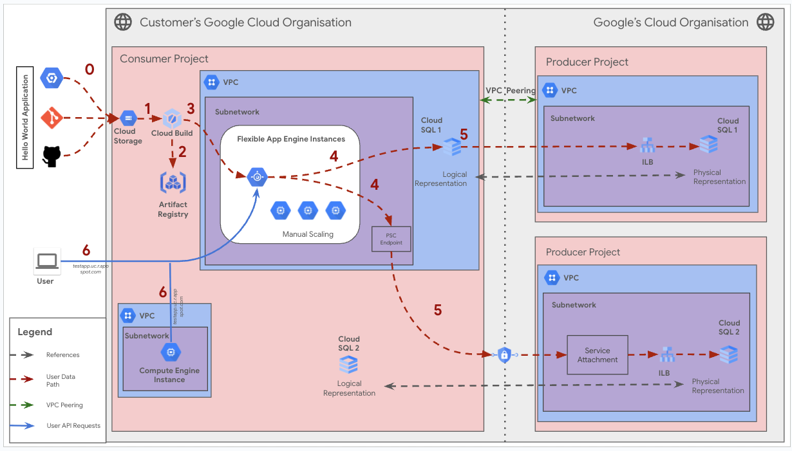

# Create a Flexible App Engine 

**On this page**

- [Introduction](#introduction)

- [Objectives](#objectives)

- [Architecture](#architecture)

  - [Request flow](#request-flow)

  - [Architecture Components](#architecture-components)

- [Deploy the solution](#deploy-the-solution)

  - [Prerequisites](#prerequisites)

  - [Deploy through “terraform-cli”](#deploy-through-terraform-cli)

- [Submit feedback](#submit-feedback)

### Introduction

This document provides guidance on configuring and deploying an application to **Google App Engine Flexible**, focusing on managing outbound network traffic. App Engine Flexible provides a more customizable environment than App Engine Standard, allowing you to run containerized applications with custom runtimes and access to underlying virtual machine instances. For controlling outbound connections, App Engine Flexible applications deployed within a VPC network can directly access resources in that VPC, and also access peered VPC networks. This guide outlines key architecture components and explains the network traffic flow.

This guide leverages the **CNCS (Cloud Networking Config Solutions)** repository for automated deployment of the App Engine Flexible application and its associated infrastructure.

### Objectives

This solution guide helps you do the following:

*   Understand the architecture of a Google App Engine Flexible application.
*   Learn about App Engine Flexible instances and their configurations.
*   Understand how App Engine Flexible applications interact with VPC networks and peered VPCs.
*   Visualize the request flow for accessing resources within and outside the VPC.
*   Deploy the application and infrastructure using the CNCS repository.

### Architecture

The architecture for a Google App Engine Flexible environment application utilizes Docker containers running on Google Compute Engine virtual machine instances. This provides greater flexibility in terms of runtime environments and resource configuration compared to App Engine Standard.  App Engine Flexible applications are deployed within a VPC network, enabling direct access to other resources in that VPC and, through VPC Peering, to resources in connected VPCs.

This guide covers the primary scenario for App Engine Flexible:

### Direct VPC and VPC Peering Access:

App Engine Flexible instances, because they reside within a VPC, can directly access other resources within the same VPC subnet.  Additionally, with properly configured VPC Peering, routing, and firewall rules, they can access resources in peered VPCs. This eliminates the need for a Serverless VPC Connector in most cases.

Following is a holistic diagram encompassing the direct VPC and VPC Peering access scenario covered by this solution.



### Request flow

The following illustrates the request processing flow:

1.  **User Request:** An external user sends a request to the application.
2.  **App Engine Load Balancing:** Google's global load balancing infrastructure receives the request and routes it to an available App Engine Flexible instance.
3.  **Cloud Build and Artifact Registry:** During deployment, Cloud Build builds the application's Docker image, triggered by a code push. The image is stored in Artifact Registry.
4.  **App Engine Flexible Instance:**  The request is handled by the application code running within a Docker container on a Compute Engine VM instance managed by App Engine Flexible.
5. **Cloud SQL Instance within same VPC**: If the resource is within the same VPC , the instances can directly connect .
6.  **VPC Peering to reach Cloud SQL Instance:** If the App Engine Flexible instance needs to access a resource in a *peered* VPC (e.g., a Cloud SQL instance in the Producer Project), the traffic flows through the VPC Peering connection.  This requires:
    *   **VPC Peering:** An active VPC peering connection between the customer's VPC and the Producer Project's VPC.
    *   **Routes:** Appropriate routes configured in *both* VPCs.
    *   **Firewall Rules:** Firewall rules in the *target* VPC allowing traffic from the App Engine Flexible instance's subnet.
7.  **Response:** The App Engine Flexible instance sends the response back to the user through the load balancer.
8. **Compute instance and User Request**: The connection for the compute and User request and response.

## Architecture Components

The diagram depicts two environments: the customer's Google Cloud organization (left) and Google's Cloud organization (right).

Within the customer's Google Cloud organization's Consumer Project, the application is deployed to App Engine Flexible. The instances reside within a VPC subnet, providing direct access to other resources in that VPC. The Producer Project contains Cloud SQL instances, accessed via VPC Peering.

The diagram depicts the following architecture components :

* **Flexible App Engine Instances:** A platform for deploying and scaling containerized applications. This version uses the Flexible environment, which runs applications in Docker containers on Compute Engine virtual machines. The diagram also indicates "Manual Scaling" for these instances.
* **VPC Network :** A virtual private cloud network within the customer's Google Cloud project. This network hosts the App Engine Flexible instances and other resources like Compute Engine.
* **Cloud SQL :** A fully managed relational database service. In this setup, it resides in a separate "Producer Project" and is accessed from the "Consumer Project" via PSC.
* **Compute Engine Instance :** Virtual machines hosted on Google Cloud, residing within the consumer's VPC network. It could be used for various auxiliary tasks or as an alternative access point.

The diagram depicts the following numbered flows :

-   **Flow 0:** **Prerequisite** The Code is stored from repositories into the Cloud Storage bucket
-   **Flow 1:** The "Hello World Application" source code is take from the cloud storage to the cloud build.
-   **Flow 2:** Cloud Build builds the Docker image and stores it in Artifact Registry.
-   **Flow 3:** The image is deployed to App Engine Flexible instances (running on Compute Engine VMs).
-   **Flow 4:** App Engine Flexible instances connect directly to resources within the same VPC *or* connect to resources in a peered VPC through the VPC Peering connection.
-   **Flow 5:**  Illustrates the connection from App Engine Flexible, through VPC Peering, to the Cloud SQL instances in the Producer Project (and their internal load balancers).
-   **Flow 6:** User traffic and Compute instances in the same VPC.

### Deploy the solution

This section guides you through the process of deploying the solution.

### Prerequisites

For the common prerequisites for this repository, please refer to the **[prerequisites.md](../prerequisites.md)** guide. Any additional prerequisites specific to this user journey will be listed below.

####

### Deploy through “terraform-cli”

1. **Clone the** cloudnetworking-config-solutions repository repository**:**

    ```
    git clone https://github.com/GoogleCloudPlatform/cloudnetworking-config-solutions.git
    ```

2. Navigate to **cloudnetworking-config-solutions** folder and update the files containing the configuration values
   * **00-bootstrap stage**
     * Update configuration/bootstrap.tfvars **\-** update the google cloud project IDs and the user IDs/groups in the tfvars.

        ```
        bootstrap_project_id                      = "your-project-id"
        network_hostproject_id                    = "your-project-id"
        network_serviceproject_id                 = "your-project-id"
        organization_stage_administrator          = ["user:user-example@example.com"]
        networking_stage_administrator            = ["user:user-example@example.com"]
        security_stage_administrator              = ["user:user-example@example.com"]
        producer_stage_administrator              = ["user:user-example@example.com"]
        producer_connectivity_administrator       = ["user:user-example@example.com"]
        consumer_stage_administrator              = ["user:user-example@example.com"]
        consumer_appengine_administrator          = ["user:user-example@example.com"]
        ```

   * **01-organisation stage**
     * Update configuration/organization.tfvars \- update the google cloud project ID and the list of the APIs to enable for the Flexible App Engine.

        ```
        activate_api_identities = {
        "project-01" = {
            project_id = "your-project-id",  # Replace with your actual project ID
            activate_apis = [
            "appengine.googleapis.com",
            "cloudbuild.googleapis.com",
            "cloudresourcemanager.googleapis.com",
            "iam.googleapis.com",
            "iamcredentials.googleapis.com",  # Service Account Credentials API
            "compute.googleapis.com",
            "artifactregistry.googleapis.com",
            ],
        },
        }
        ```

   * **02-networking stage**
     * Update configuration/networking.tfvars \- update the Google Cloud Project ID and the parameters for additional resources such as VPC, subnet, and NAT as outlined below.

        ```
        project_id = "your-project-id" # Replace with your Google Cloud Project ID
        region     = "us-central1" # Specify the region for your resources

        ## VPC input variables

        network_name = "CNCS_VPC" # Name of the VPC
        subnets = [
          {
            name                  = "CNCS_VPC_Subnet" # Name of the subnet
            ip_cidr_range         = "10.0.0.0/28" # CIDR range for the subnet
            region                = "us-central1" # Region for the subnet
            enable_private_access = true # Set to true to enable Private Google Access (required for Workbench)
          }
        ]

        # Configuration for setting up a Shared VPC Host project, enabling centralized network management and resource sharing across multiple projects.
        shared_vpc_host = false # Set to true if using a Shared VPC Host

        ## PSC/Service Connectivity Variables

        create_scp_policy      = false # Set to true to create a Service Connectivity Policy
        subnets_for_scp_policy = []  # List subnets for the SCP policy in the same region

        ## Cloud NAT input variables

        create_nat = true # Set to true to create a Cloud NAT instance

        ## Cloud HA VPN input variables

        create_havpn = false # Set to true to create a High Availability VPN
        peer_gateways = {
          default = {
            gcp = "" # Specify the peer VPN gateway, e.g., projects/<peer-project-id>/regions/<region>/vpnGateways/<vpn-name>
          }
        }

        tunnel_1_router_bgp_session_range = "169.254.1.0/30" # BGP session range for Tunnel 1
        tunnel_1_bgp_peer_asn             = 64514 # ASN for Tunnel 1 BGP peer
        tunnel_1_bgp_peer_ip_address      = "" # IP address for Tunnel 1 BGP peer
        tunnel_1_shared_secret            = "" # Shared secret for Tunnel 1

        tunnel_2_router_bgp_session_range = "169.254.2.0/30" # BGP session range for Tunnel 2
        tunnel_2_bgp_peer_asn             = 64514 # ASN for Tunnel 2 BGP peer
        tunnel_2_bgp_peer_ip_address      = "" # IP address for Tunnel 2 BGP peer
        tunnel_2_shared_secret            = "" # Shared secret for Tunnel 2

        ## Cloud Interconnect input variables

        create_interconnect = false # Set to true to create a Cloud Interconnect
        ```


   * **06-consumer stage**
     * Update the consumer/Serverless/AppEngine/Flexible/config/instance1.yaml.example file and rename it to instance1.yaml

        ```
        project_id: <project-id> # REPLACE with your project ID
        service: test-service1
        runtime: "python" # Or another supported runtime

        flexible_runtime_settings: # Configure flexible runtime settings
        operating_system: "ubuntu22" 
        runtime_version: "3.12"

        instance_class: F4_1G

        network:
          name: <network-name> # Or your VPC network name
          subnetwork: <subnet-name> #REPLACE

        version_id: "v1"

        automatic_scaling:
          cool_down_period: "120s"
          max_concurrent_requests: 50
          max_total_instances: 10
          min_total_instances: 2

          cpu_utilization:
            target_utilization: 0.6
            aggregation_window_length: "60s"

        entrypoint:
          shell: "pip3 install gunicorn flask && gunicorn -b :8080 main:app" # Example for Python/Gunicorn

        deployment:
          zip: # Alternative deployment method
            source_url: "https://storage.googleapis.com/<bucket-name>/deploy_app.zip"

        liveness_check:
          path: "/live"              # provide valid path for liveness check

        readiness_check:
          path: "/ready"               # provide valid path for readiness check
        ```

3. **Execute the terraform script**
   You can now deploy the stages individually using **run.sh** or you can deploy all the stages automatically using the run.sh file. Navigate to the execution/ directory and run this command to run the automatic deployment using **run.sh .**

      ```
      ./run.sh -s all -t init-apply-auto-approve
      or
      ./run.sh --stage all --tfcommand init-apply-auto-approve
      ```

4. **Verify Flexible App Engine Instance Creation:**
   Once the deployment is complete, navigate to the App Engine section based on the type of instance you created in the Google Cloud Console to confirm that your Flexible App Engine instance  has been successfully created.
5. **Executing your Google Flexible App Engine** - refer [link](https://cloud.google.com/appengine/docs/flexible)


### Optional: Delete the deployment

1. In Cloud Shell or in your terminal, make sure that the current working directory is $HOME/cloudshell\_open/\<Folder-name\>/execution. If it isn't, go to that directory.
2. Remove the resources that were provisioned by the solution guide:

    ```
    ./run.sh -s all -t destroy-auto-approve
    ```

    Terraform displays a list of the resources that will be destroyed.

3. When you're prompted to perform the actions, enter yes.

### Submit feedback

For common troubleshooting steps and solutions, please refer to the **[troubleshooting.md](../troubleshooting.md)** guide.

To provide feedback, please follow the instructions in our **[submit-feedback.md](../submit-feedback.md)** guide.
