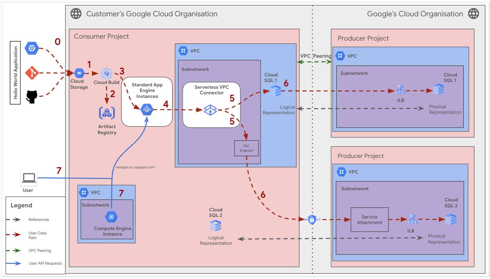

# Create a Standard App engine with Serverless VPC connector

**On this page**

- [Introduction](#introduction)

- [Objectives](#objectives)

- [Architecture](#architecture)

  - [Request flow](#request-flow)

  - [Architecture Components](#architecture-components)

- [Deploy the solution](#deploy-the-solution)

  - [Prerequisites](#prerequisites)

  - [Deploy through “terraform-cli”](#deploy-through-terraform-cli)

- [Submit feedback](#submit-feedback)

### Introduction

This document provides guidance on configuring and deploying an application to **Google App Engine Standard environment**, focusing on managing outbound network traffic. App Engine Standard offers a fully managed, serverless environment for building scalable applications. For controlling outbound connections, the primary method is using a **Serverless VPC Connector**, which allows secure access to resources within a Virtual Private Cloud (VPC). This guide also briefly covers a less common scenario involving access to resources in peered VPCs, which has limitations. The document outlines key architecture components and explains how each outbound traffic scenario works.

This guide leverages the **CNCS (Cloud Networking Config Solutions)** repository for automated deployment of the App Engine Standard application and its associated infrastructure.

### Objectives

This solution guide helps you do the following:

*   Understand the architecture of a Google App Engine Standard application.
*   Learn about App Engine Standard instances [App Engine Standard](https://cloud.google.com/appengine/docs/standard) and their configurations.
*   Learn about [Serverless VPC Access](https://cloud.google.com/vpc/docs/serverless-vpc-access) and how it enables secure connections to VPC resources.
*   Understand the limitations of accessing resources in peered VPCs from App Engine Standard.
*   Visualize the request flow for different networking scenarios.
*   Deploy the application and infrastructure using the CNCS repository.

### Architecture

The architecture for a Google App Engine Standard environment application is designed to offer a fully managed, serverless platform for building and deploying scalable web applications and backends.  It automatically handles infrastructure concerns like scaling, patching, and server management.  This allows developers to focus solely on writing code. Networking can be configured to connect to resources within a Virtual Private Cloud (VPC) using a **Serverless VPC Connector**, or in certain cases, access resources in peered VPCs.

This guide covers the primary scenario for App Engine Standard:

### Serverless VPC Connector and PSC:

*   **Serverless VPC Connector:** Serverless VPC Access uses a connector to route traffic between your App Engine Standard environment and a VPC network. The connector is associated with a specific VPC and region. This enables secure access to internal resources (like Cloud SQL instances) for outbound traffic from the App Engine application. This is the primary method for connecting to resources *within the same project*.

Following is a holistic diagram encompassing both the Serverless VPC Connector and VPC Peering (limited access) scenarios covered by this solution.



### Request flow

The following illustrates the request processing flow for both scenarios:

1.  **User Request:** An external user sends a request to the application's URL (e.g., `your-app-id.appspot.com`).
2.  **App Engine Load Balancing:** Google's global load balancing infrastructure receives the request and routes it to an available App Engine instance.
3.  **Cloud Build and Artifact Registry:** During the Deployment phase, the source code goes through Cloud Build, which is triggered by event triggers. Artifact Registry stores the built images.
4.  **App Engine Instance:** The App Engine instance (running your application code) handles the request.
5.  **Serverless VPC Connector:** If the application needs to access resources within your VPC (e.g., a Cloud SQL database in the *same* project), the traffic is routed through the Serverless VPC Connector. This connector acts as a bridge between the serverless App Engine environment and any other resource that is contained in consumer vpc .
6.  **Cloud SQL (or other VPC resource):** The application communicates with the Cloud SQL instance (or other resources) within the VPC, through the established secure connection. The request is directed towards the cloud sql via the service attachement and psc endpoint .
7. **Compute Engine Instance**: The other compute engine instances running with the same VPC.
8.  **Response:** The App Engine instance sends the response back to the user through the load balancer.

### Architecture Components

The diagram depicts two environments: the customer's Google Cloud organization (left) and Google's Cloud organization (right).

Within the customer's Google Cloud organization's Consumer Project, the application is deployed to App Engine Standard.  A Serverless VPC Connector *can* be configured. The Producer Project contains Cloud SQL instances, which can be accessed via VPC Peering or PSC endpoint.

The diagram depicts the following architecture components :

* **Standard App Engine Instances:** A fully managed, serverless platform for developing and hosting web applications. These instances run the application code.
* **Serverless VPC Connector:** Enables App Engine Standard environment services to connect to resources in a VPC network without exposing them to the public internet.
* **VPC Network :** A virtual private cloud network within the customer's Google Cloud project. This network hosts the App Engine instances and potentially other resources like Compute Engine.
* **Cloud SQL :** A fully managed relational database service. In this setup, it resides in a separate "Producer Project" and is accessed from the "Consumer Project" via PSC.
* **Compute Engine Instance :** Virtual machines hosted on Google's infrastructure. In this diagram, it appears to be another resource within the consumer's VPC, potentially for other workloads or as an alternative access point.

The diagram depicts the following numbered flows :

-   **Flow 0:** **Prerequisite** The Code is stored from repositories into the Cloud Storage bucket
-   **Flow 1:** The "Hello World Application" source code is take from the cloud storage to the cloud build.
-   **Flow 2:** Cloud Build builds the application and stores the artifact in Artifact Registry.
-   **Flow 3:** The artifact is deployed to App Engine Standard instances.
-   **Flow 4:**  App Engine instances connect via the Serverless VPC Connector (Scenario 1) *or* attempt to connect via VPC Peering (Scenario 2).
-   **Flow 5:**  Traffic, via the Connector  then goes though *either* PSC endpoint(Scenario 1) *or* via VPC Peering (Scenario 2, limited), reaches the Cloud SQL instance in the Producer Project.
-   **Flow 6:** Illustrates the connection between the Cloud SQL instance in the producer project and its internal load balancer, using a Service Attachment. This is accessed via VPC Peering.
-    **Flow 7** User Traffic and Compute instances within the same VPC.
-   **User API Requests:** The blue arrows represent user requests.

### Deploy the solution

This section guides you through the process of deploying the solution.

### Prerequisites

For the common prerequisites for this repository, please refer to the **[prerequisites.md](../prerequisites.md)** guide. Any additional prerequisites specific to this user journey will be listed below.

####

### Deploy through “terraform-cli”

1. **Clone the** cloudnetworking-config-solutions repository repository **:**

    ```
    git clone https://github.com/GoogleCloudPlatform/cloudnetworking-config-solutions.git
    ```

2. Navigate to **cloudnetworking-config-solutions** folder and update the files containing the configuration values
   * **00-bootstrap stage**
     * Update configuration/bootstrap.tfvars **\-** update the google cloud project IDs and the user IDs/groups in the tfvars.

        ```
        bootstrap_project_id                      = "your-project-id"
        network_hostproject_id                    = "your-project-id"
        network_serviceproject_id                 = "your-project-id"
        organization_stage_administrator          = ["user:user-example@example.com"]
        networking_stage_administrator            = ["user:user-example@example.com"]
        security_stage_administrator              = ["user:user-example@example.com"]
        producer_stage_administrator              = ["user:user-example@example.com"]
        producer_connectivity_administrator       = ["user:user-example@example.com"]
        consumer_stage_administrator              = ["user:user-example@example.com"]
        consumer_appengine_administrator          = ["user:user-example@example.com"]
        ```

   * **01-organisation stage**
     * Update configuration/organization.tfvars \- update the google cloud project ID and the list of the APIs to enable for the Standard App Engine.

        ```
        activate_api_identities = {
        "project-01" = {
            project_id = "your-project-id",  # Replace with your actual project ID
            activate_apis = [
            "appengine.googleapis.com",
            "cloudbuild.googleapis.com",
            "cloudresourcemanager.googleapis.com",
            "iam.googleapis.com",
            "iamcredentials.googleapis.com",  # Service Account Credentials API
            "compute.googleapis.com",
            "artifactregistry.googleapis.com",
            ],
        },
        }
        ```

   * **02-networking stage**
     * Update configuration/networking.tfvars \- update the Google Cloud Project ID and the parameters for additional resources such as VPC, subnet, and NAT as outlined below.

        ```
        project_id = "your-project-id" # Replace with your Google Cloud Project ID
        region     = "us-central1" # Specify the region for your resources

        ## VPC input variables

        network_name = "CNCS_VPC" # Name of the VPC
        subnets = [
          {
            name                  = "CNCS_VPC_Subnet" # Name of the subnet
            ip_cidr_range         = "10.0.0.0/28" # CIDR range for the subnet
            region                = "us-central1" # Region for the subnet
            enable_private_access = true # Set to true to enable Private Google Access (required for Workbench)
          }
        ]

        # Configuration for setting up a Shared VPC Host project, enabling centralized network management and resource sharing across multiple projects.
        shared_vpc_host = false # Set to true if using a Shared VPC Host

        ## PSC/Service Connectivity Variables

        create_scp_policy      = false # Set to true to create a Service Connectivity Policy
        subnets_for_scp_policy = []  # List subnets for the SCP policy in the same region

        ## Cloud NAT input variables

        create_nat = true # Set to true to create a Cloud NAT instance

        ## Cloud HA VPN input variables

        create_havpn = false # Set to true to create a High Availability VPN
        peer_gateways = {
          default = {
            gcp = "" # Specify the peer VPN gateway, e.g., projects/<peer-project-id>/regions/<region>/vpnGateways/<vpn-name>
          }
        }

        tunnel_1_router_bgp_session_range = "169.254.1.0/30" # BGP session range for Tunnel 1
        tunnel_1_bgp_peer_asn             = 64514 # ASN for Tunnel 1 BGP peer
        tunnel_1_bgp_peer_ip_address      = "" # IP address for Tunnel 1 BGP peer
        tunnel_1_shared_secret            = "" # Shared secret for Tunnel 1

        tunnel_2_router_bgp_session_range = "169.254.2.0/30" # BGP session range for Tunnel 2
        tunnel_2_bgp_peer_asn             = 64514 # ASN for Tunnel 2 BGP peer
        tunnel_2_bgp_peer_ip_address      = "" # IP address for Tunnel 2 BGP peer
        tunnel_2_shared_secret            = "" # Shared secret for Tunnel 2

        ## Cloud Interconnect input variables

        create_interconnect = false # Set to true to create a Cloud Interconnect
        ```


   * **06-consumer stage**
     * Update the consumer/Serverless/AppEngine/Standard/config/instance1.yaml.example file and rename it to instance.yaml

        ```
        project_id: <project_id>  # REPLACE with your actual project ID
        service: service-one      # Service name
        version_id: v1            # Version ID
        runtime: python39         # Runtime environment as per you code

        # --- Deployment (using a ZIP file) ---
        deployment:
          files:
            name: <filename>                                             # File name of the file eg. app.yaml
            source_url: "https://storage.googleapis.com/<remaining url>" # Public url of the code file hosted in the cloud storage bucket

        # --- Entrypoint (for Python/Flask with Gunicorn) ---
        entrypoint:
          shell: "python main.py"  #As per your code requirements

        # --- Instance Class (override module default) ---
        instance_class: B2

        # --- Manual Scaling ---
        manual_scaling:
          instances: 3

        handlers:
          - url_regex: "/.*"
            script:
              script_path: "auto"

        delete_service_on_destroy: true

        ```

3. **Execute the terraform script**
   You can now deploy the stages individually using **run.sh** or you can deploy all the stages automatically using the run.sh file. Navigate to the execution/ directory and run this command to run the automatic deployment using **run.sh .**

      ```
      ./run.sh -s all -t init-apply-auto-approve
      or
      ./run.sh --stage all --tfcommand init-apply-auto-approve
      ```

4. **Verify Standard App Engine Instance Creation:**
   Once the deployment is complete, navigate to the App Engine section and based on the type of instance you created in the Google Cloud Console to confirm that your Standard App Engine instance  has been successfully created.
5. **Executing your Google Standard App Engine** - refer [link](https://cloud.google.com/appengine/docs/standard)


### **Optional: Delete the deployment**

1. In Cloud Shell or in your terminal, make sure that the current working directory is $HOME/cloudshell\_open/\<Folder-name\>/execution. If it isn't, go to that directory.
2. Remove the resources that were provisioned by the solution guide:

    ```
    ./run.sh -s all -t destroy-auto-approve
    ```

    Terraform displays a list of the resources that will be destroyed.

3. When you're prompted to perform the actions, enter yes.

### **Submit feedback**

For common troubleshooting steps and solutions, please refer to the **[troubleshooting.md](../troubleshooting.md)** guide.

To provide feedback, please follow the instructions in our **[submit-feedback.md](../submit-feedback.md)** guide.
