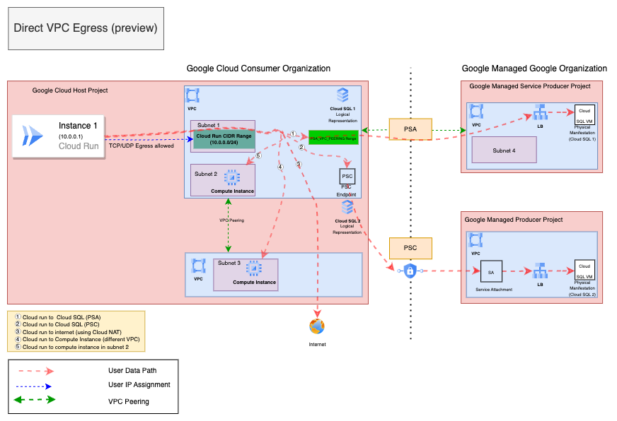

# Create a Cloud Run Job Instance with VPC Direct Egress

**On this page**

- [Introduction](#introduction)

- [Objectives](#objectives)

- [Architecture](#architecture)

- [Scenarios](#scenarios)

- [Request flow](#request-flow)

- [Architecture Components](#architecture-components)

- [Deploy the solution](#deploy-the-solution)

- [Prerequisites](#prerequisites)

- [Deploy through “terraform-cli”](#deploy-through-terraform-cli)

- [Submit feedback](#submit-feedback)

### Introduction

This document provides guidance on configuring and running a **Cloud Run Job** with a focus on managing outgoing network traffic. Cloud Run offers two primary scenarios for handling outgoing connections: using the **Serverless VPC Connector** and the **VPC Direct Egress** option. The guide outlines key architecture components and explains how each outgoing traffic using VPC Direct Egress works.

This guide provides instructions on using the **cloudnetworking-config-solutions** repository on GitHub to automate creation of Cloud Run Job instances on Google Cloud. Terraform enables you to formalize your infrastructure as code, which facilitates deployment and ensures consistency, even in complex architectures.

### Objectives

This solution guide helps you do the following :

* Set up VPC, Subnets
* Learn about [Cloud Run Job](https://cloud.google.com/run/docs/create-jobs) instance and configurations
* Learn about[ VPC Direct Egress](https://cloud.google.com/run/docs/configuring/vpc-direct-vpc)
* Create a Cloud Run Job and
* Execute the Cloud Run jobs to run your application

### Architecture

The architecture for a Cloud Run Job is designed to offer scalable, stateless containerized workloads that run as jobs, while enabling seamless integration with other Google Cloud services. Depending on your networking requirements, Cloud Run Jobs can be configured to direct outgoing traffic either via a **Serverless VPC Connector** or through **VPC Direct Egress**, providing flexibility in handling internal and external network connections.

### Scenarios

This guide covers two scenarios:

* **Scenario 1: Serverless VPC Connector :** Serverless VPC Access uses a connector to route traffic between your serverless environment and a VPC network. When created, the connector is tied to a specific VPC and region, enabling secure access to internal resources for outbound traffic from serverless services.

* **Scenario 2: VPC Direct Egress :** allows Cloud Run services or jobs to send traffic to a VPC network without a connector, simplifying setup. It reduces costs, enhances security with network tags, and improves performance with lower latency and higher throughput.


### Request flow

The following illustrates the request processing flow for both scenarios:

1. **Scenario 1: Serverless VPC Connector:**  When a Cloud Run Job is triggered, its outgoing traffic is routed through the Serverless VPC Connector, enabling secure communication with resources reachable to this VPC, such as databases or on-prem systems connected via VPN. This configuration ensures that sensitive data stays within Google Cloud’s private network, with no exposure to the public internet, making it ideal for jobs requiring access to internal services.

2. **Scenario 2: VPC Direct Egress:** Cloud Run Jobs send outgoing traffic directly to the internet using the VPC Direct Egress configuration, providing greater control over routing to external destinations. When a job is triggered, its traffic is routed directly from the VPC to other services, APIs, or third-party endpoints. A CIDR range in the form of a subnet is created in the VPC, and each job instance picks an IP address from this range, allowing the job to act as a resource within the VPC and access resources reachable to that subnet.

## **Architecture Components**

Following is a holistic diagram encompassing VPC Direct Egress scenario covered by the solution.

The diagram depicts two environments: the Google Cloud consumer organization (left box), and the Google-managed google organization (right box).

  

Within the Google Cloud consumer organization's host project, the VPC network and subnets are defined. When configuring a Cloud Run Job instance, you specify this network and subnet, enabling the job to utilize an IP address from the designated subnet's CIDR range during each execution. This effectively grants the cloud run job access to resources that are reachable or accessible to any other resource present in that VPC.

The diagram depicts five flows:
- **Flow 1** shows Cloud Run connecting to Cloud SQL via Private Service Access (PSA).
- **Flow 2** illustrates Cloud Run accessing Cloud SQL through Private Service Connect (PSC).
- **Flow 3** represents Cloud Run communicating with the internet using Cloud NAT.
- **Flow 4** depicts Cloud Run connecting to a Compute Instance in a different VPC and
- **Flow 5** shows Cloud Run accessing a Compute Instance in subnet 2.

## **Deploy the solution**

This section guides you through the process of deploying the solution.

### **Prerequisites**

For the common prerequisites for this repository, please refer to the **[prerequisites.md](../prerequisites.md)** guide. Any additional prerequisites specific to this user journey will be listed below.

####

### Deploy through “terraform-cli”

1. **Clone the** cloudnetworking-config-solutions repository repository**:**

    ```
    git clone https://github.com/GoogleCloudPlatform/cloudnetworking-config-solutions.git
    ```

2. Navigate to **cloudnetworking-config-solutions** folder and update the files containing the configuration values
   * **00-bootstrap stage**
     * Update configuration/bootstrap.tfvars **\-** update the google cloud project IDs and the user IDs/groups in the tfvars.

        ```
        bootstrap_project_id                      = "your-project-id"
        network_hostproject_id                    = "your-project-id"
        network_serviceproject_id                 = "your-project-id"
        organization_stage_administrator          = ["user:user-example@example.com"]
        networking_stage_administrator            = ["user:user-example@example.com"]
        security_stage_administrator              = ["user:user-example@example.com"]
        producer_stage_administrator              = ["user:user-example@example.com"]
        producer_connectivity_stage_administrator = ["user:user-example@example.com"]
        consumer_stage_administrator              = ["user:user-example@example.com"]
        ```

   * **01-organisation stage**
     * Update configuration/organization.tfvars \- update the google cloud project ID and the list of the APIs to enable for the AlloyDB cluster.

        ```
        activate_api_identities = {
          "project-01" = {
            project_id = "your-project-id",
            activate_apis = [
              "servicenetworking.googleapis.com",
              "run.googleapis.com",
              "iam.googleapis.com",
              "compute.googleapis.com",
              ],
          },
        }
        ```

   * **02-networking stage**
     * Update configuration/networking.tfvars \- update the Google Cloud Project ID and the parameters for additional resources such as VPC, subnet, and NAT as outlined below.

        ```
        project_id  = "your-project-id",
        region      = "us-central1"

        ## VPC input variables
        network_name = "CNCS_VPC"
        subnets = [
          {
            ip_cidr_range = "10.0.0.0/24"
            name          = "CNCS_VPC_Subnet_1"
            region        = "us-central1-a"
          }
        ]
        psa_range_name    = range1
        psa_range         = "10.0.64.0/20"

        ## PSC/Service Connectivity Variables
        create_scp_policy  = false

        ## Cloud Nat input variables
        create_nat = true
        ## Cloud HA VPN input variables
        create_havpn = false
        ```


   * **06-consumer stage**
     * Update the configuration/06-consumer/CloudRun/Job/config/instance.yaml.example file and rename it to instance.yaml

        ```
        project_id: your-project-id
        region: us-central1
        name: CNCS-cloudrun-instance
        launch_stage: BETA
        containers:
        container-name:
          image: us-docker.pkg.dev/cloudrun/container/hello
        revision:
        vpc_access:
          egress: ALL_TRAFFIC
          network: CNCS_VPC
          subnetwork: CNCS_VPC_Subnet_1
        ```

3. **Execute the terraform script**
   You can now deploy the stages individually using **run.sh** or you can deploy all the stages automatically using the run.sh file. Navigate to the execution/ directory and run this command to run the automatic deployment using **run.sh .**

      ```
      ./run.sh -s all -t init-apply-auto-approve
      or
      ./run.sh --stage all --tfcommand init-apply-auto-approve
      ```

4. **Verify Cloud Run Instance Creation:**
   Once the deployment is complete, navigate to the Cloud Run Job section based on the type of instance you created in the Google Cloud Console to confirm that your cloud run instance  has been successfully created.
5. **Executing your Google Cloud Run Jobs** - refer [link]([https://cloud.google.com/run/docs/execute/jobs](https://cloud.google.com/run/docs/execute/jobs))


## **Optional: Delete the deployment**

1. In Cloud Shell or in your terminal, make sure that the current working directory is $HOME/cloudshell\_open/\<Folder-name\>/execution. If it isn't, go to that directory.
2. Remove the resources that were provisioned by the solution guide:

    ```
    ./run.sh -s all -t destroy-auto-approve
    ```

    Terraform displays a list of the resources that will be destroyed.

3. When you're prompted to perform the actions, enter yes.

## **Submit feedback**

For common troubleshooting steps and solutions, please refer to the **[troubleshooting.md](../troubleshooting.md)** guide.

To provide feedback, please follow the instructions in our **[submit-feedback.md](../submit-feedback.md)** guide.
