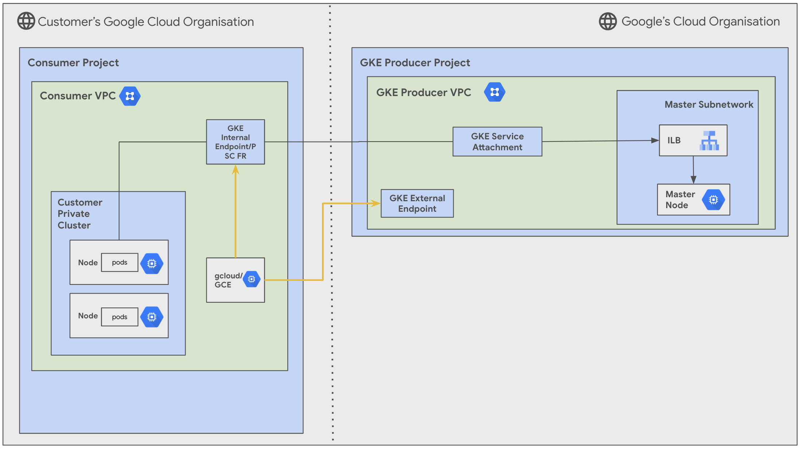

Simplified Google Kubernetes Engine Deployment with Google Compute Engine Access
---

**On this page**

  [Introduction](#introduction)

  [Objectives](#objectives)

  [Architecture Components](#architecture-components)

  [Request Flow](#request-flow)

  [Deploy the solution](#deploy-the-solution)

  [Prerequisites](#prerequisites)

  [Deploy using terraform-cli](#deploy-using-terraform-cli)

  [Optional:Delete the deployment](#optional-delete-the-deployment)

  [Known Issues](#known-issues)

  [Troubleshoot Errors](#troubleshoot-errors)

  [Submit feedback](#submit-feedback)

Introduction
---

This guide provides a comprehensive walkthrough for deploying a GKE cluster in your Google Cloud Platform (GCP) environment and connecting it to Google Compue Engine instance for easy cluster management. Google Kubernetes Engine (GKE) is a managed Kubernetes service that allows you to easily deploy and manage containerized applications in the cloud. Google Compute Engine (GCE) is a managed infrastructure service that provides virtual machines (VMs) and other compute resources. By combining Google Kubernetes Engine with Google Compue Engine, you can gain the flexibility and scalability of containers with the reliability and performance of dedicated compute resources.

Objectives
---

The objective of this guide is to cover everything from setting up your GKE cluster to deploying your first application or accessing your GKE cluster using GCE, and we'll provide clear instructions and code examples along the way.

We'll provide clear instructions and code examples to ensure a smooth and successful deployment. While going through each stage, please ensure that you have the necessary permissions required. The stages are:

* Bootstrap stage :  Granting the required IAM permissions to your service accounts.  
* Organization stage : Enabling the necessary APIs for Google Kubernetes Engine and related services.  
* Networking stage : Creating a Virtual Private Cloud (VPC) for your Google Kubernetes Engine cluster. Defining subnets for your nodes and services.  
* Security stage : Create firewall rules for your Google Compute Engine instance
* Producer stage : Provisioning your Google Kubernetes Engine cluster with desired configurations (e.g., machine type, node pools, autoscaling)
* Producer Connectivity : **skipped**  
* Consumer stage : Provisioning your Google Compute Engine instance with desired configurations (e.g., machine type, attached disks)

Throughout each stage, we'll provide guidance on recommended variables and configurations to tailor the deployment to your specific needs.

Let's get started\!


Architecture Components
---

  

This solution will guide you how to establish a connection to a GKE cluster from a Google Compute Engine (GCE) instance.

The main components that are deployed in this architecture are the following : 

1. **Consumer Google Kubernetes Engine Project & Virtual Private Cloud**  
2. **Producer Google Kubernetes Engine Project & Virtual Private Cloud**  
3. **Google Kubernetes Engine Cluster : Google Kubernetes Engine Nodes & Pods**  
4. **Google Kubernetes Engine Internal Endpoint**  
5. **Google Compute Engine instance**

This digram depicts network traffic flow for a GKE private cluster using Private Service Connect: from the customer's cluster nodes to the GKE master node within Google's managed project, using internal and/or external endpoints. It also shows how a Google Compute Engine (GCE) connects to GKE cluster from the same VPC as the internal endpoint.

Request Flow  
---

The request processing flow for the deployed topology, which allows the Google Compute Engine instance to interact with the Google Kubernetes cluster, is as follows:

1. User connect to the Google Compute Engine instance using SSH.
2. The Google Compute Engine instance forwards the request to the Google Kubernetes Engine cluster's internal endpoint.
3. The Google Kubernetes Engine cluster's internal endpoint sends the request to the Service Attachment of the Google Kubernetes cluster.
4. From the service attachment, the request is distributed to one of the nodes in the cluster by a load balancer.
    a. The node forwards the request to one of the pods that is running the application.
    b. The pod processes the request and sends a response back to the node.
    c. The node forwards the response back to the Google Compute Engine instance.

Deploy the solution  
---

Here’s a guide to configure tfvars for each stage and then use run.sh to automatically deploy the solution.


Prerequisites
---

For the common prerequisites for this repository, please refer to the **[prerequisites.md](../prerequisites.md)** guide. Any additional prerequisites specific to this user journey will be listed below.

Deploy through terraform-cli
---

1. **Clone the** cloudnetworking-config-solutions repository repository:

    ```
    git clone https://github.com/GoogleCloudPlatform/cloudnetworking-config-solutions.git
    ```

2. Navigate to the configuration/ directory and use the following tfvars for reference for in-place modifications. 

**Bootstrap stage** : 

* You will need to create a service account with the necessary permissions to be able to create Google Kubernetes Engine cluster and Google Compute Engine instance.
* Add the following project IDs and user IDs/groups in the tfvars file at configuration/bootstrap.tfvars.

```c
bootstrap_project_id                      = "your-project-id"
network_hostproject_id                    = "your-project-id"
network_serviceproject_id                 = "your-project-id"
organization_stage_administrator          = ["user:user-example@example.com"]
networking_stage_administrator            = ["user:user-example@example.com"]
security_stage_administrator              = ["user:user-example@example.com"]
producer_stage_administrator              = ["user:user-example@example.com"]
producer_connectivity_stage_administrator = ["user:user-example@example.com"]
consumer_stage_administrator              = ["user:user-example@example.com"]
```

**Organisation Stage** : 

* You will need to enable the required APIs for Google Compute Engine and Google Kubernetes Engine.
* Add your project ID here in which you wish to enable the APIs for Google Kubernetes Engine Clusters in the tfvars file at configuration/organisation.tfvars.

```
activate_api_identities = {
  "project-01" = {
    project_id = "your-project-id",
    activate_apis = [
       "servicenetworking.googleapis.com",
       "iam.googleapis.com",
       "compute.googleapis.com",
       "container.googleapis.com"
    ],
  },
}
```

**Networking Stage** : 

* You will need to create the required Virtual Private Cloud (VPC), subnets & IP ranges for Google Kubernetes Engine clusters & Google Compute Engine instance.
* Add your project ID here in which you wish to create the VPC, Subnet and NAT for Google Kubernetes Engine Clusters & Google Compute Engine instance in the tfvars file at configuration/networking.tfvars.

```c

project_id = "your-project-id"

region     = "us-central1"

## VPC input variables

network_name = "CNCS_VPC"
subnets = [
  {
    ip_cidr_range = "10.0.0.0/24"
    name          = "CNCS_VPC_Subnet_1"
    region        = "us-west1-a"
    secondary_ip_ranges = {
        ip_range_pods = "192.168.0.0/16"
        ip_range_services = "192.169.0.0/24"
      }
  }
]

# PSC/Service Connecitvity Variables

create_scp_policy      = false
subnets_for_scp_policy = [""]

## Cloud Nat input variables

create_nat = true

## Cloud HA VPN input variables

create_havpn = false
```

**Security Stage** : 

**NOTE : GKE Firewall rules are automatically created, as a user you wouldn’t need to create new firewall rules.**

* You might need to configure firewall rules to allow traffic between your GKE cluster and GCE instance.
* Use the same project ID as used above for enabling APIs and creation of networking resources. This stage should create the necessary firewall rules for GCE security in the tfvars file at configuration/security/gce.tfvars.

For Google Compute Engine : 

```
project_id = "your-project-id"

name = "CNCS_VPC"
ingress_rules = [
  {
    name        = "allow-ssh-custom-ranges"
    description = "Allow SSH access from specific networks"
    priority    = 1000
    source_ranges = [
      "", # Source ranges such as "192.168.1.0/24" or "10.0.0.0/8"
    ]
    target_tags = ["ssh-allowed", "https-allowed"]
    allow = [{
      protocol = "tcp"
      ports    = ["22", "443"]
    }]
  }
]
```

**Producer Stage** : 

* You will need to create configuration YAML files for creation of Google Kubernetes Engine clusters.
* Use the same project ID as used above for the creation of the Google Kubernetes Engine cluster in the YAML file at configuration/producer/GKE/config/instance1.yaml.

```c

project_id: your-project-id

name : gke-CNCS-cluster
network : CNCS_VPC
subnetwork : CNCS_VPC_Subnet_1
ip_range_pods : gke-cluster-range-for-pods
ip_range_services : gke-cluster-range-for-services
kubernetes_version : 1.29

```

**Consumer Stage** : 

* You will need to create configuration YAML files for creation of Google Compute Engine clusters.
* Use the same project ID as used above for the creation of the Google Compute Engine cluster in the YAML file at configuration/consumer/GCE/instance1.yaml.

```c
project_id: your-project-id

name: CNCS_GCE_instance
region : us-central1
zone: us-central1-a
image: ubuntu-os-cloud/ubuntu-2204-lts
network: projects/your-project-id/global/networks/CNCS_VPC
subnetwork: projects/your-project-id/regions/us-central1/subnetworks/CNCS_VPC_Subnet_1
```

3. Now, navigate to the execution/ directory and run this command to run the automatic deployment using run.sh : 

```c
sh run.sh -s all -t init-apply
```

Here, \-s flag with all values will run all stages and \-t flag with value init-apply will ask terraform to use init and apply steps.

This solution shall help your applications on GKE connect to persistent storage resources on GCE. Once your deployment is complete, you can deploy containerized applications to your GKE cluster. This can be done through various methods, such as:

* **kubectl:** Use the `kubectl` command-line tool to deploy your applications from YAML manifests or Helm charts.
* **gcloud:** Use the `gcloud` command-line tool to deploy your applications from pre-built images or Dockerfiles.
* **Google Cloud Console:** Use the Google Cloud Console to deploy your applications from a variety of sources, including source code, Docker images, and pre-built packages.

**Now, to connect to your newly created Google Kubernetes Clusters:**

You can connect to your GKE cluster using the following methods:

* **gcloud CLI:** Use the `gcloud container clusters get-credentials` command to configure your `kubectl` to interact with your cluster.
* **kubectl:** Once your `kubectl` is configured, you can use it to interact with your cluster, deploy applications, and manage resources.
* **Cloud Console:** Access your GKE cluster through the Google Cloud Console to view its status, manage resources, and troubleshoot issues.

To learn more about connecting to GKE clusters go through our [public documentation](https://cloud.google.com/kubernetes-engine/docs/how-to/cluster-access-for-kubectl).

Optional-Delete the deployment
---

Once you’re done with using the environment, you can destroy the resources using the [run.sh](http://run.sh) automated script with this command from parent folder : 

```c
sh run.sh -s all -t destroy
```

Before destroying, ensure that if you’d any critical data/applications you’ve safely moved them.

Known Issues  
---

No known issues for this example at the moment, however if you run into any issues please feel free to create an issue/bug in this repository. 

Troubleshoot Errors
---
For common troubleshooting steps and solutions, please refer to the **[troubleshooting.md](../troubleshooting.md)** guide.

Submit feedback  
---

To provide feedback, please follow the instructions in our **[submit-feedback.md](../submit-feedback.md)** guide.