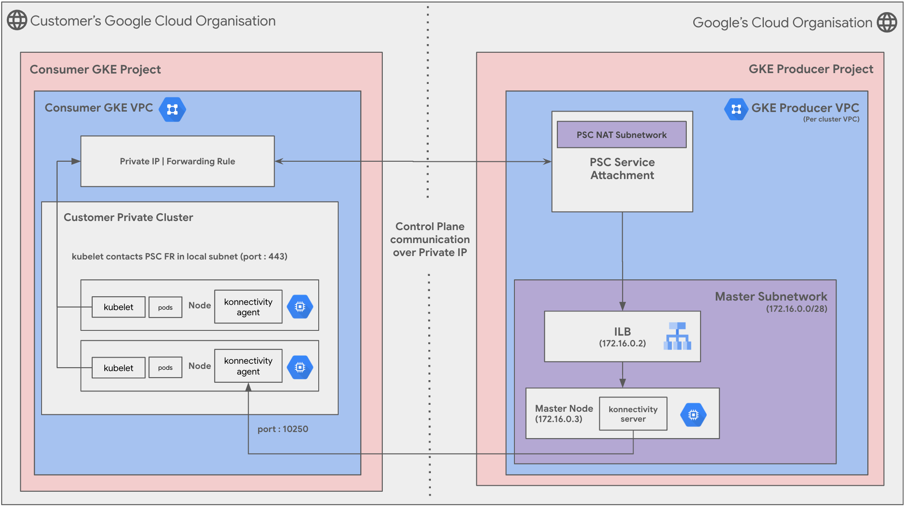
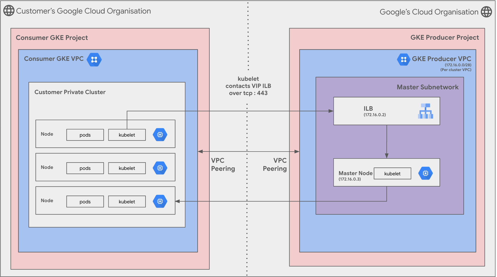

Create a Google Kubernetes Engine Cluster with different control plane connectivity options
---
**On this page**

  [Introduction](#introduction)

  [Objectives](#objectives)

  [Architecture](#architecture)

  [Request flow](#request-flow)

  [Prerequisites](#prerequisites)

  [Deploy the solution](#deploy-the-solution)

  [Optional:Delete the deployment](#optional-delete-the-deployment)

  [Known Issues](#known-issues)

  [Troubleshoot Errors](#troubleshoot-errors)

  [Submit feedback](#submit-feedback)

Introduction
---

Google Kubernetes Engine (GKE) is a fully managed, production-grade container orchestrator that allows you to deploy and manage container-based applications on Google Cloud Platform (GCP). Recently, GKE introduced enhanced control plane connectivity options, providing heightened security and improved network management for your clusters.

GKE now offers enhanced control plane connectivity, allowing you to access your cluster's control plane through private endpoints within your Virtual Private Cloud (VPC). This new model significantly improves security by eliminating public exposure of the control plane, ensuring that all communication remains within your private network. It also simplifies network management and can enhance network performance. 

**Legacy Control Plane Connectivity**

Traditionally, GKE clusters had their control plane components, such as the API server and etcd, exposed to the public internet through Cloud Load Balancers. While this allowed for remote access to the cluster, it also posed a potential security risk as the control plane was accessible from outside the VPC.

**Enhanced Control Plane Connectivity**

GKE's new control plane connectivity model eliminates public exposure by allowing you to access the control plane components through private endpoints within your VPC. This provides several advantages:

* **Enhanced Security:** By keeping all communication within your private network, you eliminate the risk of unauthorized access to the control plane from external sources.
* **Simplified Network Management:** With private endpoints, you can manage all network access to your GKE cluster through VPC rules and firewall policies, providing a more centralized and simplified approach to security.
* **Improved Network Performance:** By avoiding public internet traffic, communication between your cluster and the control plane can benefit from reduced latency and increased throughput.

**Differences between PSC cluster and Regular Public Clusters**

- Internally, PSC based cluster behaves as Private Cluster except it uses PSC infrastructure for master <-> node communication instead of VPC Peering.

- The kubelet config on each node is configured to reach the Master via the PSC forwarding rule which will be an internal RFC 1918 address from cluster's subnetwork.

- There are no special firewall rules on customer's network. Everyone in the customer's network is able to reach master, unless customer created egress deny rule manually.

**Differences between PSC and VPC Peering Private Cluster**

- PSC infrastructure for master <-> node communication instead of VPC Peering.

- The kubelet config on each node is configured to reach the Master via the PSC forwarding rule which will be an internal RFC 1918 address from customer's subnetwork.

- There are no special firewall rules on customer's network (for meantime). Everyone in the customer's network is able to reach master, unless customer created egress deny rule manually.

To read more about Private Service Connect, read our [public documentation](https://cloud.google.com/vpc/docs/private-service-connect). Private clusters version 1.29+ use Private Service Connect for cluster communication. [Release Notes](https://cloud.google.com/kubernetes-engine/docs/release-notes#March_11_2024)

Objectives
---

We'll provide clear instructions and code examples to ensure a smooth and successful deployment. While going through each stage, please ensure that you have the necessary permissions required. We’d be creating this GKE cluster with GKE’s new control plane connectivity as shared in [Google Cloud’s blog](https://cloud.google.com/blog/products/containers-kubernetes/understanding-gkes-new-control-plane-connectivity). The stages are:

* Bootstrap stage :  Granting the required IAM permissions to your service accounts.  
* Organization stage : Enabling the necessary APIs for Google Kubernetes Engine and related services.  
* Networking stage : Creating a Virtual Private Cloud (VPC) for your Google Kubernetes Engine cluster. Defining subnets for your nodes and services.  
* Security stage : **skipped**  
* Producer stage : Provisioning your Google Kubernetes Engine cluster with desired configurations (e.g., machine type, node pools, autoscaling)
* Producer Connectivity : **skipped**  
* Consumer stage : **skipped**  

Throughout each stage, we'll provide guidance on recommended variables and configurations to tailor the deployment to your specific needs.

Let's get started\!

Architecture
---



(**Scenario-1 : PSC Control Plane communication**)



(**Scenario-2 : PSA Control Plane communication**)

This solution will guide you how to establish a connection to a

The main components that are deployed in this architecture are the following : 

1. **Consumer Google Kubernetes Engine Project & Virtual Private Cloud**  
2. **Producer Google Kubernetes Engine Project & Virtual Private Cloud**  
3. **Producer CloudSQL Project & Virtual Private Cloud**  
4. **Google Kubernetes Engine Cluster : Google Kubernetes Engine Nodes & Pods**  
5. **Google Kubernetes Engine Internal Endpoint**  

Request Flow
---

The request processing flow for the deployed topology, which allows the Google Kubernetes Engine control plane communication:

1.  The user interacts with the Google Kubernetes Engine cluster using the `gcloud` or `kubectl` command-line tools.
2.  The command-line tools send API requests to the Google Kubernetes Engine cluster's control plane.
3.  The control plane authenticates the request and forwards it to the appropriate component, such as the API server, scheduler, or kubelet.
4.  The component processes the request and sends a response back to the control plane.
5.  The control plane forwards the response back to the command-line tools which display the response to the user.

Deploy the Solution
---

This section guides you through the process of deploying the solution.

Prerequisites
---

For the common prerequisites for this repository, please refer to the **[prerequisites.md](../prerequisites.md)** guide. Any additional prerequisites specific to this user journey will be listed below.

Deploy through terraform-cli
---

Here’s a guide to configure tfvars for each stage and then use run.sh to automatically deploy the solution.

1. **Clone the** cloudnetworking-config-solutions repository repository:

    ```
    git clone https://github.com/GoogleCloudPlatform/cloudnetworking-config-solutions.git
    ```

2. Navigate to the configuration/ directory and use the following tfvars for reference for in-place modifications. 

    Bootstrap stage (configuration/bootstrap.tfvars) : 

    * You will need to create a service account with the necessary permissions to be able to create Google Kubernetes Engine cluster and Google Compute Engine instance.
    * Add the following project IDs and user IDs/groups in the tfvars.

    ```c
    bootstrap_project_id                      = "your-project-id"
    network_hostproject_id                    = "your-project-id"
    network_serviceproject_id                 = "your-project-id"
    organization_stage_administrator          = ["user:user-example@example.com"]
    networking_stage_administrator            = ["user:user-example@example.com"]
    security_stage_administrator              = ["user:user-example@example.com"]
    producer_stage_administrator              = ["user:user-example@example.com"]
    producer_connectivity_stage_administrator = ["user:user-example@example.com"]
    consumer_stage_administrator              = ["user:user-example@example.com"]
    ```

    Organisation Stage (configuration/organisation.tfvars) : 

    * You will need to enable the required APIs for Google Kubernetes Engine.
    * Add your project ID here in which you wish to enable the APIs for Google Kubernetes Engine Clusters.

    ```
    activate_api_identities = {
      "project-01" = {
        project_id = "your-project-id",
        activate_apis = [
          "servicenetworking.googleapis.com",
          "iam.googleapis.com",
          "compute.googleapis.com",
          "container.googleapis.com"
        ],
      },
    }
    ```

    Networking Stage (configuration/networking.tfvars) : 

    * You will need to create the required Virtual Private Cloud (VPC), subnets & IP ranges for Google Kubernetes Engine clusters & Google Compute Engine instance.
    * Add your project ID here in which you wish to create the VPC, Subnet and NAT for Google Kubernetes Engine Clusters & Google Compute Engine instance.

    ```c

    project_id = "your-project-id"

    region     = "us-central1"

    ## VPC input variables

    network_name = "CNCS_VPC"
    subnets = [
      {
        ip_cidr_range = "10.0.0.0/24"
        name          = "CNCS_VPC_Subnet_1"
        region        = "us-west1-a"
        secondary_ip_ranges = {
            ip_range_pods = "192.168.0.0/16"
            ip_range_services = "192.169.0.0/24"
          }
      }
    ]

    # PSC/Service Connecitvity Variables

    create_scp_policy      = false
    subnets_for_scp_policy = [""]

    ## Cloud Nat input variables

    create_nat = true

    ## Cloud HA VPN input variables

    create_havpn = false
    ```

    Producer Stage (configuration/producer/GKE/config/instance1.yaml.example) : 

    * You will need to create configuration YAML files for creation of Google Kubernetes Engine clusters.
    * Here, the version mentioned would toggle the control plane communication. Private Clusters post 1.29 versions use PSC for cluster communication.
    * Use the same project ID as used above for the creation of the Google Kubernetes Engine cluster.

    ```c

    project_id: your-project-id

    name : gke-CNCS-cluster
    network : CNCS_VPC
    subnetwork : CNCS_VPC_Subnet_1
    ip_range_pods : gke-cluster-range-for-pods
    ip_range_services : gke-cluster-range-for-services
    kubernetes_version : 1.29

    ```

3. Now, navigate to the execution/ directory and run this command to run the automatic deployment using run.sh : 

```c
sh run.sh -s all -t init-apply
```

Here, \-s flag with all values will run all **s**tages and \-t flag with value init-apply will ask **t**erraform to use init and apply steps.

Usage
---

This solution shall help your applications on GKE. Once your deployment is complete, you can deploy containerized applications to your GKE cluster. This can be done through various methods, such as:

* **kubectl:** Use the `kubectl` command-line tool to deploy your applications from YAML manifests or Helm charts.
* **gcloud:** Use the `gcloud` command-line tool to deploy your applications from pre-built images or Dockerfiles.
* **Google Cloud Console:** Use the Google Cloud Console to deploy your applications from a variety of sources, including source code, Docker images, and pre-built packages.

**Now, to connect to your newly created Google Kubernetes Clusters:**

You can connect to your GKE cluster using the following methods:

* **gcloud CLI:** Use the `gcloud container clusters get-credentials` command to configure your `kubectl` to interact with your cluster.
* **kubectl:** Once your `kubectl` is configured, you can use it to interact with your cluster, deploy applications, and manage resources.
* **Cloud Console:** Access your GKE cluster through the Google Cloud Console to view its status, manage resources, and troubleshoot issues.

To learn more about connecting to GKE clusters go through our [public documentation](https://cloud.google.com/kubernetes-engine/docs/how-to/cluster-access-for-kubectl).

Optional-Delete the deployment
---

Once you’re done with using the environment, you can destroy the resources using the [run.sh](http://run.sh) automated script with this command from parent folder : 

```c
sh run.sh -s all -t destroy
```

Before destroying, ensure that if you’d any critical data/applications you’ve safely moved them.

Known Issues
---

No known issues for this example at the moment, however if you run into any issues please feel free to create an issue/bug in this repository. 

Troubleshoot Errors
---
For common troubleshooting steps and solutions, please refer to the **[troubleshooting.md](../troubleshooting.md)** guide.

Submit feedback
---

To provide feedback, please follow the instructions in our **[submit-feedback.md](../submit-feedback.md)** guide.