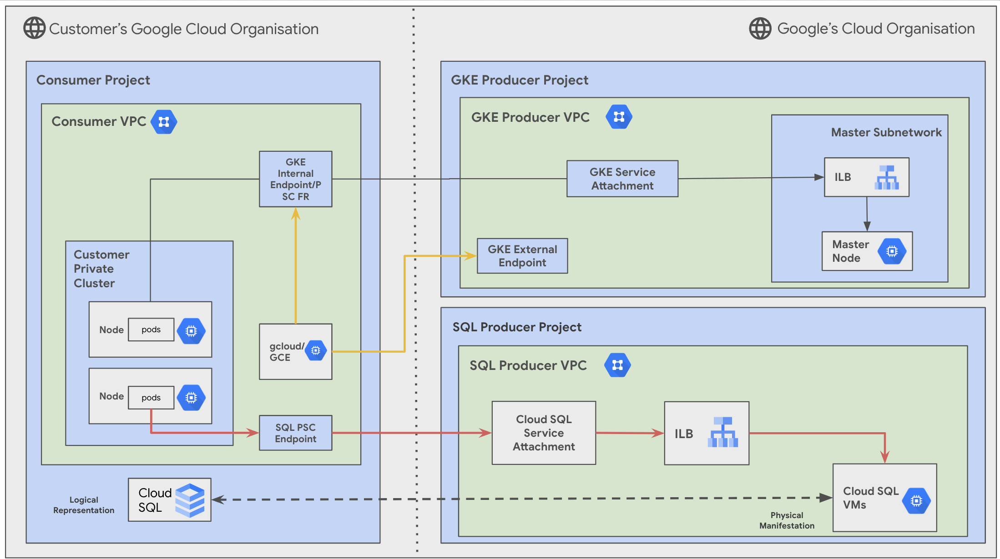

Create a Google Kubernetes Engine Cluster with Cloud SQL with Private Service Connectivity
---

**On this page**

  [Introduction](#introduction)

  [Objectives](#objectives)

  [Architecture](#architecture)

  [Request flow](#request-flow)

  [Prerequisites](#prerequisites)

  [Deploy the solution](#deploy-the-solution)

  [Usage](#usage)

  [Optional:Delete the deployment](#optional-delete-the-deployment)

  [Known Issues](#known-issues)

  [Troubleshoot Errors](#troubleshoot-errors)

  [Submit feedback](#submit-feedback)

Introduction
---

*Simplified networking solution so you can spin up infrastructure in minutes using terraform\!*

Deploy your containerized applications with speed and simplicity using Google Kubernetes Engine (GKE)\!

This guide provides a comprehensive walkthrough for deploying a GKE cluster in your Google Cloud Platform (GCP) environment and connecting it to Cloud SQL for persistent data storage. GKE is a managed Kubernetes service that allows you to easily run containerized applications at scale. Cloud SQL, on the other hand, offers fully managed relational databases like MySQL, PostgreSQL, and SQL Server. By combining GKE with Cloud SQL, you gain the flexibility and scalability of containers with the reliability and performance of managed databases.

Objectives
---

This walkthrough will guide you through the essential stages of GKE deployment, including network configuration, and application deployment, with a focus on integrating Cloud SQL for your application's data needs. We'll leverage infrastructure-as-code with Terraform to automate the deployment process, enabling you to spin up your GKE cluster in minutes.

This guide would have both Cloud SQL and GKE control plane communication use Private Service Connectivity for communication. This is to simplify the networking complexities in large-scale environments. To read more about PSC, refer to our [official documentation](https://cloud.google.com/vpc/docs/private-service-connect)

We'll provide clear instructions and code examples to ensure a smooth and successful deployment. While going through each stage, please ensure that you have the necessary permissions required. The stages are:

* Bootstrap stage :  Granting the required IAM permissions to your service accounts.  
* Organization stage : Enabling the necessary APIs for GKE and related services.  
* Networking stage : Creating a Virtual Private Cloud (VPC) for your GKE cluster. Defining subnets for your nodes and services.  
* Security stage : Create firewall rules for your Cloud SQL instance
* Producer stage : Provisioning your GKE cluster with desired configurations (e.g., machine type, node pools, autoscaling), Provisioning your CloudSQL instance with desired configurations
* Producer Connectivity : Provisioning reserved IP addresses and forwarding rules for Cloud SQL communication
* Consumer stage : **skipped**  

Throughout each stage, we'll provide guidance on recommended variables and configurations to tailor the deployment to your specific needs.

Let's get started\!

Architecture  
---



This solution will guide you how to establish a connection to a

The main components that are deployed in this architecture are the following : 

1. **Consumer Google Kubernetes Engine Project & Virtual Private Cloud**  
2. **Producer Google Kubernetes Engine Project & Virtual Private Cloud**  
3. **Producer CloudSQL Project & Virtual Private Cloud**  
4. **Google Kubernetes Engine Cluster : Google Kubernetes Engine Nodes & Pods**  
5. **Google Kubernetes Engine Internal Endpoint**  
6. **Cloud SQL instance**  
7. **SQL Private Service Connect Endpoint**

Request Flow
---
The request processing flow for the deployed topology, which allows Google Kubernetes Engine Cluster to interact with Cloud SQL with Private Service Connect:

1. A user or an application sends a request to the Google Kubernetes Engine cluster. This could be a request to access a web application, initiate a process, or retrieve some data.
2. The request is received by the Google Kubernetes Engine cluster's service, which then forwards it to a pod running the user's application.
3. The application running in the pod needs to access the Cloud SQL database. It sends a request to the Cloud SQL instance via the Private Service Connect endpoint which is the GKE Internal Endpoint. This ensures that all communication between the application and the database remains within the VPC network, enhancing security and privacy.
4. The Cloud SQL instance receives the request from the application. This could be a request to read data, write data, or perform any other database operation.
5. The Cloud SQL instance processes the request and sends a response back to the application pod in the Google Kubernetes Engine cluster.
6. The application in the pod receives the response from the Cloud SQL instance and uses it to complete the original user or application request.
7. The Google Kubernetes Engine cluster sends the final response back to the user or application that initiated the request.

This flow demonstrates how the Private Service Connect connection enables secure and efficient communication between the Google Kubernetes Engine cluster and the Cloud SQL instance, allowing applications to seamlessly interact with the database without exposing sensitive data to the public internet.

Deploy the solution
---
This section guides you through the process of deploying the solution.

Prerequisites  
---

For the common prerequisites for this repository, please refer to the **[prerequisites.md](../prerequisites.md)** guide. Any additional prerequisites specific to this user journey will be listed below.

Deploy using the Terraform CLI
---

Here’s a guide to configure tfvars for each stage and then use run.sh to automatically deploy the solution.

1. **Clone the** cloudnetworking-config-solutions repository repository:

    ```
    git clone https://github.com/GoogleCloudPlatform/cloudnetworking-config-solutions.git
    ```

2. Navigate to the configuration/ directory and use the following tfvars for reference for in-place modifications. 

Bootstrap stage (configuration/bootstrap.tfvars) : 

* You will need to create a service account with the necessary permissions to access your Cloud SQL instance.
* Add the following project IDs and user IDs/groups in the tfvars.

```c
bootstrap_project_id                      = "your-project-id"
network_hostproject_id                    = "your-project-id"
network_serviceproject_id                 = "your-project-id"
organization_stage_administrator          = ["user:user-example@example.com"]
networking_stage_administrator            = ["user:user-example@example.com"]
security_stage_administrator              = ["user:user-example@example.com"]
producer_stage_administrator              = ["user:user-example@example.com"]
producer_connectivity_stage_administrator = ["user:user-example@example.com"]
consumer_stage_administrator              = ["user:user-example@example.com"]
```

Organisation Stage (configuration/organisation.tfvars) : 

* You will need to enable the required APIs for Cloud SQL and Google Kubernetes Engine.
* Add your project ID here in which you wish to enable the APIs for Google Kubernetes Engine Clusters.

```
activate_api_identities = {
  "project-01" = {
    project_id = "your-project-id",
    activate_apis = [
       "servicenetworking.googleapis.com",
       "iam.googleapis.com",
       "compute.googleapis.com",
       "sqladmin.googleapis.com",
       "container.googleapis.com"
    ],
  },
}
```

Networking Stage (configuration/networking.tfvars) : 

* You will need to create the required Virtual Private Cloud (VPC), subnets & IP ranges for Google Kubernetes Engine clusters.
* Add your project ID here in which you wish to create the VPC, Subnet and NAT for Google Kubernetes Engine Clusters.

```c

project_id = "your-project-id"

region     = "us-central1"

## VPC input variables

network_name = "CNCS_VPC"
subnets = [
  {
    ip_cidr_range = "10.0.0.0/24"
    name          = "CNCS_VPC_Subnet_1"
    region        = "us-west1-a"
    secondary_ip_ranges = {
        ip_range_pods = "192.168.0.0/16"
        ip_range_services = "192.169.0.0/24"
      }
  }
]

# PSC/Service Connecitvity Variables

create_scp_policy      = false
subnets_for_scp_policy = [""]

## Cloud Nat input variables

create_nat = true

## Cloud HA VPN input variables

create_havpn = false
```

Security Stage (configuration/security/cloudsql.tfvars) :

**NOTE :** 

1. **Before moving forward, please delete the security/alloydb.tfvars, security/gce.tfvars and security/mrc.tfvars files as our CUJ only involves CloudSQL.**  
2. **GKE Firewall rules are automatically created, as a user you wouldn’t need to create new firewall rules.**

For CloudSQL : 

* You will need to configure firewall rules to allow traffic between your GKE cluster and Cloud SQL instance and to your GKE cluster and Cloud SQL instance as well.
* Use the same project ID as used above for enabling APIs and creation of networking resources. This stage should create the necessary firewall rules for CloudSQL security.

```
project_id   = "your-project-id",
network      = "CNCS_VPC"
egress_rules = {
  allow-egress-cloudsql = {
    deny = false
    rules = [{
      protocol = "tcp"
      ports    = ["3306"]
    }]
  }
}
```

Producer Stage (configuration/producer/GKE/config/instance1.yaml.example) : 

* You will need to create configuration YAML files for creation of Google Kubernetes Engine clusters.
* Use the same project ID as used above for the creation of the Google Kubernetes Engine cluster.

```c

project_id: your-project-id

name : gke-CNCS-cluster
network : CNCS_VPC
subnetwork : CNCS_VPC_Subnet_1
ip_range_pods : gke-cluster-range-for-pods
ip_range_services : gke-cluster-range-for-services
kubernetes_version : 1.29

```

Producer Stage (configuration/producer/CloudSQL/config/instance1.yaml.example) : 

* You will need to create configuration YAML files for creation of Cloud SQL instances.
* Use the same project ID as used above for the creation of the CloudSQL PSC instance.

```c

name: CNCS_CloudSQL_instance
project_id: your-project-id
region: us-central1
database_version: MYSQL_8_0
network_config:
    connectivity:
      psc_allowed_consumer_projects : ["your-allowed-consumer-project-id"]
```

Producer Connectivty Stage(configuration/producer-connectivity.tfvars) : 

* You will need to create configuration for PSC connectivity for Cloud SQL instance.
* Use the same project ID as used above for the creation of the CloudSQL PSC instance.
* You can leave the field `ip_address_literal` blank if you aren't sure of an available unreserved IP Address. Terraform shall automatically pick an available IP Address from your subnet.

```c
psc_endpoints = [
  {
    endpoint_project_id          = "your-endpoint-project-id"
    producer_instance_project_id = "your-producer-instance-project-id"
    subnetwork_name              = "subnetwork-1"
    network_name                 = "network-1"
    ip_address_literal           = "10.128.0.26"
    region                       = "us-central1"
    producer_cloudsql = {
      instance_name = "psc-instance-name"
    }
  },
]
```

3. Now, navigate to the execution/ directory and run this command to run the automatic deployment using run.sh : 

```c
sh run.sh -s all -t init-apply
```

Here, \-s flag with all values will run all **s**tages and \-t flag with value init-apply will ask **t**erraform to use init and apply steps.

This solution shall help your applications on GKE connect to Private Service Connectivity based Cloud SQL instances. Once your deployment is complete, you can deploy containerized applications to your GKE cluster. This can be done through various methods, such as:

* **kubectl:** Use the `kubectl` command-line tool to deploy your applications from YAML manifests or Helm charts.

**Now, to connect to your newly created Google Kubernetes Clusters:**

You can connect to your GKE cluster using the following methods:

* **gcloud CLI:** Use the `gcloud container clusters get-credentials` command to configure your `kubectl` to interact with your cluster.  
* **kubectl:** Once your `kubectl` is configured, you can use it to interact with your cluster, deploy applications, and manage resources.  
* **Cloud Console:** Access your GKE cluster through the Google Cloud Console to view its status, manage resources, and troubleshoot issues.

To learn more about connecting to GKE clusters go through our [public documentation](https://cloud.google.com/kubernetes-engine/docs/how-to/cluster-access-for-kubectl).

Optional-Delete the deployment
---

Once you’re done with using the environment, you can destroy the resources using the run.sh automated script with this command from parent folder : 

```c
sh run.sh -s all -t destroy
```

Before destroying, ensure that if you’d any critical data/applications you’ve safely moved them.

Known Issues  
---

No known issues for this example at the moment, however if you run into any issues please feel free to create an issue/bug in this repository. 

Troubleshoot Errors
---

For common troubleshooting steps and solutions, please refer to the **[troubleshooting.md](../troubleshooting.md)** guide.

Submit feedback  
---

To provide feedback, please follow the instructions in our **[submit-feedback.md](../submit-feedback.md)** guide.
