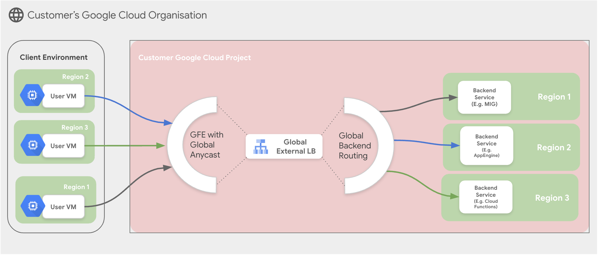

# Create an External Application Load Balancer with MIG as backend

**On this page**

  1. Introduction

  2. Objectives

  3. Architecture

  4. Request Flow

  5. Architecture Components

  6. Deploy the Solution

  7. Prerequisites

  8. Deploy with "single-click"

  9. Deploy through Terraform-cli

  10. Optional - Delete the Deployment

  11. Troubleshoot Errors

  12. Submit Feedback

---

## **Introduction**

This document provides a comprehensive guide for implementing a Load Balancer using Google Cloud's External Application Load Balancer (EALB) with a Managed Instance Group (MIG) as the backend service. The design aims to enhance application scalability and reliability by efficiently distributing HTTP and HTTPS traffic across multiple instances.

The guide assumes familiarity with Google Cloud Platform (GCP), Networking, and Terraform.

## **Objectives**

This solution guide helps you to:

* Set up a Load Balancer that distributes traffic to a MIG.
* Ensure high availability and fault tolerance for backend services.
* Automate deployment using Terraform.
* Understand the architecture and request flow of the load balancing solution.

## **Architecture**

This diagram illustrates a multi-region deployment in Google Cloud using a Global External Load Balancer (HTTP(S)) in front of backend services distributed across three different regions.  It leverages Google's global network infrastructure and anycast IP addressing for efficient traffic distribution and high availability.

* **Scenario : External Application Load Balancer with MIG**

    

### **Deployment Scenarios**

1. **Global Load Balancer:** Utilizes Google Front Ends (GFEs) for global traffic distribution.
2. **Regional Load Balancer:** Manages local traffic within a specific region for lower latency.


## **Request Flow**

1. **Client Request:** A user VM (representing a client) in any of the three client environment regions initiates a request to the application.
2. **GFE Anycast:** The request hits Google's global edge network, specifically a Google Front End (GFE) server.  Due to anycast, the request is directed to the GFE closest to the user, minimizing latency.
3. **Global External Load Balancer:** The GFE forwards the request to the Global External Load Balancer. This load balancer has a single anycast IP address, making it globally accessible.
4. **Backend Routing:** The Global External Load Balancer determines the appropriate backend service to handle the request based on configured routing rules (e.g., health checks, region targeting, traffic splitting).
5. **Backend Service:** The request is forwarded to a specific backend service in one of the three regions.  The diagram shows different example backend services in each region (MIG in Region 1, App Engine in Region 2, and Cloud Functions in Region 3), illustrating the flexibility of this setup.
6. **Response:** The backend service processes the request and sends the response back through the same path (Global External Load Balancer, GFE, and finally to the user VM).

## **Architecture Components**

* **Client Environment:** Represents the users or systems initiating requests to the application. Shown with User VMs in three different regions to emphasize the distributed nature of the clients.
* **Customer Google Cloud Project:**  Encompasses the entire deployment within the customer's Google Cloud environment.
* **GFE (Google Front End):**  Google's edge network servers, distributed globally. They act as the first point of contact for incoming requests and handle tasks like SSL/TLS termination, caching, and other optimizations.  *Key Feature: Global Anycast IP* allows routing traffic to the nearest GFE.
* **Global External Load Balancer (HTTP(S)):** Distributes traffic across multiple regions based on various criteria. *Key Feature: Global Anycast IP* provides a single global entry point for clients.
* **Global Backend Routing:**  The intelligence within the Global External Load Balancer that determines which backend service should receive the request.
* **Backend Services:** The actual application servers processing the requests. Can be various Google Cloud compute platforms like Compute Engine (MIGs), App Engine, Cloud Functions, Kubernetes Engine, etc. These are deployed in specific regions.
* **Regions (1, 2, and 3):**  Represent distinct geographical locations where Google Cloud resources are deployed.  Distributing resources across regions increases availability and allows serving users from geographically closer locations.


This architecture provides high availability, scalability, and low latency for globally distributed applications.  The anycast IPs for both the GFE and the Global External Load Balancer are crucial for directing traffic efficiently and minimizing the distance data travels.

## **Deploy the Solution**

This section provides instructions on deploying the load balancer solution using Terraform.

### **Prerequisites**

For the common prerequisites for this repository, please refer to the **[prerequisites.md](../prerequisites.md)** guide. Any additional prerequisites specific to this user journey will be listed below.

### **Deploy with "single click"**

This method uses Google Cloud Shell and Cloud Build to automate the deployment of the External Application Load Balancer with a MIG backend.

1.  **Open in Cloud Shell:** Click the button below to clone the repository and open the necessary configuration files in the Cloud Shell editor. **Note:** For testing, ensure the `cloudshell_git_repo` and `cloudshell_git_branch` parameters in the URL point to your fork and specific branch where these "single click" files and the updated guide exist. For the final version, this will point to the main repository.

    <a href="https://ssh.cloud.google.com/cloudshell/editor?shellonly=true&cloudshell_git_repo=https://github.com/GoogleCloudPlatform/cloudnetworking-config-solutions.git&cloudshell_git_branch=alb-single-click-feature&cloudshell_workspace=.&cloudshell_open_in_editor=configuration/bootstrap.tfvars,configuration/organization.tfvars,configuration/networking.tfvars,configuration/security/mig.tfvars,execution/06-consumer/MIG/config/instance.yaml.example,execution/07-consumer-load-balancing/Application/External/config/instance1.yaml.example&cloudshell_tutorial=docs/LoadBalancer/external-application-lb-mig.md#deploy-with-single-click" target="_new">
        
    </a>

2.  **Run ALB Prerequisites Script:**
    This script prepares your Google Cloud project: enables APIs, creates a Terraform state bucket for ALB, and sets Cloud Build permissions. From the root of the cloned `cloudnetworking-config-solutions` directory in Cloud Shell, run:
    ```bash
    sh docs/LoadBalancer/helper-scripts/prereq-appextlb.sh
    ```
    When prompted, enter your Google Cloud Project ID.

3.   **Review and Update Configuration Files:**
    The Cloud Shell editor will open key configuration files. Review each file and update values (project IDs, user IDs/groups, network names, regions, etc.) as per your requirements. Follow the guidance in the "Deploy through Terraform-cli" section of this document for details on each file:
    * `configuration/bootstrap.tfvars`
    * `configuration/organization.tfvars`
    * `configuration/networking.tfvars`
    * `configuration/security/mig.tfvars`
    * `execution/06-consumer/MIG/config/instance.yaml.example` (Rename to `instance.yaml` after updating.)
    * `execution/07-consumer-load-balancing/Application/External/config/instance.yaml.example` (Rename to `instance.yaml` after updating.)

4. **Submit Cloud Build Job to Deploy ALB:**
    Once configurations are updated and prerequisites are met, submit the Cloud Build job. Ensure you are in the root of the cloned repository.
    ```bash
    gcloud builds submit . --config docs/LoadBalancer/build/App-Ext-LB/cloudbuild-appextlb.yaml --ignore-file=".gcloudignore"
    ```

5.  **Verify Deployment:**
    After the Cloud Build job completes, go to the "Load Balancing" section in the Google Cloud Console. Confirm your External Application Load Balancer is created, and the MIG is attached as a backend and healthy.

6.  **[Optional] Delete the Deployment using Cloud Build:**

    To remove all resources created by this deployment, run the destroy Cloud Build job:
    ```bash
    gcloud builds submit . --config docs/LoadBalancer/build/App-Ext-LB/cloudbuild-appextlb-destroy.yaml --ignore-file=".gcloudignore"
    ```

### **Deploy through Terraform-cli**

1. Clone the repository containing the Terraform configuration files:

    ```bash
    git clone https://github.com/GoogleCloudPlatform/cloudnetworking-config-solutions.git
    ```

2. Navigate to **cloudnetworking-config-solutions** folder and update the files containing the configuration values
   * **00-bootstrap stage**
     * Update configuration/bootstrap.tfvars **\-** update the google cloud project IDs and the user IDs/groups in the tfvars.

        ```
        bootstrap_project_id                      = "your-project-id"
        network_hostproject_id                    = "your-project-id"
        network_serviceproject_id                 = "your-project-id"
        organization_stage_administrator          = ["user:user-example@example.com"]
        networking_stage_administrator            = ["user:user-example@example.com"]
        security_stage_administrator              = ["user:user-example@example.com"]
        producer_stage_administrator              = ["user:user-example@example.com"]
        producer_connectivity_stage_administrator = ["user:user-example@example.com"]
        consumer_stage_administrator              = ["user:user-example@example.com"]
        consumer_lb_administrator                 = ["user:lb-user-example@example.com"]
        ```

   * **01-organisation stage**
     * Update configuration/organization.tfvars \- update the google cloud project ID and the list of the APIs to enable for the MIG & Load Balancer.

        ```
        activate_api_identities = {
          "project-01" = {
            project_id = "your-project-id",
            activate_apis = [
              "servicenetworking.googleapis.com",
              "iam.googleapis.com",
              "compute.googleapis.com",
              ],
          },
        }
        ```
   * **02-networking stage**
     * Update `configuration/networking.tfvars` update the Google Cloud Project ID and the parameters for additional resources such as VPC, subnet, and NAT as outlined below.

        ```
        project_id  = "your-project-id"
        region      = "us-central1"

        ## VPC input variables
        network_name = "cncs-vpc"
        subnets = [
        {
            ip_cidr_range = "10.0.0.0/24"
            name          = "cncs-vpc-subnet-1"
            region        = "us-central1"
        }
        ]

        shared_vpc_host = false

        ## PSC/Service Connectivity variable
        create_scp_policy  = false

        ## Cloud Nat input variables
        create_nat = true

        ## Cloud HA VPN input variables

        create_havpn = false
        peer_gateways = {
        default = {
            gcp = "" # e.g. projects/<google-cloud-peer-projectid>/regions/<google-cloud-region>/vpnGateways/<peer-vpn-name>
        }
        }

        tunnel_1_router_bgp_session_range = ""
        tunnel_1_bgp_peer_asn             = 64514
        tunnel_1_bgp_peer_ip_address      = ""
        tunnel_1_shared_secret            = ""

        tunnel_2_router_bgp_session_range = ""
        tunnel_2_bgp_peer_asn             = 64514
        tunnel_2_bgp_peer_ip_address      = ""
        tunnel_2_shared_secret            = ""

        ## Cloud Interconnect input variables

        create_interconnect = false # Use true or false

        ## NCC input variables

        create_ncc = false
        ```

   * **03-security stage**
     * Update configuration/security/mig.tfvars file \- update the Google Cloud Project ID. This will facilitate the creation of essential firewall rules, granting required MIG firewall rules.

        ```
        project_id = "your-project-id"
        network    = "cncs-vpc"
        ingress_rules = {
        fw-allow-health-check = {
            deny               = false
            description        = "Allow health checks"
            destination_ranges = []
            disabled           = false
            enable_logging = {
            include_metadata = true
            }
            priority = 1000
            source_ranges = [
                "130.211.0.0/22",
                "35.191.0.0/16"
            ]
            targets = ["allow-health-checks"]
            rules = [{
            protocol = "tcp"
            ports    = ["80"]
            }]
        }
        }
        ```

   * **06-consumer stage**
     * Update the execution/06-consumer/MIG/config/instance.yaml.example file and rename it to instance.yaml

        ```
        name: minimal-mig
        project_id: your-project-id
        location: us-central1
        zone : us-central1-a
        vpc_name : cncs-vpc
        subnetwork_name : cncs-vpc-subnet-1
        named_ports:
            http: 80
        ```

    * **07-consumer-load-balancing stage**
        * Update the execution/07-consumer-load-balancing/Application/External/config/instance2.yaml.example file and rename it to instance2.yaml

        ```
        name: load-balancer-cncs
        project: your-project-id
        network: cncs-vpc
        backends:
        default:
            groups:
            - group: minimal-mig
                region: us-central1
        ```

3. **Execute the terraform script**
   You can now deploy the stages individually using **run.sh** or you can deploy all the stages automatically using the run.sh file. Navigate to the execution/ directory and run this command to run the automatic deployment using **run.sh .**

      ```
      ./run.sh -s all -t init-apply-auto-approve
      or
      ./run.sh --stage all --tfcommand init-apply-auto-approve
      ```

4. **Verify Load Balancer Creation:**

   Once the deployment is complete, navigate to the Load Balancing section in the Google Cloud Console to confirm that your load balancer has been successfully created with the Managed Instance Group as attached backend.

## **Optional-Delete the deployment**

1. In Cloud Shell or in your terminal, make sure that the current working directory is $HOME/cloudshell\_open/\<Folder-name\>/execution. If it isn't, go to that directory.

2. Remove the resources that were provisioned by the solution guide:

    ```
    ./run.sh -s all -t destroy-auto-approve
    ```

Terraform displays a list of the resources that will be destroyed.

3. When you're prompted to perform the actions, enter yes.

Troubleshoot Errors
---
For common troubleshooting steps and solutions, please refer to the **[troubleshooting.md](../troubleshooting.md)** guide.

## **Submit feedback**

To provide feedback, please follow the instructions in our **[submit-feedback.md](../submit-feedback.md)** guide.