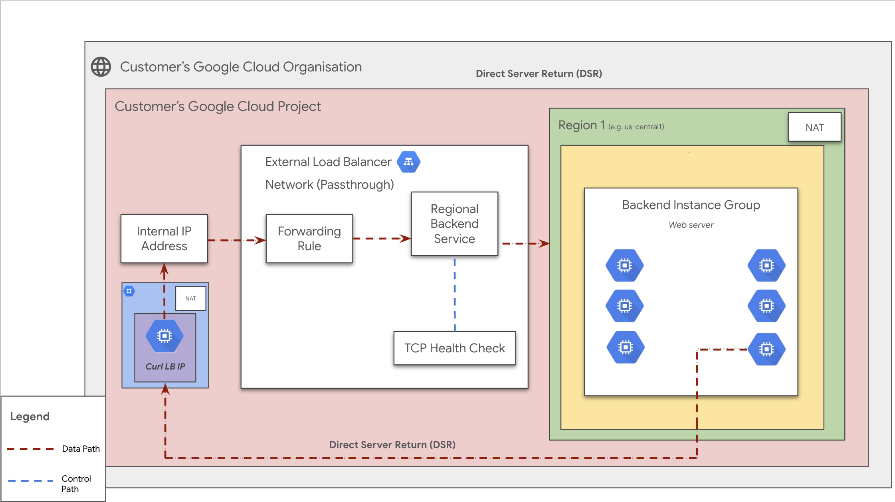

# Internal Passthrough Network Load Balancer User Guide

**On this page**

1.  Introduction
2.  Objectives
3.  Architecture
4.  Request Flow
5.  Architecture Components
6.  Deploy the Solution
7.  Prerequisites
8.  Deploy with "single-click"
9.  Deploy through Terraform-cli
10. Optional - Delete the Deployment
11. Troubleshoot Errors
12. Submit Feedback

-----

## Introduction

This document provides a comprehensive guide for implementing an [Internal Passthrough Network Load Balancer](https://cloud.google.com/load-balancing/docs/internal) using Google Cloud. This type of load balancer enables you to run and scale your services behind a private, internal IP address that is only accessible to systems within the same Virtual Private Cloud (VPC) network or networks connected to it. It is a regional, managed service ideal for internal TCP and UDP traffic, offering high performance and low latency.

The guide assumes familiarity with Google Cloud Platform (GCP) and Terraform.

## Objectives

This solution guide helps you to:

  * Set up an Internal Passthrough Network Load Balancer to distribute internal TCP or UDP traffic.
  * Provide a stable, private IP address for your internal backend services.
  * Achieve high performance and low latency for your internal applications.
  * Automate deployment using Terraform.
  * Understand the architecture and request flow of the internal load balancing solution.

## Architecture

This solution deploys a regional Internal Passthrough Network Load Balancer. The architecture consists of the following key components within a Customer's Google Cloud Project. Traffic to the load balancer originates from within the same VPC network or from a connected network (e.g., via Cloud HA-VPN or Interconnect).

<p align="center">
    
</p>

  * **Internal Client (VM):** A client instance (e.g., another application server or a user workstation) within the same VPC network or a connected network that initiates traffic.
  * **Internal IP Address:** A private IP address from your VPC's subnet range, associated with the Forwarding Rule of the Internal Passthrough Load Balancer.
  * **Internal Load Balancer (Network Passthrough):** Operates at the network layer (Layer 4) and distributes incoming traffic from your VPC network to backend instances. This deployment uses a *regional* internal NLB.
  * **Forwarding Rule:** Directs incoming traffic based on the internal IP address, protocol, and port to the Regional Backend Service. The load balancing scheme is set to `INTERNAL`.
  * **Regional Backend Service:** Defines the backend instances (in this case, within a Regional Managed Instance Group) that will receive traffic and manages their health checks.
  * **TCP Health Check:** Periodically probes the backend instances from within the VPC network to determine their health and availability. Traffic is only sent to healthy instances. Google Cloud uses special routes to allow health check probes to reach backends.

### Request Flow

The flow of a request through this Internal Passthrough Network Load Balancer setup is as follows:

1.  **Client Request:** An `Internal Client` (e.g., a VM) sends a TCP/UDP request to the `Internal IP Address` of the load balancer on a specific port.
2.  **Forwarding Rule:** The `Forwarding Rule`, which is configured with an IP address from a local subnet, receives the traffic. Based on its configuration (IP address, protocol, and port), it directs the traffic to the associated `Regional Backend Service`.
3.  **Load Balancer Distribution:** The load balancer distributes the incoming packets to a healthy instance within one of the `Zonal Backend Instance Groups`. The distribution happens directly within the Google Cloud network without the packets leaving the VPC.
4.  **Backend Processing:** The selected backend instance (a `Web server`) processes the request.
5.  **Response:** The backend instance sends the response directly back to the `Internal Client`. The source IP of the original packet is preserved, so the backend's response uses the client's IP as the destination, bypassing the load balancer for the return path.
6.  **Health Checks:** Concurrently, the `TCP Health Check` system sends probes from specific IP ranges within the Google Cloud network (`35.191.0.0/16` and `130.211.0.0/22`) to the backend instances to ensure they are healthy. Instances failing the health check are temporarily removed from the pool of available backends.

### Architecture Components

  * **Client:** A user, VM, or system within the same VPC or a connected network sending traffic.
  * **Internal IP Address:** The private IP address within your VPC for accessing the load-balanced application.
  * **Internal Passthrough Network Load Balancer:** The regional load balancer distributing internal network traffic at Layer 4.
  * **Forwarding Rule:** Directs incoming internal traffic to the backend service.
  * **Regional Backend Service:** Manages the backend instances and their health.
  * **Backend Instance Groups (MIGs):** Groups of identical virtual machine instances in different zones within a region.
  * **TCP Health Check:** Monitors the health of the backend instances from within the Google Cloud network.

## Deploy the Solution

This section provides instructions on deploying the internal load balancer solution using Terraform.

### Prerequisites

For this configuration, ensure the following are installed:

1.  **Terraform:** Modules are for use with Terraform 1.8+ and tested using Terraform 1.8+. Install from [Terraform Downloads](https://releases.hashicorp.com/terraform/).
2.  **gcloud SDK:** Install the gcloud SDK from [Google Cloud SDK Documentation](https://cloud.google.com/sdk/docs/install) to authenticate to Google Cloud while running Terraform.

### Deploy with "single-click"

This method uses Google Cloud Shell and Cloud Build to automate the deployment of the Internal Passthrough Network Load Balancer with a MIG backend.

1.  **Open in Cloud Shell:** Click the button below to clone the repository and open the necessary configuration files in the Cloud Shell editor.

    **Note**: For testing, ensure the `cloudshell_git_repo` and `cloudshell_git_branch` parameters in the URL point to your fork and specific branch where these "single click" files and the updated guide exist. For the final version, this will point to the main repository.

    <a href="https://ssh.cloud.google.com/cloudshell/editor?shellonly=true&cloudshell_git_repo=https://github.com/GoogleCloudPlatform/cloudnetworking-config-solutions.git&cloudshell_git_branch=update-nilb-docs&cloudshell_workspace=.&cloudshell_open_in_editor=configuration/bootstrap.tfvars,configuration/organization.tfvars,configuration/networking.tfvars,configuration/security/mig.tfvars,configuration/consumer/MIG/config/instance.yaml.example,configuration/consumer-load-balancing/Network/Passthrough/Internal/config/inlb-lite.yaml.example&cloudshell_tutorial=docs/LoadBalancer/internal-network-passthrough-lb-mig.md#deploy-with-single-click" target="_new">
    
    </a>

2.  **Run NILB Prerequisites Script:**
    This script prepares your Google Cloud project: enables APIs, creates a Terraform state bucket for the internal NLB (NILB), and sets Cloud Build permissions. From the root of the cloned `cloudnetworking-config-solutions` directory in Cloud Shell, run:

    ```bash
    sh docs/LoadBalancer/helper-scripts/prereq-nilb.sh
    ```

    When prompted, enter your Google Cloud Project ID.

3.  **Review and Update Configuration Files:**
    The Cloud Shell editor will open key configuration files. Review each file and update values (project IDs, user IDs/groups, network names, regions, etc.) as per your requirements. Follow the guidance in the "Deploy through Terraform-cli" section of this document for details on each file:

      * `configuration/bootstrap.tfvars`
      * `configuration/organization.tfvars`
      * `configuration/networking.tfvars`
      * `configuration/security/mig.tfvars`
      * `execution/06-consumer/MIG/config/instance.yaml.example` (Rename to `instance.yaml` after updating.)
      * `execution/07-consumer-load-balancing/Network/Passthrough/Internal/config/inlb-lite.yaml.example` (Rename to `inlb-lite.yaml` after updating.)

4.  **Submit Cloud Build Job to Deploy NILB:**
    Once configurations are updated and prerequisites are met, submit the Cloud Build job. Ensure you are in the root of the cloned repository.

    ```bash
    gcloud builds submit . --config docs/LoadBalancer/build/Net-Int-Passthrough-LB/cloudbuild-nilb.yaml
    ```

5.  **Verify Deployment:**
    After the Cloud Build job completes, go to the "Load Balancing" section in the Google Cloud Console. Confirm your Internal Passthrough Network Load Balancer is created, and the MIG is attached as a backend and healthy.

6.  **[Optional] Delete the Deployment using Cloud Build:**

    To remove all resources created by this deployment, run the destroy Cloud Build job:

    ```bash
    gcloud builds submit . --config docs/LoadBalancer/build/cloudbuild-nilb-destroy.yaml
    ```

### Deploy through Terraform-cli

1.  Clone the repository containing the Terraform configuration files:

    ```bash
    git clone https://github.com/GoogleCloudPlatform/cloudnetworking-config-solutions.git
    ```

2.  Navigate to the **cloudnetworking-config-solutions** folder and update the files containing the configuration values:

      * **00-bootstrap stage**

          * Update `configuration/bootstrap.tfvars` - update the Google Cloud project IDs and the user IDs/groups in the tfvars.

      * **01-organisation stage**

          * Update `configuration/organization.tfvars` - update the Google Cloud project ID and the list of the APIs to enable (e.g., `compute.googleapis.com`).

            ```
                activate_api_identities = {
                    "project-01" = {
                        project_id = "your-project-id",
                        activate_apis = [
                        "servicenetworking.googleapis.com",
                        "iam.googleapis.com",
                        "compute.googleapis.com",
                        ],
                    },
                }
            ```

      * **02-networking stage**

          * Update `configuration/networking.tfvars`. Ensure the VPC and subnet configurations are correct for your internal deployment. Cloud NAT is not required for the load balancer itself but may be needed for outbound internet access from the backends.

            ```
            project_id  = "your-project-id"
            region      = "us-central1"

            ## VPC input variables
            network_name = "cncs-vpc"
            subnets = [
            {
                ip_cidr_range = "10.0.0.0/24"
                name          = "cncs-vpc-subnet-1"
                region        = "us-central1"
            }
            ]

            shared_vpc_host = false

            # PSC/Service Connecitvity Variables

            create_scp_policy      = false # Use true or false based on your requirements
            subnets_for_scp_policy = [""]  # List subnets here from the same region as the SCP

            ## Cloud Nat input variables
            create_nat = false # Use true or false 

            ## Cloud HA VPN input variables

            create_havpn = false
            peer_gateways = {
            default = {
                gcp = "" # e.g. projects/<google-cloud-peer-projectid>/regions/<google-cloud-region>/vpnGateways/<peer-vpn-name>
            }
            }

            tunnel_1_router_bgp_session_range = ""
            tunnel_1_bgp_peer_asn             = 64514
            tunnel_1_bgp_peer_ip_address      = ""
            tunnel_1_shared_secret            = ""

            tunnel_2_router_bgp_session_range = ""
            tunnel_2_bgp_peer_asn             = 64514
            tunnel_2_bgp_peer_ip_address      = ""
            tunnel_2_shared_secret            = ""

            ## Cloud Interconnect input variables

            create_interconnect = false # Use true or false

            ## NCC input variables

            create_ncc = false

            ```

      * **03-security stage**

          * Update `configuration/security/mig.tfvars` file. This is critical for an internal load balancer. The firewall rule must allow traffic from Google Cloud's health check IP ranges (`130.211.0.0/22` and `35.191.0.0/16`) to your backends on the appropriate port. You should also add a rule to allow traffic from your client sources within the VPC.

            ```
            project_id = "your-project-id"
            network    = "cncs-vpc"
            ingress_rules = {
            fw-allow-health-check = {
                description      = "Allow health checks from Google Cloud"
                source_ranges = [
                    "130.211.0.0/22",
                    "35.191.0.0/16"
                ]
                targets = ["allow-health-checks"] # A network tag on your MIGs
                rules = [{
                    protocol = "tcp"
                    ports    = ["80"]
                }]
              },
            fw-allow-internal-clients = {
                description      = "Allow traffic from internal clients"
                source_ranges = ["10.0.0.0/24"] # Example: your client subnet
                targets = ["allow-health-checks"] # Reuse the same tag
                rules = [{
                    protocol = "tcp"
                    ports    = ["80"]
                }]
             }
            }
            ```

      * **06-consumer stage**

          * Update the `execution/06-consumer/MIG/config/instance.yaml.example` file and rename it to `instance.yaml`. Ensure the `vpc_name` and `subnetwork_name` are correct and that the instance template includes the network tag (e.g., `allow-health-checks`) for the firewall rules.

            ```yaml
            name: minimal-internal-mig
            project_id: your-project-id
            location: us-central1
            zone : us-central1-a
            vpc_name : cncs-vpc
            subnetwork_name : cncs-vpc-subnet-1
            tags:
              - allow-health-checks
            named_ports:
              http: 80
              https: 443
            ```

      * **07-consumer-load-balancing stage**

          * Update the `execution/07-consumer-load-balancing/Network/Passthrough/Internal/config/inlb-lite.yaml.example` file and rename it to `inlb-lite.yaml`.

            ```yaml
            name: lite-nilb
            project: <your-project-id>
            region: us-central1
            network: projects/<your-project-id>/global/networks/cncs-vpc
            subnetwork: projects/<your-project-id>/regions/us-central1/subnetworks/cncs-vpc-subnet-1
            backends:
            - group_name: minimal-internal-mig
            ```

3.  **Execute the Terraform script**

    You can deploy the stages individually using `run.sh` or deploy all stages automatically. Navigate to the `execution/` directory and run:

    ```bash
    ./run.sh -s all -t init-apply-auto-approve
    ```

    **or**

    ```bash
    ./run.sh --stage all --tfcommand init-apply-auto-approve
    ```

4.  **Verify Load Balancer Creation:**

    Once deployment is complete, go to the Load Balancing section in the Google Cloud Console to confirm your internal load balancer is created and the Managed Instance Group is attached and healthy. You can test connectivity from another VM within the same VPC.

## Optional - Delete the Deployment

1.  In Cloud Shell or your terminal, ensure the current working directory is `$HOME/cloudshell_open/<Folder-name>/execution`.

2.  Remove provisioned resources:

    ```bash
    ./run.sh -s all -t destroy-auto-approve
    ```

3.  When prompted, enter `yes`.

### Troubleshoot Errors

Check Terraform's logs and output for errors. Common issues for internal load balancers include misconfigured firewall rules that block health checks or client traffic.

## Submit Feedback

To submit feedback:

  * For assistance with streamlining network configuration automation, submit an issue on the [GitHub repository](https://github.com/GoogleCloudPlatform/cloudnetworking-config-solutions/issues).
  * For unmodified Terraform code issues, create issues in the [GitHub repository](https://github.com/GoogleCloudPlatform/cloudnetworking-config-solutions/issues).
  * For issues with the Google Cloud products used, contact [Cloud Customer Care](https://cloud.google.com/support-hub).