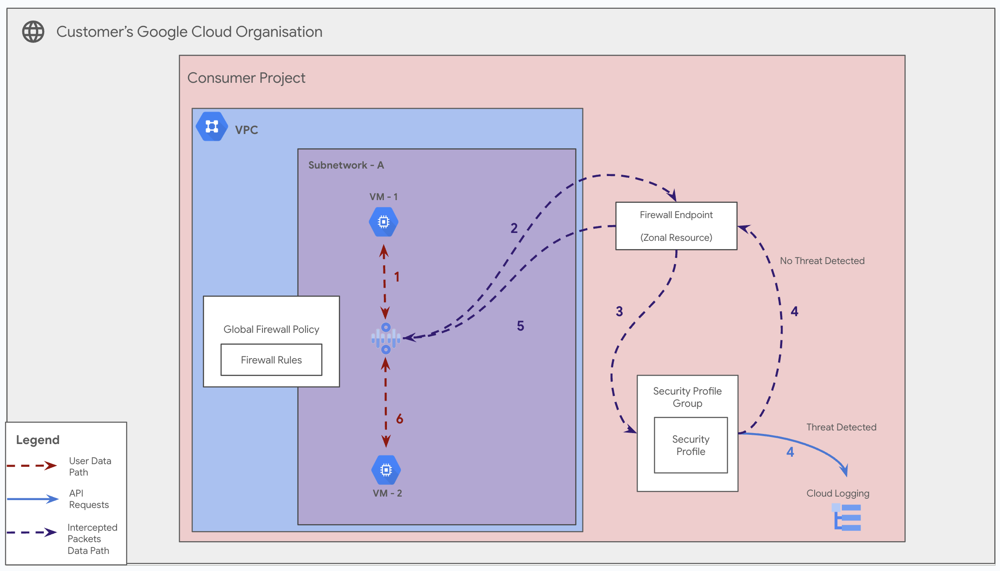

# Enterprise NGFW with Centralized Traffic Inspection

**On this page**

-   [Introduction](#introduction)
-   [Objectives](#objectives)
-   [Architecture](#architecture)
    -   [Request flow](#request-flow)
    -   [Architecture Components](#architecture-components)
-   [Deploy the solution](#deploy-the-solution)
    -   [Prerequisites](#prerequisites)
    -   [Deploy through “terraform-cli”](#deploy-through-terraform-cli)
-   [Optional: Delete the deployment](#optional-delete-the-deployment)
-   [Submit feedback](#submit-feedback)

## Introduction

This document provides guidance on configuring a complete **enterprise-grade Next-Generation Firewall (NGFW) solution** on Google Cloud. This powerful pattern combines **Firewall Endpoints** for traffic redirection with **Security Profiles** for deep packet inspection and intrusion prevention.

By following this guide, you will create a centralized security model where traffic from your workload VPCs is transparently intercepted and inspected for threats by Cloud Firewall before reaching its destination. This guide leverages the **CNCS (Cloud Networking Config Solutions)** repository to automate the deployment of all necessary components.

## Objectives

This solution guide helps you do the following:

* Understand how Firewall Endpoints and Security Profiles work together to form a complete NGFW solution.
* Visualize the end-to-end traffic flow from a workload VM, through the inspection service, and to its destination.
* Learn how to deploy and associate all the necessary organizational and project-level resources.
* Deploy the complete solution using the sequential stages in the CNCS repository.

## Architecture

This architecture creates a powerful and scalable inspection model. It uses a Firewall Endpoint to act as a managed next-hop for a VPC network. This endpoint directs traffic to the Google Cloud Firewall service for inspection. The firewall service, in turn, uses an Organization Firewall Policy, which contains rules that apply a Security Profile Group (and its underlying Security Profile) to perform threat analysis.



### Request flow

The following illustrates how network traffic is intercepted and inspected:

1.  **Initiation:** A client `VM` in a workload VPC attempts to send traffic to a destination.
2.  **Route Match:** A high-priority route in the VPC's routing table directs traffic to the **Firewall Endpoint** as its next hop.
3.  **Redirection to Firewall Service:** The Firewall Endpoint is associated with the VPC, which signals the Cloud Firewall service to handle its traffic. The packet is sent to the regional firewall service for inspection.
4.  **Firewall Policy Enforcement:** The VPC is also associated with an **Organization Firewall Policy**. The Cloud Firewall service evaluates the traffic against the rules in this policy.
5.  **Security Profile Application:** A rule in the policy matches the traffic and has its action set to `apply_security_profile_group`.
6.  **Threat Inspection:** The firewall service uses the linked **Security Profile** to perform deep packet inspection on the traffic, checking for malicious signatures.
7.  **Action & Logging:** If a threat is found, the configured action (e.g., `DENY`) is taken, and a threat log is generated. If the traffic is clean, it is allowed to pass.
8.  **Egress to Destination:** The inspected and approved traffic is sent from the firewall service to its original destination.

### Architecture Components

This solution combines the components from the previous two guides:

* **Firewall Endpoint & Association:** The networking-layer resources responsible for intercepting traffic from a VPC and redirecting it for inspection.
* **Security Profile & Group:** The security-layer resources that define the threat signatures and actions (e.g., allow, deny, alert) for the intrusion prevention service.
* **Organization Firewall Policy:** The policy that links everything together by containing rules that apply a Security Profile Group to traffic.

## Deploy the solution

This section guides you through the process of deploying the complete solution.

### Prerequisites

For the common prerequisites for this repository, please refer to the **[prerequisites.md](../prerequisites.md)** guide. Any additional prerequisites specific to this user journey will be listed below.

**IAM Permissions**: Ensure the user or Service Account running Terraform has the combined set of roles required for both stages:
  * **Project Roles:** `roles/compute.admin`, `roles/compute.securityAdmin`, `roles/compute.networkAdmin`, `roles/networksecurity.securityProfileAdmin`, `roles/serviceusage.serviceUsageConsumer`.
  * **Organization Roles:** `roles/compute.orgFirewallPolicyAdmin`, `roles/resourcemanager.organizationViewer`.

### Deploy through “terraform-cli”

1.  **Clone the cloudnetworking-config-solutions repository:**

    ```sh
    git clone [https://github.com/GoogleCloudPlatform/cloudnetworking-config-solutions.git](https://github.com/GoogleCloudPlatform/cloudnetworking-config-solutions.git)
    ```

2.  **Navigate to the `cloudnetworking-config-solutions` folder and update the files containing the configuration values.**

3.  **Configure `02-networking`:** Create your `.yaml` file(s) in the `configuration/networking/FirewallEndpoint/config/` directory to define the Firewall Endpoint and its Association.

    ```yaml
    # config/prod_fw_endpoint.yaml

    # The location (zone) is mandatory for these resources.
    location: "us-central1-a"

    # --- Defines the organization-level Firewall Endpoint ---
    firewall_endpoint:
      create: true
      name: "prod-fw-endpoint-us-central1-a"
      organization_id: "YOUR_ORGANIZATION_ID"         # <-- Replace
      billing_project_id: "my-central-billing-project"  # <-- Replace with project to bill
      labels:
        env: "prod"
        region: "us-central1"

    # --- Defines the project-level Association ---
    firewall_endpoint_association:
      create: true
      name: "assoc-to-prod-vpc-us-central1"
      association_project_id: "my-production-project"   # <-- Replace with project containing VPC
      vpc_id: "projects/my-production-project/global/networks/prod-vpc-us-east"
      labels:
        env: "prod"
    ```

4.  **Configure `03-security`:** Create your `.yaml` file(s) in the `configuration/security/SecurityProfile/config/` directory to define the Security Profile and Group.

    ```yaml
    # config/threat_profile_and_group.yaml

    # The GCP Organization ID where the resources will be created.
    organization_id: "YOUR_ORGANIZATION_ID" # <-- Replace

    # --- Defines the Security Profile resource ---
    security_profile:
      create: true
      name: "prod-app-threat-profile"
      type: "THREAT_PREVENTION"
      description: "Denies critical threats for the production application"
      labels:
        app: "prod-app"
        env: "production"

      # Configuration block for the THREAT_PREVENTION type
      threat_prevention_profile:
        severity_overrides:
          - severity: "CRITICAL"
            action: "DENY"
          - severity: "HIGH"
            action: "ALERT"

    # --- Defines the Security Profile Group resource ---
    security_profile_group:
      create: true
      name: "prod-app-profile-group"
      description: "Security group for the production application"
      labels:
        app: "prod-app"

    # --- Tells the module to link the two resources above ---
    link_profile_to_group: true
    ```

5.  **Execute the Terraform script:** Navigate to the `execution/` directory and run the `run.sh` script, targeting both stages in sequence.

    ```bash
    ./run.sh -s 02-networking/FirewallEndpoint -t init-apply-auto-approve
    ```

    This command will first deploy the Firewall Endpoint and then deploy the Security Profile. After both are created, you must manually associate the new Firewall Policy (created in stage 03) with the VPC network where the Firewall Endpoint Association was made (in stage 02).

6.  **Verify Creation:** Check the Google Cloud Console to confirm that all resources from both stages have been created successfully.

## Optional: Delete the deployment

1.  From the `execution/` directory, run the `run.sh` script with the `destroy` command, targeting the stages in **reverse order**.
    ```bash
    ./run.sh -s 02-networking/FirewallEndpoint -t destroy-auto-approve
    ```

## Submit feedback

For common troubleshooting steps and solutions, please refer to the **[troubleshooting.md](../troubleshooting.md)** guide.

To provide feedback, please follow the instructions in our **[submit-feedback.md](../submit-feedback.md)** guide.