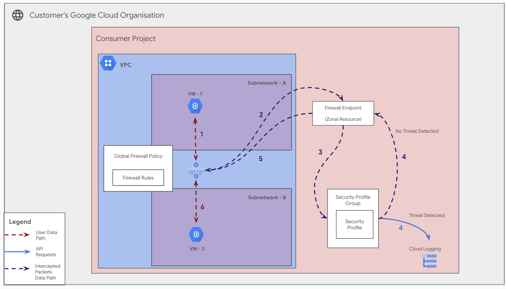

# GCP Firewall Endpoints for Centralized Traffic Inspection

**On this page**

- [Introduction](#introduction)
- [Objectives](#objectives)
- [Architecture](#architecture)
  - [Request flow](#request-flow)
  - [Architecture Components](#architecture-components)
- [Deploy the solution](#deploy-the-solution)
  - [Prerequisites](#prerequisites)
  - [Deploy through “terraform-cli”](#deploy-through-terraform-cli)
- [Optional: Delete the deployment](#optional-delete-the-deployment)
- [Submit feedback](#submit-feedback)

### Introduction

This document provides guidance on configuring and deploying **GCP Firewall Endpoints**, an organization-level resource used to create regional, zonal gateways for intercepting and inspecting network traffic. Firewall Endpoints are a core component of building centralized "hub-and-spoke" network security models where traffic from multiple VPCs can be redirected to a central inspection point, such as a third-party Next-Generation Firewall (NGFW) appliance.

This guide leverages the **CNCS (Cloud Networking Config Solutions)** repository for the automated deployment of Firewall Endpoints and their associated resources using a declarative, YAML-driven approach.

### Objectives

This solution guide helps you do the following:

* Understand the hub-and-spoke architecture for centralized traffic inspection using Firewall Endpoints.
* Learn how an organization-level Firewall Endpoint is associated with a project-level VPC network.
* Visualize the traffic flow for redirection and inspection.
* Deploy a Firewall Endpoint and its Association using the CNCS repository.

### Architecture

The architecture for a Firewall Endpoint follows a classic hub-and-spoke model. This allows an organization to centralize its security appliances (NGFWs) in a single "hub" VPC, and then route traffic from multiple "spoke" VPCs (containing workloads) through these appliances for inspection.

This guide covers the primary scenario for Firewall Endpoints:

#### Hub-and-Spoke Traffic Redirection

A Firewall Endpoint is created as an organizational resource but resides in a specific zone. This endpoint is then associated with a VPC network. High-priority routes in that network are automatically created to direct traffic to the endpoint, which in turn forwards the traffic to a configured next hop, typically a firewall appliance in a peered "hub" VPC.

Following is a holistic diagram encompassing this hub-and-spoke scenario.



#### Request flow

The following illustrates the request processing flow for east-west (VPC-to-VPC) traffic inspection:

1.  **Initiation:** A VM in the **Spoke VPC** attempts to send traffic to a resource in another VPC or on-premises network.
2.  **Route Match:** A custom route in the Spoke VPC's routing table with a high priority matches the traffic. The next hop for this route is the Firewall Endpoint.
3.  **Redirection:** The traffic is sent to the Firewall Endpoint.
4.  **Forwarding:** The Firewall Endpoint forwards the traffic packet, unmodified, to its configured next-hop target, which is typically an Internal Load Balancer in the peered **Hub VPC**.
5.  **Inspection:** The Internal Load Balancer distributes the packet to a backend instance, which is a third-party **NGFW appliance**. The appliance inspects the packet.
6.  **Egress:** If the traffic is permitted, the NGFW appliance, which has its own route table, sends the packet back out towards its original destination.
7.  **Response:** Return traffic follows the same path in reverse to be inspected by the NGFW appliance.

### Architecture Components

The diagram depicts the following architecture components:

* **Firewall Endpoint:** An organizational resource that acts as a managed, regional next-hop for redirecting traffic.
* **Firewall Endpoint Association:** A project-level resource that links a Firewall Endpoint to a specific VPC network, activating it.
* **Hub VPC:** A centralized VPC network, typically in a dedicated security project, that hosts the firewall appliances.
* **Spoke VPC:** A VPC network that hosts application workloads. Its traffic is what needs to be inspected.
* **VPC Peering:** A required connection between the Hub and Spoke VPCs to allow traffic to be routed between them.
* **Next-Generation Firewall (NGFW):** A third-party security appliance (e.g., from Palo Alto Networks, Fortinet, etc.) deployed as a VM instance, usually behind an Internal Load Balancer.

### Deploy the solution

This section guides you through the process of deploying the solution.

#### Prerequisites

For the common prerequisites for this repository, please refer to the **[prerequisites.md](../prerequisites.md)** guide. Any additional prerequisites specific to this user journey will be listed below.

 **IAM Permissions**: Ensure the user or Service Account running Terraform has the following roles:
  * `roles/compute.networkAdmin` on the project.
  * `roles/compute.admin` on the project (for creating test VPCs, VMs, etc.).
  * `roles/resourcemanager.organizationViewer` on the organization.

#### Deploy through “terraform-cli”

1.  **Clone the repository:**
    ```bash
    git clone [https://github.com/GoogleCloudPlatform/cloudnetworking-config-solutions.git](https://github.com/GoogleCloudPlatform/cloudnetworking-config-solutions.git)
    ```

2.  **Update `00-bootstrap/bootstrap.tfvars`:** Navigate to the configuration folder and update the file with your project IDs and user/group names for administration.

3.  **Update `01-organization/organization.tfvars`:** Update this file to enable the necessary APIs for the project where you will deploy the test infrastructure.
    ```hcl
    # organization.tfvars
    
    activate_api_identities = {
      "my-test-project" = {
        project_id = "your-project-id",  # Replace with your actual project ID
        activate_apis = [
          "compute.googleapis.com",
          "networksecurity.googleapis.com",
          "iam.googleapis.com",
          "iamcredentials.googleapis.com",
          "resourcemanager.googleapis.com"
        ],
      },
    }
    ```

4.  **Create a Consumer YAML file:** Navigate to the `configuration/networking/FirewallEndpoint/config/` directory. Create a `.yaml` file (e.g., `my-endpoint.yaml`) to define your Firewall Endpoint.
    ```yaml
    # 02-networking/FirewallEndpoint/config/my-endpoint.yaml
    
    # The location (zone) is mandatory for these resources.
    location: "us-central1-a"

    # --- Defines the organization-level Firewall Endpoint ---
    firewall_endpoint:
      create: true
      name: "prod-fw-endpoint-us-central1-a"
      organization_id: "YOUR_ORGANIZATION_ID"         # <-- Replace
      billing_project_id: "YOUR_BILLING_PROJECT_ID"   # <-- Replace with project to bill

    # --- Defines the project-level Association ---
    firewall_endpoint_association:
      create: true
      name: "assoc-to-prod-vpc-us-central1"
      association_project_id: "YOUR_VPC_PROJECT_ID"   # <-- Replace with project containing VPC
      vpc_id: "projects/YOUR_VPC_PROJECT_ID/global/networks/your-prod-vpc" # <-- Replace
    ```

5.  **Execute the Terraform script:** Navigate to the `execution/` directory and run the `run.sh` script to deploy only the networking stage.
    ```bash
    ./run.sh -s 02-networking/FirewallEndpoint -t init-apply-auto-approve
    ```

6.  **Verify Creation:** Once the deployment is complete, navigate to **VPC Network > Firewall endpoints** in the Google Cloud Console to confirm that your resources have been successfully created.

### Optional: Delete the deployment

1.  From the `execution/` directory, run the `run.sh` script with the `destroy` command for the networking stage.
    ```bash
    ./run.sh -s 02-networking/FirewallEndpoint -t destroy-auto-approve
    ```

### Submit feedback

For common troubleshooting steps and solutions, please refer to the **[troubleshooting.md](../troubleshooting.md)** guide.

To provide feedback, please follow the instructions in our **[submit-feedback.md](../submit-feedback.md)** guide.