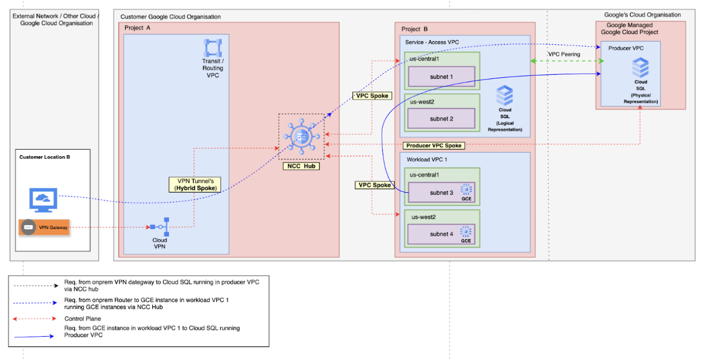

# Network Connectivity Center
## Mesh Topology with Hybrid Spoke (HA-VPN)

**On this page**

1. [Introduction](#introduction)
2. [Objectives](#objectives)
3. [Architecture](#architecture)
4. [Request flow](#request-flow)
5. [Deploy the solution](#deploy-the-solution)
6. [Prerequisites](#prerequisites)
7. [Deploy through “terraform-cli”](#deploy-through-terraform-cli)
8. [Optional: Delete the deployment](#optional-delete-the-deployment)
9. [Submit feedback](#submit-feedback)


## Introduction

The Hybrid Spoke with HA VPN solution enables secure and highly available connectivity between on-premises networks and Google Cloud environments. By leveraging Google Cloud's High Availability VPN (HA VPN) and Interconnect, this architecture provides resilient, scalable, and managed network connectivity for hybrid cloud deployments. This guide outlines the key concepts, deployment steps, and best practices for implementing the Hybrid Spoke with HA VPN solution.

## Objectives

- Establish secure and highly available connectivity between on-premises networks and Google Cloud using HA VPN and Interconnect.
- Understand the architecture and components involved in the Hybrid Spoke with HA VPN solution.
- Learn the step-by-step process to deploy and configure the solution using Terraform.
- Ensure best practices for scalability, reliability, and security in hybrid cloud networking.
- Provide guidance for managing, monitoring, and troubleshooting the deployed solution.

## Architecture

This section explains the hybrid cloud network architecture using Google Cloud, focusing on secure connectivity between on-premises resources, Google Cloud workloads, and managed services like Cloud SQL.




The architecture follows a hub-and-spoke model, leveraging Google Cloud's Network Connectivity Center (NCC) to centralize and manage network connectivity.

- **Customer Location B**: Represents the on-premises data center or office. Connectivity to Google Cloud is established via a VPN Gateway.
- **Customer Google Cloud Organization**:
    - **Project A (Hub)**: Hosts the Transit/Routing VPC, which acts as the central point for routing traffic. A Cloud VPN tunnel connects this VPC to the on-premises VPN Gateway, forming a secure "Hybrid Spoke."
    - **Network Connectivity Center (NCC) Hub**: Serves as the central hub, interconnecting all network spokes (on-premises VPN and VPCs in Project B) for seamless communication.
    - **Project B (Spokes)**: Contains Workload VPCs, configured as VPC Spokes attached to the NCC Hub. These VPCs run customer applications on Google Compute Engine (GCE) instances.
- **Google's Cloud Organization (Service Producer)**:
    - **Producer VPC**: Hosts a managed Cloud SQL database.
    - **VPC Peering**: A private peering connection links the customer's Service-Access VPC to the Producer VPC, enabling secure, low-latency communication using private IPs.

### Request Flow Descriptions

The architecture supports multiple traffic flows, each represented by different line styles and colors in the diagram:

1. **On-Premises to Cloud SQL (Dotted Black Line)**
     - **Origin**: On-premises VPN Gateway at Customer Location B.
     - **Path**:
         1. Traffic enters Google Cloud via the Cloud VPN tunnel into the Transit/Routing VPC.
         2. Routed through the NCC Hub.
         3. Forwarded to the Service-Access VPC (VPC Spoke).
         4. Crosses the VPC Peering connection to reach the Cloud SQL instance in the Producer VPC.

2. **On-Premises to GCE Instance (Dashed Blue Line)**
     - **Origin**: On-premises network.
     - **Path**:
         1. Traffic traverses the Cloud VPN tunnel into the Transit/Routing VPC.
         2. Routed through the NCC Hub.
         3. Sent to the appropriate Workload VPC Spoke.
         4. Delivered to the target GCE instance.

3. **GCE Instance to Cloud SQL (Solid Purple Line)**
     - **Origin**: GCE instance in the Service-Access VPC.
     - **Path**:
         1. Traffic flows directly across the VPC Peering connection.
         2. Arrives at the Cloud SQL instance in the Producer VPC.
     - **Note**: This is the most efficient path, as it bypasses the NCC Hub.

This architecture ensures secure, scalable, and efficient connectivity between on-premises environments, Google Cloud workloads, and managed services.

## Deploy the solution

This section guides you through the process of deploying the solution.

### Prerequisites

For the common prerequisites for this repository, please refer to the **[prerequisites.md](../prerequisites.md)** guide. Any additional prerequisites specific to this user journey will be listed below.

### Deploy through terraform-cli

1. **Clone the cloudnetworking-config-solutions repository:**
     ```sh
     git clone https://github.com/GoogleCloudPlatform/cloudnetworking-config-solutions.git
     ```

2. Navigate to the **cloudnetworking-config-solutions** folder and update the files containing the configuration values:
     - **00-bootstrap stage**
         - Update `configuration/bootstrap.tfvars` – update the Google Cloud project IDs and the user IDs/groups in the tfvars.
             ```hcl
             folder_id                           = "<your-project-id>"
             bootstrap_project_id                = "<your-project-id>"
             network_hostproject_id              = "<your-project-id>"
             network_serviceproject_id           = "<your-project-id>"
             organization_administrator          = ["user:user-example@example.com"]
             networking_administrator            = ["user:user-example@example.com"]
             security_administrator              = ["user:user-example@example.com"]
             producer_cloudsql_administrator     = ["user:user-example@example.com"]
             producer_gke_administrator          = ["user:user-example@example.com"]
             producer_alloydb_administrator      = ["user:user-example@example.com"]
             producer_vertex_administrator       = ["user:user-example@example.com"]
             producer_mrc_administrator          = ["user:user-example@example.com"]
             producer_connectivity_administrator = ["user:user-example@example.com"]
             consumer_gce_administrator          = ["user:user-example@example.com"]
             consumer_cloudrun_administrator     = ["user:user-example@example.com"]
             ```

     - **01-organisation stage**
         - Update `configuration/organization.tfvars` – update the Google Cloud project ID and the list of the APIs to enable the service networking API.
             ```hcl
             activate_api_identities = {
                 "project-01" = {
                     project_id = "your-project-id",
                     activate_apis = [
                         "servicenetworking.googleapis.com",
                         "iam.googleapis.com",
                         "compute.googleapis.com",
                     ],
                 },
             }
             ```

     - **02-networking stage**
         - Update `configuration/networking/ncc/config` – update the Google Cloud Project ID and parameters for additional resources such as VPC, subnet, and NAT as outlined based on your requirements.
         - Rename the provided `.yaml.example` file in this directory to `.yaml`.
         - Choose an implementation file (`.yaml`) of your choice to customize the NCC mesh configuration.
            ```yaml
            hubs:
                - name: <hub_name>
                    project_id: <hub_project_id>
                    export_psc: true
                    policy_mode: PRESET
                    preset_topology: MESH
                    auto_accept_projects:
                        - <hub_project_id>
                    create_new_hub: false
                    existing_hub_uri: "projects/<hub_project_id>/locations/global/hubs/<hub_name>"
                    group_name: default
                    group_decription: "Auto-accept group"

            spokes:
                - type: linked_vpc_network
                    name: <vpc-spoke-name>
                    project_id: <vpc-spoke-project-id>
                    uri: projects/<vpc-spoke-projectid>/global/networks/<vpc-name>
                - type: linked_vpn_tunnels
                    name: <vpn-spoke-name>
                    project_id: <vpn-spoke-project-id>
                    location: <region>
                    uris:
                        - projects/<vpn-spoke-project-id>/regions/<region>/vpnTunnels/<tunnel-name-1>
                        - projects/<vpn-spoke-project-id>/regions/<region>/vpnTunnels/<tunnel-name-2>
            ```

3. **Execute the terraform script**  
     You can now deploy the stages individually using **run.sh** or you can deploy all the stages automatically using the run.sh file. Navigate to the `execution/` directory and run this command to run the automatic deployment using **run.sh**.
     ```sh
     ./run.sh -s all -t init-apply-auto-approve
     # or
     ./run.sh --stage all --tfcommand init-apply-auto-approve
    ```
4. **Verify HA VPN and NCC resource creation:**  
    After deployment, go to the Network Connectivity Center and VPN sections in the Google Cloud Console. Confirm that your HA VPN tunnels and NCC hub and spokes have been successfully created and are in the expected state.

    Your hybrid spoke with HA VPN topology is now ready to connect on-premises environments to Google Cloud, supporting both producer and consumer VPCs.


## Optional: Delete the deployment

1. In Cloud Shell or in your terminal, make sure that the current working directory is `$HOME/cloudshell_open/<Folder-name>/execution`. If it isn't, go to that directory.
2. Remove the resources that were provisioned by the solution guide:
     ```sh
     ./run.sh -s all -t destroy-auto-approve
     ```
     Terraform displays a list of the resources that will be destroyed.
3. When you're prompted to perform the actions, enter `yes`.

## Submit feedback

For common troubleshooting steps and solutions, please refer to the **[troubleshooting.md](../troubleshooting.md)** guide.

To provide feedback, please follow the instructions in our **[submit-feedback.md](../submit-feedback.md)** guide.

