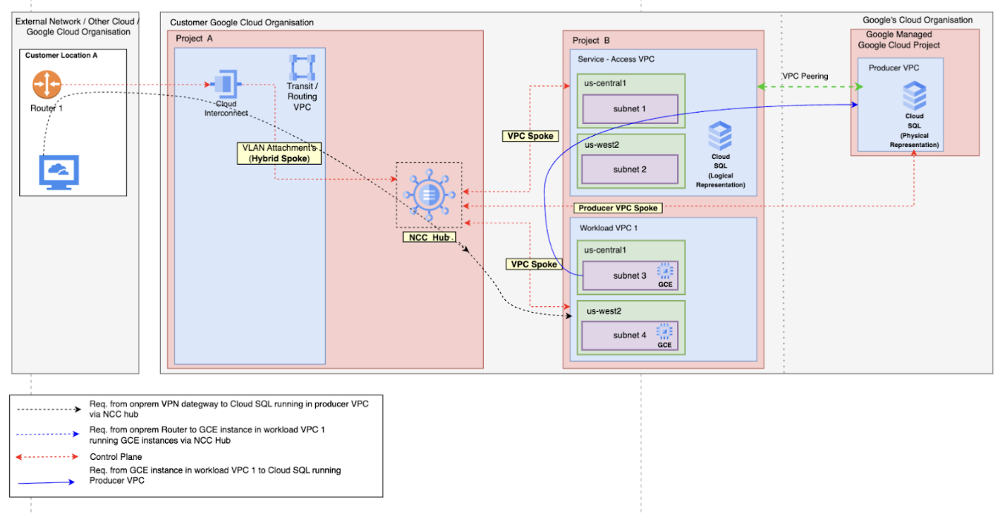

# Network Connectivity Center
## Mesh Topology with Hybrid Spoke (Interconnect) 

**On this page**

1. [Introduction](#introduction)
2. [Objectives](#objectives)
3. [Architecture](#architecture)
4. [Request flow](#request-flow)
5. [Deploy the solution](#deploy-the-solution)
6. [Prerequisites](#prerequisites)
7. [Deploy through “terraform-cli”](#deploy-through-terraform-cli)
8. [Optional: Delete the deployment](#optional-delete-the-deployment)
9. [Submit feedback](#submit-feedback)

## Introduction

Hybrid Spoke with Interconnect enables organizations to seamlessly connect their on-premises environments to Google Cloud using Dedicated or Partner Interconnect. By leveraging Network Connectivity Center (NCC), you can centralize and simplify network management, connecting VPCs, VPNs, and Interconnect attachments into a unified, scalable topology. This approach is ideal for hybrid and multi-cloud scenarios, providing secure, high-performance connectivity.

## Objectives

-   **Hybrid Connectivity:** Connect on-premises networks to Google Cloud using Dedicated or Partner Interconnect.
-   **Centralized Management:** Use Network Connectivity Center (NCC) to manage VPCs, VPNs, and Interconnect attachments.
-   **Enhanced Security:** Isolate resources using a Producer-Consumer VPC model.
-   **Scalability:** Support hybrid and multi-cloud scenarios with easy expansion.
-   **Automation:** Streamline deployment with Terraform.

## Architecture

This architecture demonstrates a robust hybrid and multi-cloud network topology using Google Cloud, enabling secure and efficient connectivity between on-premises environments, multiple VPCs, and managed services.



### Core Components

- **Customer Location A:**  
    Represents the customer's on-premises data center or office, connected to Google Cloud via Interconnect.

- **Customer Google Cloud Organization:**  
    The customer's Google Cloud environment, segmented into several networking components:
    - **Transit/Routing VPC (Project A):**  
        Acts as a central hub for managing network traffic. It contains Interconnect attachments that establishes a secure Hybrid Spoke connection with the on-premises Interconnect.
    - **Network Connectivity Center (NCC) Hub:**  
        Centralizes network connectivity, linking the Transit/Routing VPC with other VPCs (spokes) within the organization.
    - **Workload VPCs (Project B):**  
        Host applications and VM instances (Google Compute Engine). Multiple Workload VPCs (e.g., Workload VPC 1, and a second VPC with Subnet 3 and Subnet 4) are configured as VPC Spokes connected to the NCC Hub.

- **Google's Cloud Organization:**  
    A separate Google Cloud environment, typically managed by a service provider, hosting services consumed by the customer.
    - **Producer VPC:**  
        Hosts managed services such as Cloud SQL. This VPC is commonly used in SaaS provider scenarios.

- **VPC Peering:**  
    Connects the Producer VPC to the customer's Workload VPC 1, enabling private communication using internal IPs without traversing the public internet.

### Data and Request Flows

The diagram illustrates three primary data flow patterns:

- **Dotted Black Line (On-premises to Cloud SQL):**
    1. Request originates from the on-premises Interconnect.
    2. Travels through the Interconnect attachments to the Transit/Routing VPC.
    3. Routed via the NCC Hub to the appropriate Workload VPC (VPC Spoke).
    4. Traverses the VPC Peering connection to reach the Cloud SQL instance in the Producer VPC.

- **Dashed Blue Line (On-premises to GCE):**
    1. Request starts from the on-premises network.
    2. Follows the Interconnect attachments and Transit/Routing VPC to the NCC Hub.
    3. Routed to a GCE instance in Subnet 3 of the second Workload VPC.

- **Solid Purple Line (GCE to Cloud SQL):**
    1. Request originates from a GCE instance in Workload VPC 1.
    2. Directly accesses the Cloud SQL instance in the Producer VPC via VPC Peering.

This architecture provides a scalable, secure, and flexible foundation for hybrid and multi-cloud connectivity, supporting centralized management and efficient data flows between on-premises and cloud resources.

## Deploy the solution

This section guides you through the process of deploying the solution.

### Prerequisites

To use this configuration solution, ensure the following are installed:

1. **Terraform**: Modules are for use with Terraform 1.8+ and tested using Terraform 1.8+. Choose and install the preferred Terraform binary from [here](https://releases.hashicorp.com/terraform/).
2. **gcloud SDK**: Install gcloud SDK from [here](https://cloud.google.com/sdk/docs/install) to authenticate to Google Cloud while running Terraform.

### Deploy through terraform-cli

1. **Clone the cloudnetworking-config-solutions repository:**
     ```sh
     git clone https://github.com/GoogleCloudPlatform/cloudnetworking-config-solutions.git
     ```

2. Navigate to the **cloudnetworking-config-solutions** folder and update the files containing the configuration values:
     - **00-bootstrap stage**
         - Update `configuration/bootstrap.tfvars` – update the Google Cloud project IDs and the user IDs/groups in the tfvars.
             ```hcl
             folder_id                           = "<your-project-id>"
             bootstrap_project_id                = "<your-project-id>"
             network_hostproject_id              = "<your-project-id>"
             network_serviceproject_id           = "<your-project-id>"
             organization_administrator          = ["user:user-example@example.com"]
             networking_administrator            = ["user:user-example@example.com"]
             security_administrator              = ["user:user-example@example.com"]
             producer_cloudsql_administrator     = ["user:user-example@example.com"]
             producer_gke_administrator          = ["user:user-example@example.com"]
             producer_alloydb_administrator      = ["user:user-example@example.com"]
             producer_vertex_administrator       = ["user:user-example@example.com"]
             producer_mrc_administrator          = ["user:user-example@example.com"]
             producer_connectivity_administrator = ["user:user-example@example.com"]
             consumer_gce_administrator          = ["user:user-example@example.com"]
             consumer_cloudrun_administrator     = ["user:user-example@example.com"]
             ```

     - **01-organisation stage**
         - Update `configuration/organization.tfvars` – update the Google Cloud project ID and the list of the APIs to enable the service networking API.
             ```hcl
             activate_api_identities = {
                 "project-01" = {
                     project_id = "your-project-id",
                     activate_apis = [
                         "servicenetworking.googleapis.com",
                         "iam.googleapis.com",
                         "compute.googleapis.com",
                     ],
                 },
             }
             ```

     - **02-networking stage**
         - Update `configuration/networking/ncc/config` – update the Google Cloud Project ID and parameters for additional resources such as VPC, subnet, and NAT as outlined based on your requirements.
         - Rename the provided `.yaml.example` file in this directory to `.yaml`.
         - Choose an implementation file (`.yaml`) of your choice to customize the NCC mesh configuration.
             ```yaml
             hubs:
                 - name: <hub_name>
                     project_id: <hub_project_id>
                     description: "Example NCC Hub"
                     labels:
                         env: prod
                     export_psc: true
                     policy_mode: PRESET
                     preset_topology: MESH
                     auto_accept_projects:
                         - <hub_project_id>
                         - <secondary_project_id>
                     create_new_hub: false
                     existing_hub_uri: "projects/<hub_project_id>/locations/global/hubs/<hub_name>"
                     group_name: default

             spokes:
                 - type: linked_vpc_network
                     name: spoke1
                     project_id: <spoke1_project_id>
                     uri: projects/<spoke1_project_id>/global/networks/<vpc1_name>
                     description: "VPC Spoke 1"
                     labels:
                         env: prod
                 - type: linked_interconnect_attachments
                     name: <linked_interconnect_attachments_name>
                     project_id: <spoke_project_id>
                     location: <region>
                     uris:
                         - projects/<spoke_project_id>/regions/<region>/interconnectAttachments/<linked_interconnect_attachments_name>
                         - projects/<spoke_project_id>/regions/<region>/interconnectAttachments/<linked_interconnect_attachments_name>
             ```

3. **Execute the terraform script**  
     You can now deploy the stages individually using **run.sh** or you can deploy all the stages automatically using the run.sh file. Navigate to the `execution/` directory and run this command to run the automatic deployment using **run.sh**.
     ```sh
     ./run.sh -s all -t init-apply-auto-approve
     # or
     ./run.sh --stage all --tfcommand init-apply-auto-approve
    ```
4. **Verify Interconnect and NCC resource creation:**  
    After deployment, go to the Network Connectivity Center and Interconnect sections in the Google Cloud Console. Confirm that your Interconnect attachments and NCC hub and spokes have been successfully created and are in the expected state.

    Your hybrid spoke with Interconnect topology is now ready to connect on-premises environments to Google Cloud, supporting both producer and consumer VPCs.


## Optional: Delete the deployment

1. In Cloud Shell or in your terminal, make sure that the current working directory is `$HOME/cloudshell_open/<Folder-name>/execution`. If it isn't, go to that directory.
2. Remove the resources that were provisioned by the solution guide:
     ```sh
     ./run.sh -s all -t destroy-auto-approve
     ```
     Terraform displays a list of the resources that will be destroyed.
3. When you're prompted to perform the actions, enter `yes`.

## Submit feedback

To troubleshoot errors, check Terraform's logs and output.

To submit feedback, do the following:

- If you're looking for assistance with streamlining network configuration automation for a comparable use case, feel free to submit an issue on the [GitHub repository](https://github.com/GoogleCloudPlatform/cloudnetworking-config-solutions/issues).
- For unmodified Terraform code, create issues in the [GitHub repository](https://github.com/GoogleCloudPlatform/cloudnetworking-config-solutions/issues). GitHub issues are reviewed on a best-effort basis and are not intended for general use questions.
- For issues with the products that are used in the solution, contact [Cloud Customer Care](https://cloud.google.com/support-hub).
