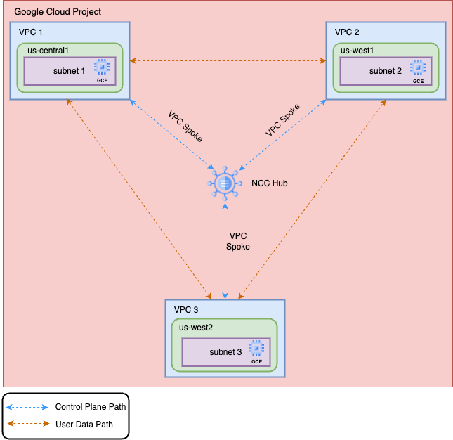

# Network Connectivity Center with Mesh Topology
## Mesh Topology with VPC as spokes

**On this page**

  1. Introduction

  2. Objectives

  3. Architecture

  4. Request Flow

  5. Architecture Components

  6. Deploy the Solution

  7. Prerequisites

  8. Deploy with "single-click"

  9. Deploy through Terraform-cli

  10. Optional - Delete the Deployment

  11. Troubleshoot Errors

  12. Submit Feedback

## Introduction

This guide is designed to assist Network and Engineering teams in simplifying their cloud migration journey. Moving to a cloud-first strategy often involves managing complex networks across on-premises and multiple cloud providers. This guide focuses on automating the configuration of Google Cloud's Network Connectivity Center (NCC), a crucial component for simplifying connectivity across these heterogeneous environments.

NCC provides a single management experience for your on-premises and cloud networks, enabling consistent access, policies, and services across global regions. However, managing and configuring NCC manually can be time-consuming and error-prone. This guide leverages automation to streamline the creation of Hubs and Spokes within NCC, accelerating your cloud adoption journey.

This guide assumes familiarity with cloud networking concepts, including Virtual Private Clouds (VPCs), and basic understanding of automation tools. It provides step-by-step instructions and best practices for automating NCC configurations, ultimately improving efficiency and reducing operational overhead.

## Objectives

* Create a Network Connectivity Center Hub: Establish a central hub for managing network connectivity across your Google Cloud projects and on-premises networks.
* Establish VPC Spokes: Create three VPC spokes in different regions (e.g., us-central1, europe-west1, asia-east1) and attach them to the Network Connectivity Center hub.
* Configure Full Mesh Connectivity: Configure a full mesh topology where each VPC spoke can communicate directly with all other spokes.
* Validate Network Connectivity: Deploy workloads (e.g., virtual machines) in each VPC spoke and validate connectivity between them using tools like ping.


## Architecture

**Scenario 1:** The diagram illustrates a multi-network cloud architecture with 3 VPC spokes connected with a hub in a mesh topology.



### Request flow

This scenario involves creating a hub of mesh topology and 3 VPC Spoke connecting to this hub. The architecture diagram depicts a hub-and-spoke network topology, designed to facilitate communication between multiple VPCs (Virtual Private Clouds).

1. Hub: The central point of the network, configured with a mesh topology to enable efficient traffic routing between connected spokes.

2. Spokes: Three VPCs (VPC1, VPC2, VPC3) are connected to the Hub as VPC spokes. Each spoke represents an isolated network environment. These Spokes can be from the same google cloud project or from a different google cloud project.

3. Firewall Rules: To control traffic flow between spokes, firewall rules are implemented on each VPC, allowing or denying ingress and egress traffic based on IP CIDR ranges and ports.

4. Network Connectivity: The architecture relies on Network Connectivity APIs to establish and manage connections between the hub and spokes.

The architecture diagram illustrates 3 different VPC i.e. VPC1, VPC2 and VPC3 connected as VPC spoke to the NCC Hub. The VPC networks can be located across different projects in the same google cloud organization or different organizations. The resources created within this VPC along with appropriate firewall rules would allow connectivity between the different producer and consumer services created in these VPC. For simplicity, we have created 3 GCE instances in each of the VPC. Once the NCC connection is established, each of these GCE private/internal IPs would be reachable to each other.

## Deploy the solution

This section guides you through the process of deploying the solution.

### Prerequisites

For the common prerequisites for this repository, please refer to the **[prerequisites.md](../prerequisites.md)** guide. Any additional prerequisites specific to this user journey will be listed below.

### Deploy with "single click"

1. Click on Open in Google Cloud Shell button below.

    <a href="https://ssh.cloud.google.com/cloudshell/editor?shellonly=true&cloudshell_git_repo=https://github.com/sridharshini1/cloudnetworking-config-solutions.git&cloudshell_open_in_editor=configuration/organization.tfvars&cloudshell_open_in_editor=configuration/networking.tfvars&cloudshell_open_in_editor=configuration/networking/ncc/ncc.tfvars&cloudshell_open_in_editor=configuration/networking/ncc/config/instance-vpc-spoke-lite.yaml.example&cloudshell_tutorial=docs/Networking/NCC/ncc-mesh.md" target="_new">
        
    </a>

2. Run the prerequisites script to enable APIs and set Cloud Build permissions.
    ```
    sh docs/NCC/helper-script/prereq-vpcspoke.sh
    ```

3. Update the configuration files that gets loaded in the Cloud shell editor and run the cloud build job to create resources

    ```
    gcloud builds submit . --config docs/NCC/build/VPCSpokeMesh/cloudbuild-vpcspoke.yaml --ignore-file=".gcloudignore"
    ```

4. [Optional] Run the Cloud Build Job to destroy resources

    ```
    gcloud builds submit . --config docs/NCC/build/VPCSpokeMesh/cloudbuild-vpcspoke-destroy.yaml --ignore-file=".gcloudignore"
    ```


### Deploy through terraform-cli

1. **Clone** the cloudnetworking-config-solutions repository repository**:**
    ```
    git clone https://github.com/GoogleCloudPlatform/cloudnetworking-config-solutions.git
    ```

2. Navigate to **cloudnetworking-config-solutions** folder and update the files containing the configuration values
   * **00-bootstrap stage**
     * Update configuration/bootstrap.tfvars **\-** update the google cloud project IDs and the user IDs/groups in the tfvars.

        ```
            folder_id                           = "<your-project-id>"
            bootstrap_project_id                = "<your-project-id>"
            network_hostproject_id              = "<your-project-id>"
            network_serviceproject_id           = "<your-project-id>"
            organization_administrator          = ["user:user-example@example.com"]
            networking_administrator            = ["user:user-example@example.com"]
            security_administrator              = ["user:user-example@example.com"]
            producer_cloudsql_administrator     = ["user:user-example@example.com"]
            producer_gke_administrator          = ["user:user-example@example.com"]
            producer_alloydb_administrator      = ["user:user-example@example.com"]
            producer_vertex_administrator       = ["user:user-example@example.com"]
            producer_mrc_administrator          = ["user:user-example@example.com"]
            producer_connectivity_administrator = ["user:user-example@example.com"]
            consumer_gce_administrator          = ["user:user-example@example.com"]
            consumer_cloudrun_administrator     = ["user:user-example@example.com"]
        ```

   * **01-organisation stage**
     * Update configuration/organization.tfvars \- update the google cloud project ID and the list of the APIs to enable the service networking API.

        ```
        activate_api_identities = {
          "project-01" = {
            project_id = "your-project-id",
            activate_apis = [
              "servicenetworking.googleapis.com",
              "iam.googleapis.com",
              "compute.googleapis.com",
              ],
          },
        }
        ```

  * **02-networking stage**
    * Update `configuration/networking/ncc/config` – update the Google Cloud Project ID and parameters for additional resources such as VPC, subnet, and NAT as outlined based on your requirements.
    * Rename the provided `.yaml.example` file in this directory to `.yaml`.
    * Choose an implementation file (`.yaml`) of your choice to customize the NCC mesh configuration.

      ```yaml
      hubs:
       - name: <hub_name>
        project_id: <hub_project_id>
        description: "Example NCC Hub"
        labels:
          env: prod
        export_psc: true
        policy_mode: PRESET
        preset_topology: MESH
        auto_accept_projects:
          - <hub_project_id>
          - <secondary_project_id>
        create_new_hub: false
        existing_hub_uri: "projects/<hub_project_id>/locations/global/hubs/<hub_name>" # Reuse an existing hub by setting `create_new_hub: false`
        group_name: default
        group_decription: "Auto-accept group"
        spoke_labels:
          team: network

      spokes:
       - type: linked_vpc_network
        name: spoke1
        project_id: <spoke1_project_id>
        uri: projects/<spoke1_project_id>/global/networks/<vpc1_name>
        description: "VPC Spoke 1"
        labels:
          env: prod
      # Add more spokes by appending additional entries under the `spokes` section. Each spoke can be associated with the hub as needed.
      ```
3. **Execute the terraform script**
   You can now deploy the stages individually using **run.sh** or you can deploy all the stages automatically using the run.sh file. Navigate to the execution/ directory and run this command to run the automatic deployment using **run.sh .**

    ```
    ./run.sh -s all -t init-apply-auto-approve
    or
    ./run.sh --stage all --tfcommand init-apply-auto-approve
    ```

4. **Verify NCC resource creation:**
   Once the deployment is complete, navigate to the network connectivity center section in the Google Cloud Console to confirm that your network connectivity center resources has been successfully created.

   Your network connectivity center hub and spoke are now ready to serve different producers and consumers.

## Optional-Delete the deployment

1. In Cloud Shell or in your terminal, make sure that the current working directory is $HOME/cloudshell\_open/\<Folder-name\>/execution. If it isn't, go to that directory.
2. Remove the resources that were provisioned by the solution guide:

    ```
    ./run.sh -s all -t destroy-auto-approve
    ```

Terraform displays a list of the resources that will be destroyed.

3. When you're prompted to perform the actions, enter yes.

## Submit feedback

For common troubleshooting steps and solutions, please refer to the **[troubleshooting.md](../troubleshooting.md)** guide.

To provide feedback, please follow the instructions in our **[submit-feedback.md](../submit-feedback.md)** guide.
