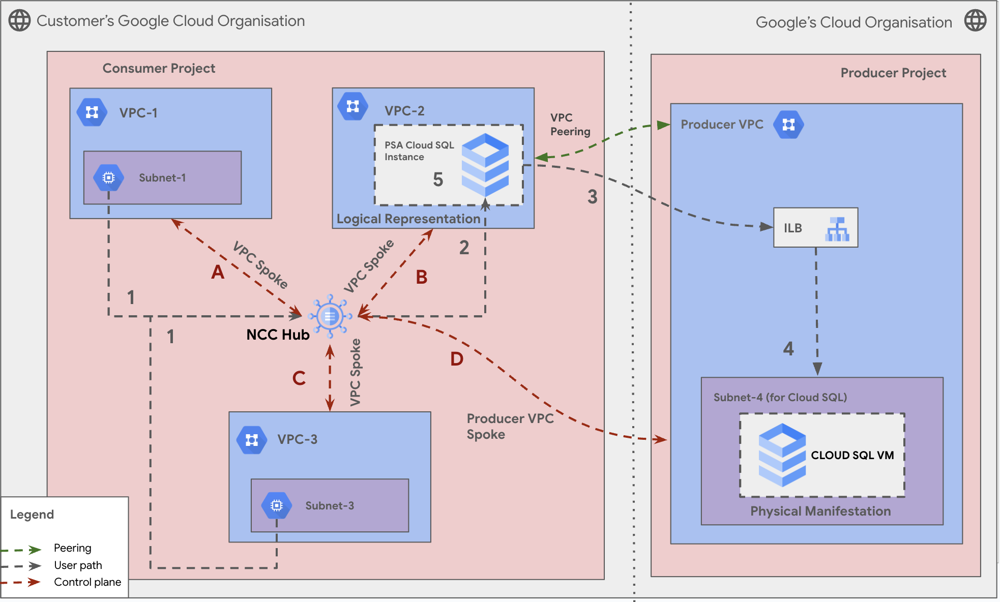

# Network Connectivity Center
## Mesh Topology with Producer VPC as a spoke 

**On this page**

  1. Introduction

  2. Objectives

  3. Architecture

  4. Request Flow

  5. Architecture Components

  6. Deploy the Solution

  7. Prerequisites

  8. Deploy with "single-click"

  9. Deploy through Terraform-cli

  10. Optional - Delete the Deployment

  11. Troubleshoot Errors

  12. Submit Feedback

## Introduction

This document guides you on using a Producer VPC as a spoke within a Google Cloud Network Connectivity Center (NCC). This approach enables secure connectivity between a service producer's VPC and external entities, such as on-premises consumers or partners, allowing service producers to offer services or data while maintaining control over network security and routing.

Following are the steps involved :

1. Provide the existing VPC spoke of your consumer network that is peered with the producer network.
2. Specify the name of the peering connection.

Using this information, Network Connectivity Center identifies the VPC network of the service producer and adds a corresponding Producer VPC spoke to a hub in your project. Once the Producer VPC spoke is part of the hub, its subnet routes are exported, allowing other spokes on the hub to access its services.

To utilize a Producer VPC spoke, the service must be consumed using private services access. Specifically, the name of the peering connection between your VPC network and the producer VPC network must be `servicenetworking-googleapis-com`. Most Google services consumed through private services access, such as Cloud SQL and Filestore, are compatible with Producer VPC spokes.

This approach leverages the capabilities of NCC to provide a centralized platform for managing network connections, simplifying the overall network architecture, and enhancing security when sharing resources with external parties.

## Objectives

* Enable Private Services Access: Ensure private services access is configured between the Producer VPC and consumer VPCs.
* Configure a Producer VPC Spoke: Set up a Producer VPC as a spoke and attach it to the Network Connectivity Center hub.
* Export Subnet Routes: Configure the Producer VPC spoke to export its subnet routes to the Network Connectivity Center hub.
* Validate Connectivity: Deploy workloads in the Producer VPC and consumer VPCs, and validate connectivity between them using tools like ping or traceroute.


## Architecture

**Secure and Centralized Connectivity for Cloud SQL Access:**  
This diagram illustrates a secure and centralized connectivity architecture for accessing a Cloud SQL instance from multiple consumer VPCs within a Google Cloud environment. It utilizes Network Connectivity Center (NCC) as a hub to manage connectivity and routing, and a Producer-Consumer model to isolate the Cloud SQL instance within a dedicated Producer VPC.



### Request Flow

This section describes how a user in **VPC-1** accesses a **Cloud SQL instance** in the **Producer VPC** using Network Connectivity Center (NCC).

#### User Plane Data Flow

1. **VPC-1 to VPC-2 (via NCC Hub):**  
  The request from VPC-1 is routed through the NCC Hub to VPC-2.

2. **VPC-2 (PSA Representation):**  
  VPC-2, with Private Service Access (PSA), receives the request and prepares to forward it to the Producer VPC.

3. **VPC-2 to Producer VPC (via VPC Peering):**  
  The request is sent from VPC-2 to the Producer VPC using VPC Peering.

4. **Producer VPC to Cloud SQL VM (via ILB):**  
  The Producer VPC's Internal Load Balancer (ILB) directs the request to the Cloud SQL VM.

5. **Response Path:**  
  The Cloud SQL VM processes the request and returns the response along the same path.

#### Control Plane Communication

- **A:** VPC-1 ↔ NCC Hub  
- **B:** VPC-2 ↔ NCC Hub  
- **C:** VPC-3 ↔ NCC Hub  
- **D:** NCC Hub ↔ Producer VPC Spoke  

Numbers (1–5) indicate the user plane (data flow), while letters (A–D) represent control plane communications for route exchange, health checks, and configuration.

## Deploy the solution

This section guides you through the process of deploying the solution.

### Prerequisites

For the common prerequisites for this repository, please refer to the **[prerequisites.md](../prerequisites.md)** guide. Any additional prerequisites specific to this user journey will be listed below.

### Deploy with "single click"

1. Click on Open in Google Cloud Shell button below.

    <a href="https://ssh.cloud.google.com/cloudshell/editor?shellonly=true&cloudshell_git_repo=https://github.com/sridharshini1/cloudnetworking-config-solutions.git&cloudshell_open_in_editor=configuration/organization.tfvars&cloudshell_open_in_editor=configuration/networking.tfvars&cloudshell_open_in_editor=configuration/networking/ncc/ncc.tfvars&cloudshell_open_in_editor=configuration/networking/ncc/config/instance-producer-vpc-lite.yaml.example&cloudshell_tutorial=docs/Networking/NCC/ncc-producer-vpc.md" target="_new">
        
    </a>

2. Run the prerequisites script to enable APIs and set Cloud Build permissions.
    ```
    sh docs/NCC/helper-script/prereq-producerspoke.sh
    ```

3. Update the configuration files that gets loaded in the Cloud shell editor and run the cloud build job to create resources

    ```
    gcloud builds submit . --config docs/NCC/build/ProducerVPCSpoke/cloudbuild-producerspoke.yaml --ignore-file=".gcloudignore"
    ```

4. [Optional] Run the Cloud Build Job to destroy resources

    ```
    gcloud builds submit . --config docs/NCC/build/VPCSpokeMesh/cloudbuild-producerspoke-destroy.yaml --ignore-file=".gcloudignore"
    ```

### Deploy through terraform-cli

1. **Clone the cloudnetworking-config-solutions repository:**
  ```sh
  git clone https://github.com/GoogleCloudPlatform/cloudnetworking-config-solutions.git
  ```

2. **Navigate to the `cloudnetworking-config-solutions` folder and update the configuration files:**

  - **00-bootstrap stage**
    - Update `configuration/bootstrap.tfvars` with your Google Cloud project IDs and user IDs/groups:
      ```hcl
      folder_id                           = "<your-project-id>"
      bootstrap_project_id                = "<your-project-id>"
      network_hostproject_id              = "<your-project-id>"
      network_serviceproject_id           = "<your-project-id>"
      organization_administrator          = ["user:user-example@example.com"]
      networking_administrator            = ["user:user-example@example.com"]
      security_administrator              = ["user:user-example@example.com"]
      producer_cloudsql_administrator     = ["user:user-example@example.com"]
      producer_gke_administrator          = ["user:user-example@example.com"]
      producer_alloydb_administrator      = ["user:user-example@example.com"]
      producer_vertex_administrator       = ["user:user-example@example.com"]
      producer_mrc_administrator          = ["user:user-example@example.com"]
      producer_connectivity_administrator = ["user:user-example@example.com"]
      consumer_gce_administrator          = ["user:user-example@example.com"]
      consumer_cloudrun_administrator     = ["user:user-example@example.com"]
      ```

  - **01-organisation stage**
    - Update `configuration/organization.tfvars` with your project ID and enable required APIs:
      ```hcl
      activate_api_identities = {
        "project-01" = {
        project_id = "your-project-id",
        activate_apis = [
          "servicenetworking.googleapis.com",
          "iam.googleapis.com",
          "compute.googleapis.com",
        ],
        },
      }
      ```

  - **02-networking stage**
    - Update `configuration/networking.tfvars` with your project ID and networking parameters:
      ```hcl
      project_id  = "your-project-id"
      region      = "us-central1"

      ## VPC input variables for workbench

      create_network    = "" # Use true or false
      create_subnetwork = "" # Use true or false
      psa_range_name    = "psarange-1"
      psa_range         = "10.0.64.0/20"
      subnets = [
        {
        name                  = "subnet-1"
        ip_cidr_range         = "10.0.0.0/24"
        region                = "us-central1"
        description           = "Primary subnet"
        flow_logs_config = {
          aggregation_interval = "INTERVAL_10_MIN"
          filter_expression    = "true"
          flow_sampling        = 0.5
          metadata             = "INCLUDE_ALL_METADATA"
          metadata_fields      = ["field1", "field2"]
        }
        secondary_ip_ranges = {
          "secondary-range-1" = "10.1.0.0/24"
        }
        }
      ]
      ```

    - To configure NCC for your environment, create YAML files in the `../../../configuration/networking/ncc/config/` directory. Example:
      ```yaml
      hubs:
        - name: <hub_name>
        project_id: <hub_project_id>
        description: "Example NCC Hub"
        labels:
          env: prod
        export_psc: true
        policy_mode: PRESET
        preset_topology: MESH
        auto_accept_projects:
          - <hub_project_id>
          - <secondary_project_id>
        create_new_hub: false
        existing_hub_uri: "projects/<hub_project_id>/locations/global/hubs/<hub_name>"
        group_name: default
        group_decription: "Auto-accept group"
        spoke_labels:
          team: network

      spokes:
        - type: "producer_vpc_spoke"
        name: "producer-spoke-1"
        project_id: "producerspoke1-project-id"
        location: "global"
        uri: "projects/producerspoke1-project-id/global/networks/producer-spoke-1-vpc"
        description: "Producer VPC spoke for shared services"
        peering: "servicenetworking-googleapis-com"
        exclude_export_ranges: []
        labels:
          env: "prod"
      ```


    3. **Execute the terraform script**
        You can now deploy the stages individually using **run.sh** or you can deploy all the stages automatically using the run.sh file. Navigate to the execution/ directory and run this command to run the automatic deployment using **run.sh .**

          ```
          ./run.sh -s all -t init-apply-auto-approve
          or
          ./run.sh --stage all  --tfcommand init-apply-auto-approve
          ```
    4. **Verify Producer VPC Spoke Creation:**
        After the deployment is complete, navigate to the Network Connectivity Center section in the Google Cloud Console to confirm that the Producer VPC spoke has been successfully created and attached to the hub.

        Your Producer VPC spoke is now ready to facilitate seamless and secure connectivity between the producer's services and the consumer networks.

## Optional-Delete the deployment

1. In Cloud Shell or in your terminal, make sure that the current working directory is $HOME/cloudshell\_open/\<Folder-name\>/execution. If it isn't, go to that directory.
2. Remove the resources that were provisioned by the solution guide:

    ```
    ./run.sh -s all -t destroy-auto-approve
    ```

Terraform displays a list of the resources that will be destroyed.

3. When you're prompted to perform the actions, enter yes.

## Submit feedback

For common troubleshooting steps and solutions, please refer to the **[troubleshooting.md](../troubleshooting.md)** guide.

To provide feedback, please follow the instructions in our **[submit-feedback.md](../submit-feedback.md)** guide.