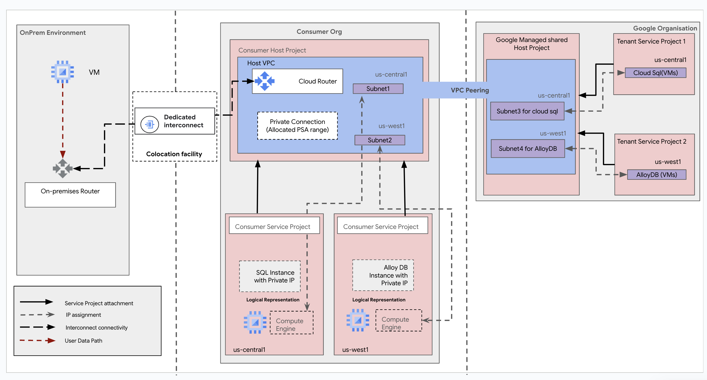
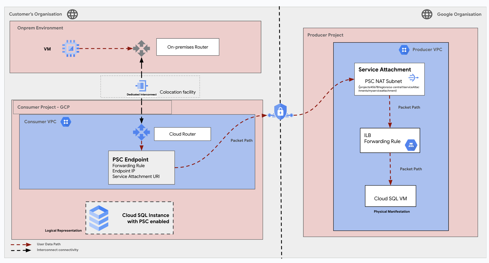
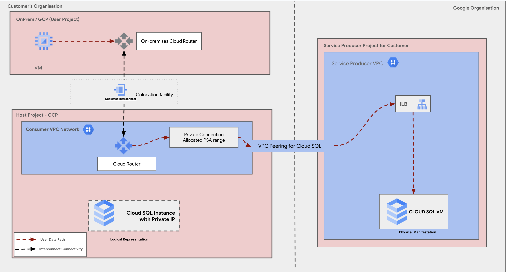

# Interconnect Connectivity with Cloud SQL and AlloyDB

**On this page**

1. [Objectives](#objectives)
2. [Architecture](#architecture)
3. [Request flow](#request-flow)
4. [Deploy the solution](#deploy-the-solution)
5. [Prerequisites](#prerequisites)
6. [Deploy through “terraform-cli”](#deploy-through-terraform-cli)
7. [Optional: Delete the deployment](#optional-delete-the-deployment)
8. [Submit feedback](#submit-feedback)

## Introduction

This guide assists database administrators, cloud architects, and cloud engineers in deploying Google Cloud Interconnect for seamless connectivity between on-premises networks and Google Cloud resources. It focuses on integrating Cloud SQL and AlloyDB, leveraging Private Service Access (PSA) for private connectivity to Google-managed services and Private Service Connect (PSC) for securely exposing services to consumers within or across organizations.

Key features include automated setup using Terraform, secure networking with Virtual Private Cloud (VPC), dynamic routing via Border Gateway Protocol (BGP), and scalable connectivity options. The guide ensures high-performance, low-latency connections while simplifying complex configurations, making it ideal for hybrid cloud deployments and real-time database integration.

## Objectives

* Learn how to configure and deploy Google Cloud Interconnect to establish secure, high-performance connectivity between your on-premises network and Google Cloud resources such as Cloud SQL and AlloyDB.
* Deploy Cloud SQL and AlloyDB instances with Private Service Access (PSA) and Private Service Connect (PSC) enabled, integrating them with your on-premises or hybrid infrastructure for secure, optimized communication.
* Modify your network and connectivity settings to ensure seamless private access to Cloud SQL and AlloyDB, including configuring VLAN attachments, BGP routing, and setting up firewall rules.
* Perform post-deployment actions such as validating connectivity, monitoring resource performance, and managing security configurations to ensure the reliability and security of your database solutions with Interconnect.

## Architecture

**Scenario 1:** The diagram illustrates a hybrid cloud architecture with connectivity between an on-premises environment and Google Cloud.



#### Request flow

The request flow in this diagram is as follows:

  1. User Request:

      * A user within the "OnPrem Environment" initiates a request to access resources (e.g., database query, application access) located in the "Consumer Service Project" (either SQL Instance or AlloyDB Instance).

  2. On-Premises Routing:

      * The request is routed through the "On-premises Router" within the user's "OnPrem Environment."
      * The router directs the request to the "Dedicated Interconnect" that establishes a private connection to the "Colocation Facility."

  3. Colocation Facility:

      * The request enters the "Colocation Facility" where it reaches the "VM" (Virtual Machine).
      * The VM acts as a gateway or intermediary within the "Consumer Host Project."

  4. Consumer Host Project:

      * The request is forwarded from the VM to the "Cloud Router" within the "Host VPC" (Virtual Private Cloud) in the us-central1 region.
      * The Cloud Router directs the request based on the destination:
          * SQL Instance: The request is routed within the same VPC (us-central1) to the "Subnet1" where the "SQL Instance with Private IP" resides.
          * AlloyDB Instance: The request traverses through "VPC Peering" to reach the us-west1 region. It then goes to "Subnet2" and finally to the "AlloyDB Instance with Private IP" in "Subnet4 for AlloyDB."

  5. Google Managed Shared Host Project:

      * If the request targets resources within the "Google Organisation," it passes through the "Google Managed Shared Host Project."
      * The request is routed to the appropriate "Tenant Service Project" (either 1 or 2) based on the specific resource being accessed.
          * Tenant Service Project 1: The request is routed to the "Cloud SQL (VMs)" in the us-central1 region.
          * Tenant Service Project 2: The request is routed to the "AlloyDB (VM)" in the us-west1 region.

  6. Response:

      * Once the request is processed by the respective service (SQL Instance, AlloyDB Instance, Cloud SQL, or AlloyDB), the response follows the reverse path back to the user in the "OnPrem Environment."

**Scenario 2:** The diagram depicts three environments: the on-premises environment (left box), the Google Cloud consumer organization (middle box), and the Google-managed google organization (right box).



#### Request flow

The request flow in this diagram is as follows:

1. On-premises Environment:
   * A VM in the on-premises environment sends a request.
   * The traffic is routed through the on-premises router.
2. Interconnect to GCP:
   * The request passes through a Dedicated Interconnect (or VPN) that links the on-premises environment to the Google Cloud Platform (GCP).
   * The interconnect connectivity facilitates secure communication between the on-premises environment and the cloud.
3. Consumer Project (GCP):
   * Once in GCP, the traffic enters the Consumer VPC.
   * The Cloud Router manages the routing within the VPC, forwarding the request to the Private Service Connect (PSC) Endpoint.
   * The PSC Endpoint is associated with:
     * A forwarding rule.
     * An endpoint IP.
     * A service attachment URI.
4. Crossing to Producer Project:
   * The request is routed via the Service Attachment, a component configured in the Producer VPC.
   * The Service Attachment maps the connection to the Internal Load Balancer (ILB) Forwarding Rule.
5. Producer Project (GCP):
   * The ILB Forwarding Rule in the Producer VPC directs the traffic to its final destination.
   * The destination in this case is a Cloud SQL VM, representing the physical manifestation of the service being accessed.


* **Packet Path**

    * The User Data Path (solid red line) illustrates the route of the request, starting from the on-premises VM to the Cloud SQL instance.
    * The Interconnect Connectivity (dashed red line) facilitates communication between the on-premises environment and GCP infrastructure.

**Scenario 3:** On-Premises to Google Cloud Connectivity with Private Service Access Emphasizing Security



#### Request flow

The request flow in this diagram is as follows:

1. On-premises VM:
   * A request is initiated from the VM in the on-premises environment.
   * Traffic is routed through the on-premises cloud router.
2. Dedicated Interconnect:
   * The request travels through the Dedicated Interconnect in a colocation facility, connecting the on-premises environment to Google Cloud.
3. Host Project (Consumer VPC):
   * The request enters the Consumer VPC Network.
   * The Cloud Router in the Consumer VPC forwards the request to the Private Connection, which uses an allocated Private Service Access (PSA) range.
   * The Private Connection establishes VPC Peering to the service producer project.
4. Service Producer Project:
   * The request reaches the Internal Load Balancer (ILB) in the Service Producer VPC.
   * The ILB directs the request to the Cloud SQL VM (the physical instance handling the database).

**Simplified Flow Summary:**
VM (On-Premises) → On-Premises Router → Dedicated Interconnect → Cloud Router (Consumer VPC) → Private Connection → VPC Peering → Internal Load Balancer (ILB) → Cloud SQL VM**

## Products Used

The solution for setting up Google Cloud Interconnect for Cloud SQL and AlloyDB involves the following Google Cloud products:

* **Google Cloud Interconnect:** A high-bandwidth, low-latency networking service that establishes direct, private connectivity between your on-premises environment and Google Cloud. Interconnect offers secure, reliable communication for hybrid workloads, enabling seamless integration of on-premises and cloud-based resources.

* **Cloud SQL:** A fully managed relational database service for MySQL, PostgreSQL, and SQL Server. It provides scalability, high availability, and ease of management for applications requiring relational database capabilities.

* **AlloyDB for PostgreSQL:** A PostgreSQL-compatible database service designed for demanding workloads. It delivers high performance, scalability, and advanced analytical capabilities with built-in high availability and resilience.

* **Google Cloud Virtual Private Cloud (VPC):** A globally distributed, private network infrastructure that securely connects Google Cloud resources. VPC supports custom subnet configurations, private networking, and routing flexibility essential for hybrid cloud deployments with Interconnect.

* **Private Service Access (PSA):** Enables private, secure access to Google-managed services like Cloud SQL and AlloyDB from your VPC, ensuring traffic remains on Google’s network for enhanced security and reduced latency.

* **Cloud Logging:** Collects and stores logs from Google Cloud resources, allowing you to analyze operations such as network connectivity and database performance. It provides visibility into critical events during Interconnect setup and usage.

* **Cloud Monitoring:** Offers insights into the health and performance of Google Cloud resources. It allows you to monitor metrics, set up alerts, and optimize the performance of Interconnect, Cloud SQL, and AlloyDB.

* **Identity and Access Management (IAM):** Manages access to Google Cloud resources with granular permissions. IAM ensures that only authorized users or service accounts can configure and use Interconnect, VPC, and database services.

* **Terraform:** An infrastructure-as-code tool that automates the deployment and management of resources, including Interconnect configurations, VPC networks, and databases, ensuring repeatability and consistency across environments.

* **gcloud CLI:** A command-line tool that simplifies interactions with Google Cloud, enabling efficient configuration and verification of Interconnect and related resources.

## Deploy the solution

This section guides you through the process of deploying the solution.

### Prerequisites

  For the common prerequisites for this repository, please refer to the **[prerequisites.md](../prerequisites.md)** guide. Any additional prerequisites specific to this user journey will be listed below.

  To establish connectivity between your on-premises environment and Google Cloud resources like **AlloyDB** and **Cloud SQL**, the following prerequisites and steps must be followed:

### Establishing Interconnect and Configuring Connectivity for AlloyDB or Cloud SQL

This document outlines the process of setting up Dedicated Interconnect and configuring connectivity for AlloyDB or Cloud SQL within a Google Cloud environment.

**1. Colocation Facility and Dedicated Interconnect**

* Ensure customer access to a **common peering location** (i.e., a colocation facility) where Google offers **Dedicated Interconnect**.
* At this location, your customer routers will connect directly to Google's network devices via **cross-connect**.

* Ordering Dedicated Interconnect

* Use the **Google Cloud Console** to order a Dedicated Interconnect.
* Upon ordering, you will receive an **LOA-CFA** (Letter of Authorization and Connecting Facility Assignment). This document contains details needed to:
    * Work with the colocation facility to establish the **cross-connection** to Google's peering network.

**2. VLAN Attachment and Interconnect Attachment**

* Once the physical cross-connect is established, create a **VLAN attachment** on the Google side.
* Then, create an **interconnect attachment (ICA)** to associate the VLAN attachment with a VPC network in your Google Cloud project.

**3. Verifying Connection Status**

* After the cross-connection is established:
    * The interconnect link status in the Google Cloud Console will turn **green**, indicating it is **PROVISIONED**.
    * At this point, the physical connection between your on-premises environment and Google’s network edge is complete.

**4. Tools and Access Requirements**

Before running any scripts, ensure the following:

* **Tools Installation:**
    * Install Terraform on the machine from which you plan to execute the script.
    * Install gcloud CLI on the same machine.
* **GCP Project Access:**
    * Ensure access to GCP projects and permissions to use the physical connections established at the colocation facility.
* **Supported Network Design Patterns:**
    * **Single Project Topology:** If using one host project to manage resources.
    * **Host-Service Project Topology:** If using separate host and service projects. For this topology, you will require **Compute XPN Permission** (described in Step 7 below).

**5. Required IAM Permissions**

  Ensure the user executing the script has the following permissions in the respective projects:

   * **Interconnect Project**

      * compute.interconnectAttachments.use
      * compute.interconnectAttachments.get
      * compute.interconnectAttachments.list

   *  **Host Project**

      * roles/compute.networkAdmin
      * roles/compute.securityAdmin
      * roles/iam.serviceAccountAdmin
      * roles/serviceusage.serviceUsageAdmin
      * roles/resourcemanager.projectIamAdmin

   * **Service Project**

      * roles/compute.instanceAdmin
      * roles/iam.serviceAccountAdmin
      * roles/serviceusage.serviceUsageAdmin
      * roles/resourcemanager.projectIamAdmin

  * **[Optional] Compute XPN Permission**

      * If using the Host-Service project topology, ensure the user has roles/compute.xpnAdmin permission at the common folder containing both host and service projects. Learn more.

**6. Assigning Permissions**

You can assign IAM permissions using either of the following methods:

* **Using Google Cloud Console:**

  * Assign the required roles via the web console to the user executing the script.

* **Using gcloud CLI:**

  1. Run the following commands to assign roles programmatically:
    `gcloud projects add-iam-policy-binding <PROJECT_ID> \
      --member="user:<USER_EMAIL>" \
      --role="roles/<ROLE>"`

**7. Service Account and Impersonation**

* Create a **service account** with the necessary permissions described above.
* Use the service account to impersonate while running the Terraform code. Learn more about service account impersonation.

**Steps to Update Terraform Configuration:**

1. Update the providers.tf.template file:
   * Set the `impersonate_service_account` field with the service account email created earlier.
2. Rename providers.tf.template to providers.tf.

**8. Execution Steps**

Once the prerequisites are complete:

* Execute the Terraform script to establish the interconnect and configure connectivity for AlloyDB or Cloud SQL.
* Follow the appropriate topology (Single Project or Host-Service Project) based on your architecture.

This process ensures seamless and secure connectivity between your on-premises environment and Google Cloud databases.

### Deploy through “terraform-cli”

1. **Clone the cloudnetworking-config-solutions repository:**
   `git clone https://github.com/GoogleCloudPlatform/cloudnetworking-config-solutions.git`

### Configuration

To configure networking.tfvars for your environment, here's an example which can be used for your reference:

```terraform
project_id = "gcp-project-id"
region     = "us-central1"

## VPC input variables

network_name = "network"
subnets = [
  {
    ip_cidr_range = "10.0.1.0/16"
    name          = "subnet1"
    region        = "us-central1-a"
  },
  {
    ip_cidr_range = "192.168.0.1/16"
    name          = "subnet2"
    region        = "us-central1-b"
  }
]

# PSC/Service Connecitvity Variables

create_scp_policy      = true
subnets_for_scp_policy = ["subnet1"]

## Cloud Nat input variables
create_nat = true

## Cloud HA VPN input variables

create_havpn = false
peer_gateways = {
  default = {
    gcp = "" # e.g. projects/<google-cloud-peer-projectid>/regions/<google-cloud-region>/vpnGateways/<peer-vpn-name>
  }
}

tunnel_1_router_bgp_session_range = "ip-cidr-range"
tunnel_1_bgp_peer_asn             = 64514
tunnel_1_bgp_peer_ip_address      = "ip-from-the-cidr-range"
tunnel_1_shared_secret            = "secret1"

tunnel_2_router_bgp_session_range = "ip-cidr-range"
tunnel_2_bgp_peer_asn             = 64514
tunnel_2_bgp_peer_ip_address      = "ip-from-the-cidr-range"
tunnel_2_shared_secret            = "secret2"

## Cloud Dedicated Interconnect input variables

create_interconnect = false

project_id         = "dedicated-ic-8-5546"
region             = "us-west2"
zone               = "us-west2-a"
create_network     = true
create_subnetwork  = true
network_name       = "alloydb-vpc"
subnetwork_name    = "alloydb-subnet"
subnetwork_ip_cidr = "10.2.0.0/16"

# Variables for Interconnect
interconnect_project_id  = "cso-lab-management"
first_interconnect_name  = "cso-lab-interconnect-1"
second_interconnect_name = "cso-lab-interconnect-2"
ic_router_bgp_asn        = 65001

//first vlan attachment configuration values
first_va_name          = "vlan-attachment-a"
first_va_asn           = "65418"
create_first_vc_router = false
first_va_bandwidth     = "BPS_1G"
first_va_bgp_range     = "169.254.61.0/29"
first_vlan_tag         = 601

//second vlan attachment configuration values
second_va_name          = "vlan-attachment-b"
second_va_asn           = "65418"
create_second_vc_router = false
second_va_bandwidth     = "BPS_1G"
second_va_bgp_range     = "169.254.61.8/29"
second_vlan_tag         = 601

private_ip_address               = "199.36.154.8" # Example IP address
private_ip_address_prefix_length = 30             # Example prefix length

## Usage

**NOTE** : run the terraform commands with the `-var-file` referencing the networking.tfvars present under the /configuration folder.

```

 **Example** : `terraform plan \-var-file=../configuration/networking.tfvars terraform apply \-var-file=../configuration/networking.tfvars`

```
- Initialize: Run `terraform init`.
- Plan: Run `terraform plan -var-file=../configuration/networking.tfvars` to review the planned changes.
- Apply:  If the plan looks good, run `terraform apply -var-file=../configuration/networking.tfvars` to create or update the resources.
```

```
- Dependencies: Ensure that the required GCP services are enabled in your project.
- Resource Names: Choose unique names to avoid conflicts.
- Security: Review the default firewall rules and SCPs to ensure they align with your security requirements
```

2. **Execute the terraform script**
   You can now deploy the stages individually using **run.sh** or you can deploy all the stages automatically using the [run.sh](http://run.sh) file. Navigate to the execution/ directory and run this command to run the automatic deployment using **run.sh .**

    ```
    ./run.sh -s all -t init-apply-auto-approve
    or
    ./run.sh --stage all --tfcommand init-apply-auto-approve
    ```

### **Optional : Delete the deployment**

1. In Cloud Shell or in your terminal, make sure that the current working directory is $HOME/cloudshell\_open/\<Folder-name\>/execution. If it isn't, go to that directory.
2. Remove the resources that were provisioned by the solution guide:

    ```
    ./run.sh -s all -t destroy-auto-approve
    ```

    Terraform displays a list of the resources that will be destroyed.

3. When you're prompted to perform the actions, enter yes.

## Troubleshooting Hybrid Cloud Connectivity

This document provides a guide to troubleshooting connectivity issues between an on-premises environment and Google Cloud, specifically focusing on the architecture with Dedicated Interconnect, VPC Peering, and Private Service Access.

**1. Connectivity Issues**

* **On-premises to Google Cloud:**

  * **Symptom:** No connectivity between on-premises systems and Google Cloud resources.

  * **Troubleshooting Steps:**

  * **Interconnect Connectivity:**
      * Verify the physical connection of the Dedicated Interconnect.
      * Check the status of the Interconnect link on the Google Cloud Console.
      * Inspect Cloud Router configuration for BGP peering and route propagation.
      * Use `ping` and `traceroute` to test connectivity between on-premises systems and the Cloud Router.

  * **VPC Peering:**
      * Ensure VPC peering connections are established and active.
      * Verify route propagation between peered VPCs.
      * Check for any route conflicts or blackholes.

  * **Firewall Rules:**
      * Review and adjust firewall rules in both on-premises and Google Cloud environments.
      * Ensure necessary ports and protocols are allowed.

  * **DNS Resolution:**
      * Check DNS resolution for both on-premises and Google Cloud resources.
      * Verify that DNS servers can resolve names correctly.

 *  **Within Google Cloud:**

    * **Symptom:** Connectivity issues between resources within Google Cloud (e.g., between VMs in different VPCs).

    * **Troubleshooting Steps:**

    * **VPC Peering:**
      * Verify the status of VPC peering connections.
      * Check route propagation and ensure routes are being advertised correctly.

    * **Firewall Rules:**
      * Review firewall rules within the VPCs to ensure traffic between resources is allowed.

    * **Routing Tables:**
      * Check routing tables for any misconfigurations or incorrect routes.

      * **Network Tags:**
      * If using network tags, verify that tags are correctly applied to resources and that firewall rules are configured accordingly.

  * **Private Service Access (PSA):**

    * **Symptom:** Unable to access services like Cloud SQL or AlloyDB using PSA.

    * **Troubleshooting Steps:**

      * **PSA Configuration:**
      * Verify the correct configuration of PSA endpoints.
      * Ensure that the service account used has the necessary permissions.

      * **Firewall Rules:**
      * Check firewall rules within the VPC where the PSA endpoint is deployed to allow traffic.

      * **Network Connectivity:**
      * Verify that the VPC where the PSA endpoint is deployed has proper connectivity to the service (e.g., Cloud SQL).

**2. Performance Issues**

* **Symptom:** Slow network performance or high latency.

* **Troubleshooting Steps:**

  **Interconnect Performance:**
  * Monitor Interconnect link utilization and latency.
  * Check for any link congestion or degradation.

  **Routing:**
  * Optimize routing paths to minimize hops and latency.
  * Avoid suboptimal routes that may increase latency.

  **Network Topology:**
  * Review the overall network topology and identify potential bottlenecks.

  **Application Optimization:**
  * Optimize applications to minimize network traffic and improve efficiency.

**3. Security Issues**

* **Symptom:** Unauthorized access, data breaches, or security incidents.

* **Troubleshooting Steps:**

  **Security Group Rules:**
  * Review and tighten security group rules to minimize the attack surface.
  * Only allow necessary traffic.

  **IAM Roles and Permissions:**
  * Ensure that IAM roles and permissions are properly configured and least privilege is applied.
  * Regularly review and update IAM policies.

  **Logging and Monitoring:**
  * Enable and review logs from Cloud Router, VPC Flow Logs, and other relevant services to detect and investigate suspicious activity.
  * Implement intrusion detection and prevention systems (IDPS).

**4. Tools and Resources**

* **Google Cloud Console:**
  * Provides tools for monitoring network connectivity, troubleshooting VPC peering, and managing firewall rules.

* **Cloud Logging:**
  * Collects and analyzes logs from various Google Cloud services, including VPC Flow Logs and Cloud Router logs.

* **Cloud Monitoring:**
  * Provides metrics and dashboards for monitoring network performance, latency, and resource utilization.

* **Cloud Trace:**
  * Helps to identify and troubleshoot latency issues within distributed systems.

**Note:** This document provides general troubleshooting guidance. Specific steps and configurations may vary depending on your environment and the nature of the issue.


## Submit feedback

For common troubleshooting steps and solutions, please refer to the **[troubleshooting.md](../troubleshooting.md)** guide.

To provide feedback, please follow the instructions in our **[submit-feedback.md](../submit-feedback.md)** guide.
