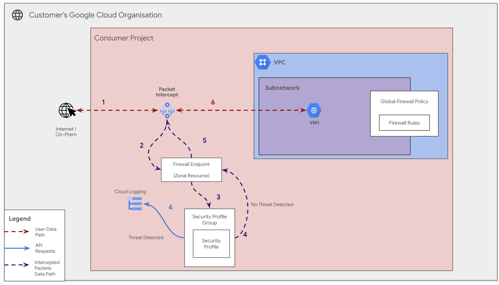

# GCP Security Profiles for Intrusion Prevention

**On this page**

-   [Introduction](#introduction)
-   [Objectives](#objectives)
-   [Architecture](#architecture)
    -   [Request flow](#request-flow)
    -   [Architecture Components](#architecture-components)
-   [Deploy the solution](#deploy-the-solution)
    -   [Prerequisites](#prerequisites)
    -   [Deploy through “terraform-cli”](#deploy-through-terraform-cli)
-   [Optional: Delete the deployment](#optional-delete-the-deployment)
-   [Submit feedback](#submit-feedback)

## Introduction

This document provides guidance on configuring and deploying **GCP Security Profiles** and **Security Profile Groups** using Google Cloud Firewall. These resources are the core components of Cloud Firewall's intrusion prevention service (IPS), allowing you to define fine-grained threat detection and prevention policies that can be applied across your organization.

This guide leverages the **CNCS (Cloud Networking Config Solutions)** repository for the automated deployment of Security Profiles and their related infrastructure using a declarative, YAML-driven approach.

## Objectives

This solution guide helps you do the following:

* Understand the architecture of Cloud Firewall's intrusion prevention service.
* Learn how Security Profiles, Security Profile Groups, and Firewall Policies work together.
* Visualize how network traffic is inspected against threat signatures.
* Deploy Security Profiles and associate them with a VPC network using the CNCS repository.

## Architecture

The architecture for applying Security Profiles involves a clear hierarchy of resources. A **Security Profile** contains the actual IPS settings (e.g., "deny critical severity threats"). This profile is attached to a **Security Profile Group**. This group is then referenced by a rule within an **Organization-level Firewall Policy**. Finally, this policy is **associated** with a target folder or VPC network to enforce the rules.

Following is a holistic diagram encompassing this hierarchical model.



### Request flow

The following illustrates how network traffic is inspected:

1.  **Initiation:** A client `VM-A` attempts to send traffic to a server `VM-B` within the same VPC network.
2.  **Policy Association:** The VPC network is associated with an Organization Firewall Policy. All traffic within the VPC is subject to this policy's rules.
3.  **Rule Match:** A rule within the Firewall Policy matches the traffic from `VM-A` to `VM-B`. This rule's action is set to `apply_security_profile_group`.
4.  **Inspection:** The traffic is redirected to the Cloud Firewall service for deep packet inspection.
5.  **Profile Enforcement:** Cloud Firewall uses the linked Security Profile to check the traffic against its database of threat signatures.
6.  **Action Taken:** If a threat is detected (e.g., one with "CRITICAL" severity), the profile's configured action (e.g., `DENY`) is taken, and the packet is dropped.
7.  **Logging:** A corresponding threat log is generated in Cloud Logging. If the traffic is not deemed a threat, it is allowed to proceed to `VM-B`.

### Architecture Components

The diagram depicts the following architecture components:

* **Security Profile:** An organization-level resource that defines threat prevention settings, such as actions for different threat severities.
* **Security Profile Group:** An organization-level resource that acts as a container for a Security Profile. This group is what you reference in firewall rules.
* **Organization Firewall Policy:** A global or regional policy container for firewall rules that can be applied to folders or networks across an organization.
* **Firewall Policy Rule:** A rule within the policy that defines matching criteria (e.g., source/destination IP ranges) and an action (e.g., `allow`, `deny`, or `apply_security_profile_group`).
* **VPC Network:** The network where workloads reside and where the Firewall Policy is enforced.

## Deploy the solution

This section guides you through the process of deploying the solution.

### Prerequisites

For the common prerequisites for this repository, please refer to the **[prerequisites.md](../prerequisites.md)** guide. Any additional prerequisites specific to this user journey will be listed below.

**IAM Permissions**: Ensure the user or Service Account running Terraform has the following roles:
  * `roles/compute.securityAdmin` on the project.
  * `roles/compute.orgFirewallPolicyAdmin` on the organization.
  * `roles/resourcemanager.organizationViewer` on the organization.

### Deploy through “terraform-cli”

1.  **Clone the cloudnetworking-config-solutions repository:**

    ```sh
    git clone [https://github.com/GoogleCloudPlatform/cloudnetworking-config-solutions.git](https://github.com/GoogleCloudPlatform/cloudnetworking-config-solutions.git)
    ```

2.  **Navigate to the `cloudnetworking-config-solutions` folder and update the files containing the configuration values.**

3.  **Update `01-organization/organization.tfvars`:** Update this file to enable the necessary APIs for the project where you will deploy the test infrastructure.

    ```hcl
    activate_api_identities = {
      "my-test-project" = {
        project_id = "your-project-id",  # Replace with your actual project ID
        activate_apis = [
          "compute.googleapis.com",
          "networksecurity.googleapis.com",
          "iam.googleapis.com",
          "iamcredentials.googleapis.com",
          "resourcemanager.googleapis.com"
        ],
      },
    }
    ```

4.  **Create a Consumer YAML file:** Navigate to the `configuration/security/SecurityProfile/config/` directory. Create a `.yaml` file (e.g., `my-ips-profile.yaml`) to define your Security Profile.

    ```yaml
    organization_id: "YOUR_ORGANIZATION_ID" # <-- Replace

    security_profile:
      create: true
      name: "prod-threat-profile"
      type: "THREAT_PREVENTION"
      description: "Production threat prevention profile"
      threat_prevention_profile:
        severity_overrides:
          - severity: "CRITICAL"
            action: "DENY"
          - severity: "HIGH"
            action: "DENY"
          - severity: "MEDIUM"
            action: "ALERT"

    security_profile_group:
      create: true
      name: "prod-threat-group"

    link_profile_to_group: true
    ```

5.  **Execute the Terraform script:** Navigate to the `execution/` directory and run the `run.sh` script to deploy only the security stage.

    ```bash
    ./run.sh -s 03-security/SecurityProfile -t init-apply-auto-approve
    ```

6.  **Verify Creation:** Once the deployment is complete, navigate to **VPC Network > Cloud Firewall > Security profiles** in the Google Cloud Console to confirm that your resources have been successfully created.

## Optional: Delete the deployment

1.  From the `execution/` directory, run the `run.sh` script with the `destroy` command for the security stage.

    ```bash
    ./run.sh -s 03-security/SecurityProfile -t destroy-auto-approve
    ```

## Submit feedback

For common troubleshooting steps and solutions, please refer to the **[troubleshooting.md](../troubleshooting.md)** guide.

To provide feedback, please follow the instructions in our **[submit-feedback.md](../submit-feedback.md)** guide.
