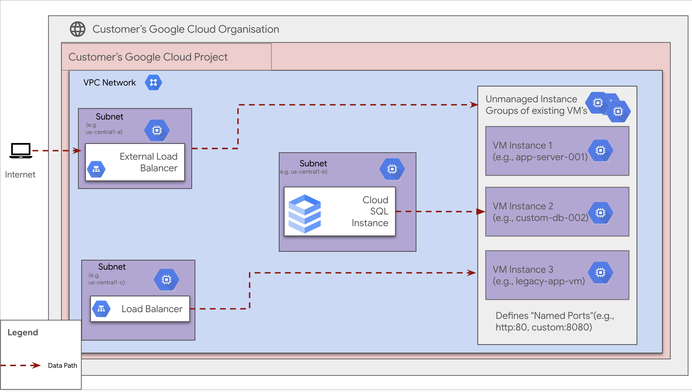

# Unmanaged Instance Groups

**On this page**

1. [Introduction](#introduction)
2. [Objectives](#objectives)
3. [Architecture](#architecture)
4. [Request flow](#request-flow)
5. [Deploy the solution](#deploy-the-solution)
6. [Prerequisites](#prerequisites)
7. [Deploy through “terraform-cli”](#deploy-through-terraform-cli)
8. [Optional: Delete the deployment](#optional-delete-the-deployment)
9. [Submit feedback](#submit-feedback)

## Introduction

This document outlines the implementation and operational considerations for leveraging Unmanaged Instance Groups (UMIGs) within our infrastructure. In modern cloud environments, while managed services and auto-scaling solutions offer significant benefits, there are scenarios where a higher degree of control and flexibility over individual virtual machine instances is paramount. UMIGs provide a robust mechanism for grouping and managing collections of instances that fall outside the purview of traditional auto-scaling or managed instance group functionalities.

The primary purpose of adopting UMIGs is to cater to use cases requiring:

- **Precise Instance Control:** Granular management of instance lifecycle, including specific configurations, manual scaling, and custom deployment procedures.
- **Heterogeneous Workloads:** Support for environments where instances within a group may have diverse specifications or run specialized applications that do not lend themselves to homogeneous scaling.
- **Integration with External Systems:** Seamless integration with existing orchestration tools, third-party monitoring, or legacy systems that expect direct instance interaction.
- **Cost Optimization for Specific Workloads:** Fine-grained control over instance types and numbers to optimize costs for predictable or non-elastic workloads.

This document will detail the architecture, deployment strategies, and operational guidelines for effectively utilizing Unmanaged Instance Groups, ensuring they serve as a valuable component of our cloud infrastructure while maintaining the necessary levels of stability, security, and manageability.

## Objectives

- **Granular VM Control:** Manage individually configured VMs within a group, supporting heterogeneous setups.
- **Manual Scaling:** Add or remove VMs manually as workload demands change; no auto-scaling or auto-healing.
- **Load Balancer Integration:** Use UMIGs as backends for Google Cloud Load Balancers to distribute traffic.
- **Manual Updates:** Update and maintain instances yourself; no automated rolling updates.
- **Safe Deletion:** Deleting a UMIG removes only the group, not the underlying VMs.
- **Location Consistency:** All VMs must be in the same project, zone, VPC, and subnet.
- **Named Ports Support:** Define named ports for load balancer traffic routing.

## Architecture

**Scenario 1:** This diagram gives a detailed breakdown of the request flow, assuming the primary entry point is from the internet:



### Request flow

- **Assumption:** An External Load Balancer is already configured with a backend service pointing to an *Unmanaged Instance Group* of existing VMs (e.g., VM Instance 1: `app-server-001`, VM Instance X: `another-app-server`).
    - An internet request (e.g., from a user's browser to `www.your-app.com`) arrives at the External Load Balancer, which has a public IP address.
        - *Note:* DNS resolution has already mapped the domain name to the Load Balancer's IP.
    - The External Load Balancer:
        - Examines its configuration.
        - Identifies the relevant Backend Service, which uses the Unmanaged Instance Group as its backend.
    - The Load Balancer performs health checks directly on each VM in the unmanaged group (e.g., `app-server-001`, `another-app-server`).
        - Health checks determine if each VM is "healthy" and able to serve traffic.
    - Based on health check results and the configured load balancing policy (e.g., round-robin, least connections), the Load Balancer selects a healthy VM from the group (e.g., `app-server-001`).
    - The Load Balancer forwards the incoming request to the internal IP address of the selected VM within the Google Cloud VPC network.
    - The selected VM processes the request (e.g., serves a webpage, performs computations, interacts with Cloud SQL).
    - The VM sends its response back to the External Load Balancer.
    - The Load Balancer returns the response to the original client over the Internet.

- **Key takeaway:**  
    The Unmanaged Instance Group acts as a list of specific VMs for the Load Balancer to distribute traffic to. The Load Balancer manages request distribution, but VM lifecycle management (creation, deletion, scaling) is handled manually by you, outside of the Load Balancer's automatic scaling features.

## Deploy the solution

### **Prerequisites**

For the common prerequisites for this repository, please refer to the **[prerequisites.md](../prerequisites.md)** guide. Any additional prerequisites specific to this user journey will be listed below.

1. **Clone the cloudnetworking-config-solutions repository:**

    ```sh
    git clone https://github.com/GoogleCloudPlatform/cloudnetworking-config-solutions.git
    ```

2. **Navigate to the `cloudnetworking-config-solutions` folder and update the files containing the configuration values:**

    - **00-bootstrap stage**
        - Update `configuration/bootstrap.tfvars` — update the Google Cloud project IDs and the user IDs/groups in the tfvars.

            ```hcl
            bootstrap_project_id                        = "your-project-id"
            network_hostproject_id                      = "your-project-id"
            network_serviceproject_id                   = "your-project-id"
            organization_stage_administrator            = ["user:user-example@example.com"]
            networking_stage_administrator              = ["user:user-example@example.com"]
            security_stage_administrator                = ["user:user-example@example.com"]
            producer_stage_administrator                = ["user:user-example@example.com"]
            producer_connectivity_administrator         = ["user:user-example@example.com"]
            consumer_stage_administrator                = ["user:user-example@example.com"]
            consumer_appengine_administrator            = ["user:user-example@example.com"]
            ```

    - **01-organisation stage**
        - Update `configuration/organization.tfvars` — update the Google Cloud project ID and the list of the APIs to enable for the Standard App Engine.

            ```hcl
            activate_api_identities = {
                "project-01" = {
                    project_id = "your-project-id",  # Replace with your actual project ID
                    activate_apis = [
                        "compute.googleapis.com",
                        "iam.googleapis.com",
                        "iamcredentials.googleapis.com",
                        "storage.googleapis.com"
                    ],
                },
            }
            ```

    - **02-networking stage**
        - Update `configuration/networking.tfvars` — update the Google Cloud Project ID and the parameters for additional resources such as VPC, subnet, and NAT as outlined below.

            ```hcl
            project_id = "your-project-id" # Replace with your Google Cloud Project ID
            region     = "us-central1" # Specify the region for your resources

            ## VPC input variables

            network_name = "CNCS_VPC" # Name of the VPC
            subnets = [
              {
                name                  = "CNCS_VPC_Subnet" # Name of the subnet
                ip_cidr_range         = "10.0.0.0/28" # CIDR range for the subnet
                region                = "us-central1" # Region for the subnet
                enable_private_access = true # Set to true to enable Private Google Access (required for Workbench)
              }
            ]

            # Configuration for setting up a Shared VPC Host project, enabling centralized network management and resource sharing across multiple projects.
            shared_vpc_host = false # Set to true if using a Shared VPC Host

            ## PSC/Service Connectivity Variables

            create_scp_policy      = false # Set to true to create a Service Connectivity Policy
            subnets_for_scp_policy = []  # List subnets for the SCP policy in the same region

            ## Cloud NAT input variables

            create_nat = true # Set to true to create a Cloud NAT instance

            ## Cloud HA VPN input variables

            create_havpn = false # Set to true to create a High Availability VPN
            peer_gateways = {
              default = {
                gcp = "" # Specify the peer VPN gateway, e.g., projects/<peer-project-id>/regions/<region>/vpnGateways/<vpn-name>
              }
            }

            tunnel_1_router_bgp_session_range = "169.254.1.0/30" # BGP session range for Tunnel 1
            tunnel_1_bgp_peer_asn             = 64514 # ASN for Tunnel 1 BGP peer
            tunnel_1_bgp_peer_ip_address      = "" # IP address for Tunnel 1 BGP peer
            tunnel_1_shared_secret            = "" # Shared secret for Tunnel 1

            tunnel_2_router_bgp_session_range = "169.254.2.0/30" # BGP session range for Tunnel 2
            tunnel_2_bgp_peer_asn             = 64514 # ASN for Tunnel 2 BGP peer
            tunnel_2_bgp_peer_ip_address      = "" # IP address for Tunnel 2 BGP peer
            tunnel_2_shared_secret            = "" # Shared secret for Tunnel 2

            ## Cloud Interconnect input variables

            create_interconnect = false # Set to true to create a Cloud Interconnect
            ```

    - **06-consumer stage**
        - Update the `configuration/06-consumer/UMIG/config/instance.yaml.example` file with the following content and rename it to `instance.yaml`:

            ```yaml
            project_id: your_project_id
            zone: your_zone                # The zone where your instances are located (e.g., us-central1-a)
            name: your_umig_name           # The name you want to assign to this unmanaged instance group
            description: "Instance group managed by the UMIG Terraform module."
            network: your_network_name
            instances:
              - instance_name_1
              - instance_name_2
            named_ports:
              - name: http
                port: 80
              - name: https
                port: 443
            ```

3. **Execute the terraform script**

    You can now deploy the stages individually using **run.sh** or you can deploy all the stages automatically using the run.sh file. Navigate to the `execution/` directory and run this command to run the automatic deployment using **run.sh**:

    ```sh
    ./run.sh -s all -t init-apply-auto-approve
    # or
    ./run.sh --stage all --tfcommand init-apply-auto-approve
    ```

4. **Verify UMIG Creation:**

    1. Use the Google Cloud Console or gcloud CLI to list instance groups in the relevant project and zone.
    2. Confirm that the UMIG appears in the list with the expected name and configuration.
    3. Check the status of the instances within the group to ensure they are running as intended.
    4. Optionally, review logs or monitoring dashboards for additional confirmation of proper setup.

## Optional: Delete the deployment

1. In Cloud Shell or in your terminal, make sure that the current working directory is `$HOME/cloudshell_open/<Folder-name>/execution`. If it isn't, go to that directory.
2. Remove the resources that were provisioned by the solution guide:

    ```sh
    ./run.sh -s all -t destroy-auto-approve
    ```

    Terraform displays a list of the resources that will be destroyed.

3. When you're prompted to perform the actions, enter `yes`.

## Submit feedback

To troubleshoot errors, check Terraform's logs and output.

To submit feedback, do the following:

- If you're looking for assistance with streamlining network configuration automation for a comparable use case, feel free to submit an issue on the [GitHub repository](https://github.com/GoogleCloudPlatform/cloudnetworking-config-solutions/issues).
- For unmodified Terraform code, create issues in the [GitHub repository](https://github.com/GoogleCloudPlatform/cloudnetworking-config-solutions/issues). GitHub issues are reviewed on a best-effort basis and are not intended for general use questions.
- For issues with the products that are used in the solution, contact [Cloud Customer Care](https://cloud.google.com/support-hub).


