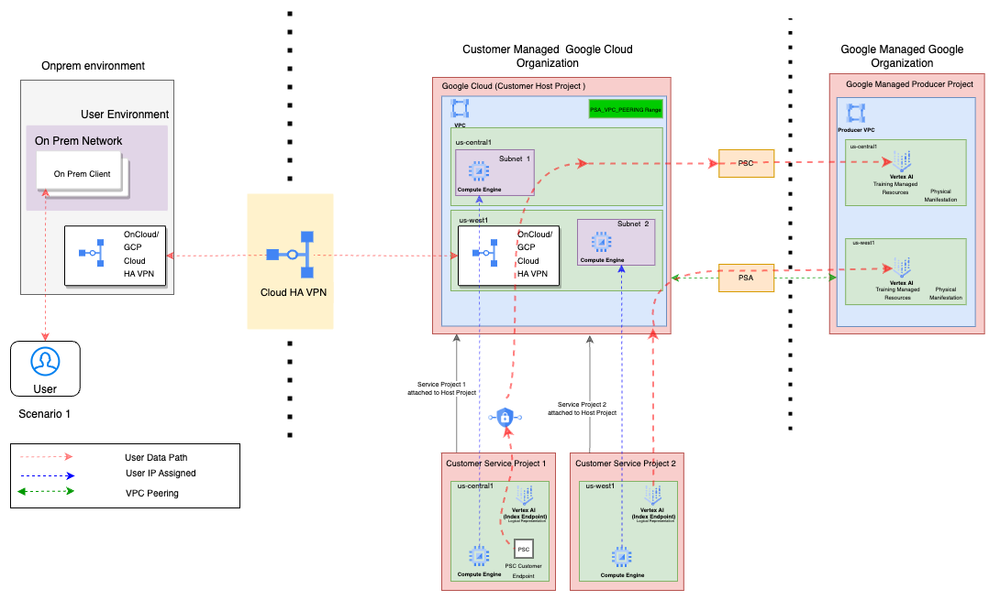

# Create a Vector Search instance with secure private connectivity through Private Service Access(PSA)

**On this page**

  [Introduction](#introduction)

  [Objectives](#objectives)

  [Architecture](#architecture)

  [Request flow](#request-flow)

  [Architecture Components](#architecture-components)

  [Deploy the solution](#deploy-the-solution)

  [Prerequisites](#prerequisites)

  [Deploy through “terraform-cli”](#deploy-through-terraform-cli)

  [Optional-Delete the deployment](#optional-delete-the-deployment)

  [Submit feedback](#submit-feedback)

### Introduction

The objective of this document is to guide users through the setup, configuration and utilization of Google Cloud's Vertex AI Vector Search. The guide explains the underlying architecture, request flow, and core components, enabling users to efficiently integrate this solution and enhance their AI/ML capabilities through vector-based similarity searches. It also simplifies the setup of the network configuration required to use Vertex AI Vector Search.

The guide assumes familiarity with cloud computing concepts, terraform, Vector Search instance, virtual private cloud (VPC), and Private Service Access (PSA).

This guide provides instructions on using the **cloudnetworking-config-solutions** repository on GitHub to simplify creation of your Vector Search instance on Google Cloud. Terraform enables you to formalize your infrastructure as code, which facilitates deployment and ensures consistency, even in complex architectures.

### Objectives

This solution guide helps you do the following :

* Set up VPC, subnets and private connectivity using PSA
* Learn about vector search instance and configurations
* Create a Vector Search instance with secure private connectivity through PSA

### Architecture

This solution creates an index, index endpoint and deploys the index endpoint for the vector search instance. The solution also creates all the necessary components such as VPC, subnets, PSA VPC Peering etc.

It covers following four scenarios:

* **Within VPC**

  * **Scenario 1: Simple connectivity within a VPC using PSA :** Suitable for deployments entirely within the Google Cloud environment using PSA for private connectivity.

  * **Scenario 2: Simple connectivity within a VPC using PSC :** Suitable for deployments entirely within the Google Cloud environment using PSC for private connectivity.

* **Across different network using cloud HA VPN**

  * **Scenario 3: Connectivity with Cloud HA VPN using PSA :** Ideal for connecting from on-premises(or other cloud provider) to the vector search instance created in google cloud.

  * **Scenario 4: Connectivity with Cloud HA VPN using PSC :** Ideal for connecting from on-premises(or other cloud provider) to the vector search instance created in google cloud.


### Request flow

The following illustrates the request processing flow for both scenarios:

1. **Scenario 1 & 2 :** Within the Google Cloud project, a user initiates a request from another Google Cloud resource residing within the same Virtual Private Cloud (VPC) as the Vertex AI Vector Search instance. The request is routed through the VPC network to the vector search instance using its private IP address. The vector search instance is configured with private connectivity, leveraging **Private Service Access (PSA)** in **Scenario 1**, or **Private Service Connect (PSC)** in **Scenario 2**, based on the specific use case.

2. **Scenario 3 & 4 :** A user initiates a request from an on-premises resource or a resource operating outside the VPC where the Vertex AI Vector Search instance is deployed. The on-premises location (or external network) connects to the Google Cloud network via a **Cloud High Availability (HA) VPN**. The request is then routed through the Cloud HA VPN connection, which securely links the on-premises or external network to the VPC hosting the vector search instance.
   The vector search instance is configured with private connectivity, utilizing **Private Service Access (PSA)** in **Scenario 3**, or **Private Service Connect (PSC)** in **Scenario 4**, depending on the specific configuration. This setup ensures secure communication over the VPN while maintaining internal routing within the VPC for improved performance and security.

   In all scenarios, the private connectivity ensures that all communication remains internal to the VPC, enhancing security and reducing latency by avoiding public internet exposure.

## **Architecture Components**

Following is a holistic diagram encompassing both the scenarios covered by the solution.

The diagram depicts three environments: the on-premises environment (left box), the Customer Managed Google Cloud organization (middle box), and the Google-managed google organization (right box).

  

Cloud HA VPN facilitates a secure and reliable connection between the on-premises environment and the Google Cloud consumer organization.

In the context of Google Cloud, the customer-managed Google Cloud organization is the primary entity where customer-managed Google Cloud resources are created. The diagram illustrates three Google Cloud projects, one of which is the customer host project. This project is responsible for creating and overseeing Virtual Private Cloud (VPC) networks. Within the customer host project, a VPC network is established, encompassing subnets represented by violet boxes and region represented by green boxes. One subnet resides in the us-central1 region and another subnet resides in us-west1. To facilitate private connectivity between the VPC network created in the customer host project and the VPC network of the Google-managed host project, a PSA VPC\_Peering range is configured within the VPC network. The Cloud HA VPN routers are positioned within the subnet and establish the connection between the on-premises(or external) network and the VPC network.

Customer Service Project 1 and Customer Service project 2 are attached to the Customer Host Project. This attachment uses the host project's networks.

* **Customer Service Project 1** uses the PSA VPC\_Peering range for the creation of index endpoints required by Vector Search instance .
* **Customer Service Project 2** creates a PSC attachment for the Vector Search index endpoint point and utilizes the IP address from the subnet 2 created in the host project.

The diagram describes the working components of the google cloud involved when using the Cloud HA VPN to establish communication with an on premise environment or other VPC network running in another GCP project.
The solution template helps in automating the creation, configuration of HA VPN tunnels, gateways, compute routers etc resources and helps in establishing communication of VPC network with another network which could be running in google cloud or outside of google cloud.

## **Deploy the solution**

This section guides you through the process of deploying the solution.

### **Prerequisites**

For the common prerequisites for this repository, please refer to the **[prerequisites.md](../prerequisites.md)** guide. Any additional prerequisites specific to this user journey will be listed below.

####

### Deploy through terraform-cli
1. **Clone the** cloudnetworking-config-solutions repository repository**:**

    ```
    git clone https://github.com/GoogleCloudPlatform/cloudnetworking-config-solutions.git
    ```

2. Navigate to **cloudnetworking-config-solutions** folder and update the files containing the configuration values
   * **00-bootstrap stage**
     * Update configuration/bootstrap.tfvars **\-** update the google cloud project IDs and the user IDs/groups in the tfvars.

        ```
        bootstrap_project_id                      = "your-project-id"
        network_hostproject_id                    = "your-project-id"
        network_serviceproject_id                 = "your-project-id"
        organization_stage_administrator          = ["user:user-example@example.com"]
        networking_stage_administrator            = ["user:user-example@example.com"]
        security_stage_administrator              = ["user:user-example@example.com"]
        producer_stage_administrator              = ["user:user-example@example.com"]
        producer_connectivity_stage_administrator = ["user:user-example@example.com"]
        consumer_stage_administrator              = ["user:user-example@example.com"]
        ```

   * **01-organisation stage**
     * Update configuration/organization.tfvars \- update the google cloud project ID and the list of the APIs to enable for the Vertex AI Vector Search instance.

        ```
        activate_api_identities = {
          "project-01" = {
            project_id = "your-project-id",
            activate_apis = [
              "servicenetworking.googleapis.com",
              "aiplatform.googleapis.com",
              "iam.googleapis.com",
              "compute.googleapis.com",
              ],
          },
        }
        ```

   * **02-networking stage**
     * Update configuration/networking.tfvars \- update the Google Cloud Project ID and the parameters for additional resources such as VPC, subnet, and NAT as outlined below.

        ```
        project_id  = "your-project-id",
        region      = "us-central1"

        ## VPC input variables
        network_name = "CNCS_VPC"
        subnets = [
          {
            ip_cidr_range = "10.0.0.0/24"
            name          = "CNCS_VPC_Subnet_1"
            region        = "us-central1-a"
          }
        ]
        psa_range_name    = range1
        psa_range         = "10.0.64.0/20"

        ## PSC/Service Connectivity Variables
        create_scp_policy  = false

        ## Cloud Nat input variables
        create_nat = true
        ## Cloud HA VPN input variables
        create_havpn = false
        ```

   * **04-producer stage**
     * Update the configuration/04-producer/VectorSearch/config/instance.yaml.example file and rename it to instance.yaml

        ```
        project_id:"your-project-id"
        region: us-central1
        index_display_name : cncs-vectorsearch-index1
        index_update_method : BATCH_UPDATE
        dimension: 2
        approximate_neighbors_count: 150
        shard_size: SHARD_SIZE_SMALL
        distance_measure_type: DOT_PRODUCT_DISTANCE
        index_endpoint_display_name : cncs-vectorsearch-index-endpoint-1
        index_endpoint_network : projects/<your-project-id>/global/networks/CNCS_VPC
        tree_ah_config:
          leaf_node_embedding_count: 500
          leaf_nodes_to_search_percent: 7
        brute_force_config: null
        deployed_index_id: cncs_deploy_index_id_1
        ```

3. **Execute the terraform script**
   You can now deploy the stages individually using **run.sh** or you can deploy all the stages automatically using the [run.sh](http://run.sh) file. Navigate to the execution/ directory and run this command to run the automatic deployment using **run.sh .**

    ```
    ./run.sh -s all -t init-apply-auto-approve
    or
    ./run.sh --stage all --tfcommand init-apply-auto-approve
    ```

4. **Verify Vector Search instance creation:**
   Once the deployment is complete, navigate to the Vertex AI Vector Search section in the Google Cloud Console to confirm that your vector search index, index endpoint and deployed index endpoint has been successfully reflected.

5. **Using Vector Search:**
   * You can utilize the list of Jupyter Notebook tutorials to help you get started [https://cloud.google.com/vertex-ai/docs/vector-search/notebooks](https://cloud.google.com/vertex-ai/docs/vector-search/notebooks)

## **Optional-Delete the deployment**

1. In Cloud Shell or in your terminal, make sure that the current working directory is $HOME/cloudshell\_open/\<Folder-name\>/execution. If it isn't, go to that directory.
2. Remove the resources that were provisioned by the solution guide:

    ```
    ./run.sh -s all -t destroy-auto-approve
    ```

    Terraform displays a list of the resources that will be destroyed.

3. When you're prompted to perform the actions, enter yes.

## **Known Issues**

No known issues.

## **Submit feedback**

For common troubleshooting steps and solutions, please refer to the **[troubleshooting.md](../troubleshooting.md)** guide.

To provide feedback, please follow the instructions in our **[submit-feedback.md](../submit-feedback.md)** guide.