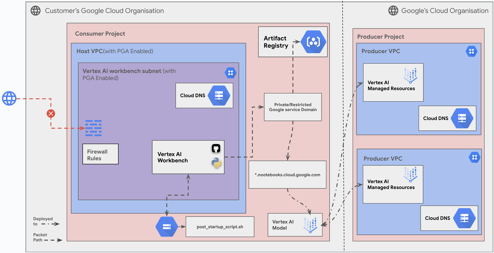

# Create a Vertex AI Workbench Instance using Private Google Access (PGA)

## On this page

1. [Introduction](#introduction)
2. [Objectives](#objectives)
3. [Architecture](#architecture)
    * [Request flow](#request-flow)
    * [Architecture Components](#architecture-components)
4. [Deploy the solution](#deploy-the-solution)
    * [Prerequisites](#prerequisites)
    * [Deploy through “terraform-cli”](#deploy-through-terraform-cli)
5. [Optional: Delete the deployment](#optional-delete-the-deployment)
6. [Troubleshoot Errors](#troubleshoot-errors)
7. [Submit feedback](#submit-feedback)

## Introduction

This guide walks you through setting up and configuring a Vertex AI Workbench instance using the cloudnetworking-config-solutions repository on GitHub. Vertex AI Workbench provides a managed development environment for building and deploying machine learning models on Google Cloud. This guide focuses on leveraging Terraform, within the cloudnetworking-config-solutions repository, to simplify the creation and management of your Workbench instance, including necessary networking configurations. It outlines the architecture, deployment process, and key components involved, enabling you to quickly and efficiently provision a Workbench environment tailored to your needs. A basic understanding of Google Cloud Platform and  Terraform is expected. By using the provided Terraform configurations, you can automate the deployment of your Vertex AI Workbench instance, ensuring consistency and reproducibility while minimizing manual configuration.

## Objectives 

This guide aims to provide a comprehensive solution for setting up and configuring a Vertex AI Workbench instance using the cloudnetworking-config-solutions repository on GitHub. The guide will cover the following objectives:
1. **Create a Vertex AI Workbench instance:** This includes setting up the necessary networking configurations, including Private Google Access (PGA).
2. **Connect to the Vertex AI Workbench instance:** This involves configuring the necessary network settings on your local machine or network. You can connect to the instance via SSH using the private IP address and the configured firewall rules.
3. **Interact with Vertex AI and other Google Cloud services:** This can be done from within the Jupyter notebook of the Vertex AI Workbench instance.
4. **Manage the Vertex AI Workbench instance:** This includes deleting the instance and troubleshooting any issues that may arise.

## Architecture 

This guide covers the following scenario:

### Secure and Private Connectivity Overview
This diagram illustrates a **secure and private connectivity setup for Vertex AI Workbench within a customer's Google Cloud organization**, leveraging Private Google Access (PGA) and a "Producer-Consumer" model. Here's what's happening:



### Request flow

The following illustrates the request processing:

* **User Interaction:** The user starts by interacting with the **Vertex AI Workbench instance**. This interaction could be through a **web browser** or any other **client tool**. We can assume the user is trying to access **notebooks.cloud.google.com** (as indicated in the diagram). 
* **Firewall Rules:** The user's request, originating from their local machine (represented by the globe icon), first encounters the Firewall Rules within the Customer's Google Cloud Organization's Consumer Project. These rules act as a security gate, determining whether the request is allowed to proceed.
* **Host VPC:** Assuming the firewall rules permit the traffic, the request then enters the Host VPC (Virtual Private Cloud). This is a logically isolated section of the customer's Google Cloud network. The Host VPC has Private Google Access (PGA) enabled.
* **Vertex AI Workbench Subnet (with PGA Enabled):** The request is routed to the specific subnet within the Host VPC where the Vertex AI Workbench instance resides. This subnet also has PGA enabled, allowing it to communicate with Google's services privately.
* **Private/Restricted Google Service Domain:** The Vertex AI Workbench instance, through the PGA, attempts to connect to the notebooks.cloud.google.com service. This connection goes through a private/restricted Google service domain, bypassing the public internet.
* **Producer VPC (Google's Cloud Organization):** The request is then routed to the appropriate Producer VPC within Google's Cloud Organization. This is where the actual Vertex AI Managed Resources, including the Vertex AI Model, are located.
* **Vertex AI Model:** The Vertex AI Workbench interacts with the Vertex AI Model. This could involve running the model, training it, or deploying it.
* **Post-Startup Script:** The diagram also shows a post_startup_script.sh being deployed to the Vertex AI Workbench. This script likely automates some configuration or setup tasks on the Workbench instance.

### Architecture Components

- **Vertex AI Workbench:** A managed development environment for building and deploying machine learning models.
- **Private Google Access (PGA):** Enables VMs with internal IPs to access Google APIs and services privately.
- **Host VPC with PGA:** A Virtual Private Cloud (VPC) configured with Private Google Access (PGA) to ensure secure and private connectivity for resources within the network.
- **Vertex AI Managed Resources:** Includes the infrastructure for hosting and managing machine learning models.

## Deploy the solution 

This section guides you through the process of deploying the solution.

### Prerequisites 

For the common prerequisites for this repository, please refer to the **[prerequisites.md](../prerequisites.md)** guide. Any additional prerequisites specific to this user journey will be listed below.

### Deploy through “terraform-cli” 

* **Clone the cloudnetworking-config-solutions repository:**

  ```sh
  git clone https://github.com/GoogleCloudPlatform/cloudnetworking-config-solutions.git
  ```

* **Navigate to cloudnetworking-config-solutions folder and update the files containing the configuration values:**

  * **00-bootstrap stage:**
    * Update `configuration/bootstrap.tfvars` - update the Google Cloud project IDs and the user IDs/groups in the tfvars.

      ```hcl
      bootstrap_project_id                      = "your-project-id"
      network_hostproject_id                    = "your-project-id"
      network_serviceproject_id                 = "your-project-id"
      organization_stage_administrator          = ["user:user-example@example.com"]
      networking_stage_administrator            = ["user:user-example@example.com"]
      security_stage_administrator              = ["user:user-example@example.com"]
      producer_stage_administrator              = ["user:user-example@example.com"]
      producer_connectivity_administrator       = ["user:user-example@example.com"]
      consumer_stage_administrator              = ["user:user-example@example.com"]
      consumer_workbench_administrator          = ["user:workbench-user-example@example.com"]
      ```

  * **01-organization stage:**
    * Update the `configuration/organization.tfvars` file with the following parameters to configure the Google Cloud project ID and the list of APIs to enable for the Vertex AI Workbench instance:

      ```hcl
      activate_api_identities = {
        "project-01" = {
          project_id    = "your-project-id",
          activate_apis = [
            "servicenetworking.googleapis.com",
            "iam.googleapis.com",
            "compute.googleapis.com",
            "aiplatform.googleapis.com",
            "notebooks.googleapis.com",
          ],
        },
      }
      ```

  * **02-networking stage:**
    * Update the `configuration/networking.tfvars` file with the following parameters to configure the Google Cloud Project ID, VPC, subnet, NAT, and other networking resources:

      ```hcl
      project_id = "" # Replace with your Google Cloud Project ID
      region     = "us-central1" # Specify the region for your resources

      ## VPC input variables

      network_name = "default-vpc" # Name of the VPC
      subnets = [
        {
          name                  = "default-subnet" # Name of the subnet
          ip_cidr_range         = "10.0.0.0/24" # CIDR range for the subnet
          region                = "us-central1" # Region for the subnet
          enable_private_access = true # Set to true to enable Private Google Access (required for Workbench)
        }
      ]

      # Configuration for setting up a Shared VPC Host project, enabling centralized network management and resource sharing across multiple projects.
      shared_vpc_host = false # Set to true if using a Shared VPC Host

      ## PSC/Service Connectivity Variables

      create_scp_policy      = false # Set to true to create a Service Connectivity Policy
      subnets_for_scp_policy = []  # List subnets for the SCP policy in the same region

      ## Cloud NAT input variables

      create_nat = true # Set to true to create a Cloud NAT instance

      ## Cloud HA VPN input variables

      create_havpn = false # Set to true to create a High Availability VPN
      peer_gateways = {
        default = {
          gcp = "" # Specify the peer VPN gateway, e.g., projects/<peer-project-id>/regions/<region>/vpnGateways/<vpn-name>
        }
      }

      tunnel_1_router_bgp_session_range = "169.254.1.0/30" # BGP session range for Tunnel 1
      tunnel_1_bgp_peer_asn             = 64514 # ASN for Tunnel 1 BGP peer
      tunnel_1_bgp_peer_ip_address      = "" # IP address for Tunnel 1 BGP peer
      tunnel_1_shared_secret            = "" # Shared secret for Tunnel 1

      tunnel_2_router_bgp_session_range = "169.254.2.0/30" # BGP session range for Tunnel 2
      tunnel_2_bgp_peer_asn             = 64514 # ASN for Tunnel 2 BGP peer
      tunnel_2_bgp_peer_ip_address      = "" # IP address for Tunnel 2 BGP peer
      tunnel_2_shared_secret            = "" # Shared secret for Tunnel 2

      ## Cloud Interconnect input variables

      create_interconnect = false # Set to true to create a Cloud Interconnect

      ```

  * **03-security stage:**
    * Update `configuration/security/workbench.tfvars` file - update the Google Cloud Project ID. This will facilitate the creation of essential firewall rules, including rules to allow SSH access to port 22 for Workbench instances with private IP configurations.

      ```hcl
      # Project ID for the Google Cloud project
      project_id = "<project-id>"

      # Network name where the firewall rules will be applied
      network = "projects/<project-id>/global/networks/default-vpc"

      # Ingress rules configuration
      ingress_rules = {
        "allow-ssh-custom-ranges-workbench" = {
          deny               = false
          description        = "Allow SSH access to Workbench instances from trusted sources"
          destination_ranges = []
          disabled           = false
          enable_logging = {
            include_metadata = true
          }
          priority = 1000
          source_ranges = [
            "192.168.1.0/24", # Replace with the specific IP range of your VPC for security
          ]
          targets = ["allow-ssh-custom-ranges-workbench"]
          rules = [
            {
              protocol = "tcp"
              ports    = ["22"]
            }
          ]
        }
      }
      ```

  * **06-consumer stage:**
    * Update the `configuration/06-consumer/Workbench/config/instance-lite.yaml.example` file with the following content and rename it to `instance-lite.yaml`:

      ```yaml
      name: default-workbench-instance # Default Workbench instance name
      project_id: project-id          # Replace with your GCP project ID
      location: us-central1-a         # Default zone
      gce_setup:
        network_interfaces:
          - network: projects/project-id/global/networks/default-vpc   # Default network path
            subnet: projects/project-id/regions/us-central1/subnetworks/default-subnet # Default subnet path
      ```

* **Execute the terraform script:**
  You can now deploy the stages individually using **run.sh** or you can deploy all the stages automatically using the run.sh file. Navigate to the `execution/` directory and run this command to run the automatic deployment using **run.sh**:

  ```sh
  ./run.sh -s all -t init-apply-auto-approve
  or
  ./run.sh --stage all --tfcommand init-apply-auto-approve
  ```

* **Verify Workbench Instance Creation:**
  Once the deployment is complete, navigate to the Vertex AI Workbench section in the Google Cloud Console to confirm that your Workbench instance has been successfully created and is in a running state. You should be able to see its details, including the assigned region, machine type, and network configuration.

* **Connect to Your Workbench Instance:**
  * **Access JupyterLab via SSH:**
    For **Private Connectivity** to your Workbench instance, use SSH to establish a connection. Follow these steps to set up SSH port forwarding and access your JupyterLab session through a local browser:

    1. Run the following command using the Google Cloud CLI in your preferred terminal or in Cloud Shell:

      ```sh
      gcloud compute ssh default-workbench-instance \
         --project <project-id> \
         --zone us-central1-a \
         -- -NL 8080:localhost:8080
      ```

      Replace the placeholder:
      - `PROJECT_ID`: Your Google Cloud project ID.

    2. Access your JupyterLab session:
      - If you ran the command on your local machine, open [https://localhost:8080](https://localhost:8080) in your browser.
      - If you ran the command in Cloud Shell, use the **Web Preview** feature on port 8080 to access JupyterLab.

* **Using Vertex AI Workbench:**
  Explore the available Jupyter Notebook tutorials to get started with Vertex AI Workbench: [Vertex AI Workbench Tutorials](https://cloud.google.com/vertex-ai/workbench/docs/tutorials).

* **Optional - Delete the deployment:**
  1. In Cloud Shell or in your terminal, make sure that the current working directory is `$HOME/cloudshell_open/<Folder-name>/execution`. If it isn't, go to that directory.
  2. Remove the resources that were provisioned by the solution guide:

      ```sh
      ./run.sh -s all -t destroy-auto-approve
      ```

  3. When you're prompted to perform the actions, enter `yes`.

## Troubleshoot Errors 

Currently, there are no known issues specific to the Vertex AI Workbench setup when following this guide.

## Submit feedback 

For common troubleshooting steps and solutions, please refer to the **[troubleshooting.md](../troubleshooting.md)** guide.

To provide feedback, please follow the instructions in our **[submit-feedback.md](../submit-feedback.md)** guide.